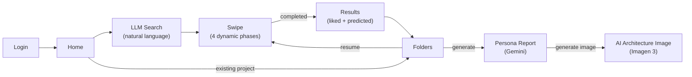
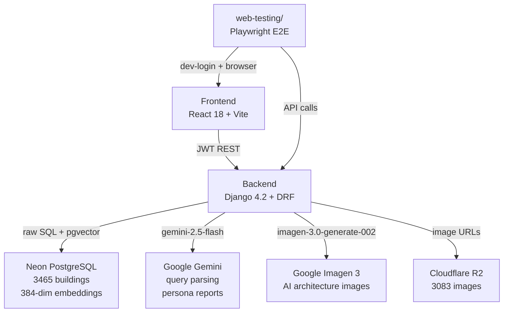
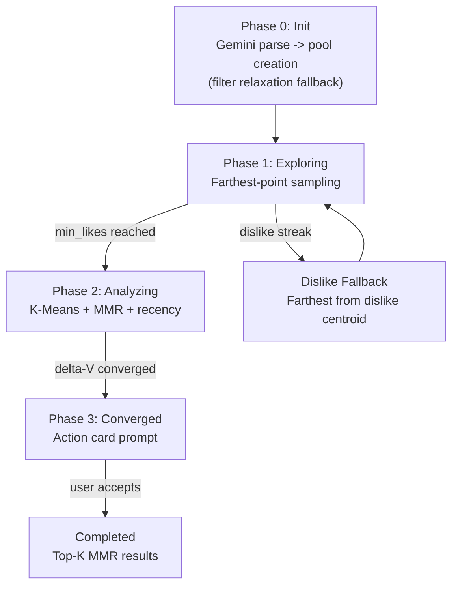

# System Report

> How the code works right now. Auto-updated by reporter after every commit.
> For what we're building: see Goal.md. For task status: see Task.md.

---

## User Flow

## System Architecture

## Algorithm Pipeline

## Backend Structure
| File | Responsibility |
|------|---------------|
| `engine.py` | Recommendation algorithm: pool creation, farthest-point, K-Means+MMR, convergence, top-K; centroid cache key uses spread dimensions (0, 191, -1) for collision resistance |
| `services.py` | Gemini LLM: query parsing (gemini-2.5-flash), persona report generation; Imagen 3: AI architecture image generation; retry wrapper with 1-retry + logging |
| `views.py` | All REST endpoints -- session CRUD, swipes, projects, images, auth, report image generation; `select_for_update()` on session query + `session.save()` before prefetch to prevent concurrent exposed_ids staleness; persona report returns structured errors (502 with error_type); building_id validation returns 400; prefetch computed outside transaction.atomic(); pool_embeddings cached across transaction boundary (no redundant fetch for prefetch); dislike embeddings batch-fetched via get_pool_embeddings |
| `config/settings.py` | RECOMMENDATION dict (12 hyperparameters), JWT config, DB config (CONN_MAX_AGE=600), CORS; uses STORAGES dict (Django 4.2+ format) for WhiteNoise static files |
| `apps/accounts/views.py` | Google/Kakao/Naver OAuth, dev-login, JWT token management; all login views use `authentication_classes = []` |
| `tests/conftest.py` | pytest fixtures: SQLite in-memory DB override, user_profile, auth_client, api_client |
| `tests/test_auth.py` | 7 auth integration tests (Google login mock, token refresh, logout, dev-login) |
| `tests/test_sessions.py` | 8 session lifecycle tests (creation, swipes, idempotency, phase transitions) with mocked engine.py |
| `tests/test_projects.py` | 8 project + batch tests (CRUD, pagination, auth, building batch) |

## Frontend Structure
| File | Responsibility |
|------|---------------|
| `api/client.js` | API client with 10s fetch timeout, network retry (2x backoff), `normalizeCard()` field mapping, `callApi()` with JWT refresh, `socialLogin` clears stale tokens, `generateReportImage()` |
| `App.jsx` | Router, auth state, session management, project sync on login (incl. `reportImage` mapping), `initSession` with try-catch-finally (setIsSwipeLoading in finally block prevents infinite spinner), explicit prefetch null reset, swipe error handling, `handleImageGenerated` propagates image state, `handleGenerateReport` propagates errors to caller, `preloadImage` with 1.5s timeout (does not block UI on slow CDN) |
| `SwipePage.jsx` | Card deck, swipe gestures, PC keyboard swiping, 3D flip, gallery, phase progress bar, "View Results" (converged/completed only), TutorialPopup, image error retry + fallback; safe-area height; 2-line title clamp; currentCard renders over loading state (overlay spinner) without bulky buttons |
| `TutorialPopup.jsx` | First-time user guide with responsive semi-transparent overlay (swipe vs arrow key hints), tap-to-dismiss (localStorage) |
| `FavoritesPage.jsx` | Project folders, persona report display with AI image generation button, "Generate Persona Report" button with error display; safe-area height; 44px back button |
| `LLMSearchPage.jsx` | AI search input, Gemini integration; safe-area-adjusted fixed elements, constrained horizontal scroll |
| `LoginPage.jsx` | Google auth-code flow login, `onNonOAuthError` popup handling |
| `TabBar.jsx` | Bottom navigation with safe-area-inset-bottom padding (content-box) |
| `ProjectSetupPage.jsx` | New project setup with folder name and area range; safe-area-adjusted layout |

## Web Testing Structure
| File | Responsibility |
|------|---------------|
| `web-testing/research/persona.py` | PersonaProfile dataclass; template mode (random from pools) + LLM mode (Gemini); serializable to dict/JSON |
| `web-testing/research/scenarios.py` | TestScenario dataclass; keyword-overlap scoring for swipe decisions (program 3x, style 2x, atmosphere 2x, material 1x; threshold 0.35) |
| `web-testing/runner/runner.py` | Playwright E2E orchestration: dev-login -> home -> LLM search -> swipe loop -> results -> persona report; iPhone 14 Pro viewport; headless Chromium; 3-strategy swipe (locator -> viewport-center -> keyboard); screenshots on all steps; card visibility assertion; gesture/api/card/image timing breakdown |
| `web-testing/runner/collector.py` | StepRecord, ApiCallRecord, ErrorRecord dataclasses; Collector class with response/console/exception listeners; screenshot capture per step |
| `web-testing/runner/reporter.py` | Generates report.json with summary stats, bottleneck classification (image_loading, api_call, algorithm_computation, llm_api, database_query, rendering) |
| `web-testing/runner/feedback.py` | Generates feedback.json mapping API endpoints to source files; performance cause hints; pass/warn/fail status; suggestion string |
| `web-testing/run.py` | CLI entry point: --personas N, --mode template/llm, --auto-fix, --loop N, --dashboard-only; symlinks latest report to dashboard/data/latest/ |
| `web-testing/dashboard/` | Static HTML/JS/CSS SPA: persona sidebar, step timeline viewer with timing breakdown, error panel, sortable performance table with gesture/api/card/image columns; timing-aware bottleneck classification; dark theme; CSS Grid layout |

## API Surface
| Method | Endpoint | Description |
|--------|----------|-------------|
| POST | `/api/v1/auth/social/google/` | Google login (accepts `access_token` or `code`) -> JWT |
| POST | `/api/v1/auth/token/refresh/` | Refresh access token |
| POST | `/api/v1/auth/logout/` | Blacklist refresh token |
| GET | `/api/v1/projects/` | List user's projects |
| POST | `/api/v1/projects/` | Create project |
| DELETE | `/api/v1/projects/{id}/` | Delete project |
| POST | `/api/v1/projects/{id}/report/generate/` | Generate persona report (502 on Gemini failure with error_type) |
| POST | `/api/v1/projects/{id}/report/generate-image/` | Generate AI architecture image from persona report |
| POST | `/api/v1/analysis/sessions/` | Start swipe session (filter relaxation fallback, returns `filter_relaxed`) |
| POST | `/api/v1/analysis/sessions/{id}/swipes/` | Record swipe (idempotency scoped to session, dislike fallback tracks exposed_ids, 400 on missing building_id) |
| GET | `/api/v1/analysis/sessions/{id}/result/` | Get results |
| GET | `/api/v1/images/diverse-random/` | Get 10 diverse buildings |
| POST | `/api/v1/images/batch/` | Batch-fetch buildings by ID |
| POST | `/api/v1/parse-query/` | LLM query parsing (returns filter_priority) |
| POST | `/api/v1/auth/dev-login/` | Dev login (DEBUG-only, returns 404 without DEV_LOGIN_SECRET, rate-limited 5/min) |

## Feature Status (from checklist)

### Complete
- Google OAuth login (auth-code flow for mobile compatibility) + JWT (access 1hr, refresh 30d, blacklist)
- **Stale token defense:** frontend clears tokens before social login; backend login views skip JWT authentication
- 4-phase recommendation pipeline (exploring -> analyzing -> converged -> completed)
- Weighted scoring pool creation (CASE WHEN SQL, OR-based, filter_priority weights)
- **Filter relaxation fallback** in session creation (drop geo/numeric -> random pool)
- Gemini filter_priority end-to-end (parse-query -> session create -> pool scoring)
- LLM search seed IDs force-included in pool
- K-Means + MMR card selection with recency weighting
- **Recency weight math protection** -- `max(0, ...)` guard prevents amplification when `round_num < entry_round`
- Convergence detection via delta-V moving average
- Action card for graceful session exit with **improved messaging** (title + subtitle, clear swipe direction hints)
- **"View Results" button only shows on converged/completed phase** (not during analyzing)
- **Dislike fallback cards tracked in exposed_ids** (no card repetition)
- MMR-diversified top-k results
- Preference vector updates (like +0.5, dislike -1.0, L2-normalize)
- Natural language query parsing + persona report generation (Gemini)
- **Gemini retry logic** -- 1 retry with 1s delay, specific error logging per attempt
- **Structured Gemini errors** -- persona report returns error_type + detail on failure, frontend shows error text
- **AI architecture image generation** (Imagen 3 via google-genai SDK, base64 stored in project model)
- Project CRUD + sync from backend on login + batch-fetch building cards
- Images served from Cloudflare R2
- SwipePage (swipe gestures, 3D flip, gallery), FavoritesPage (folders, persona report + AI image)
- Dark/light theme, loading skeletons, image preloading, fullscreen gallery overlay
- Phase-aware progress bar, action card early exit, multi-step project setup
- Dev-login endpoint + debug overlay (automated testing)
- Vercel + Railway deployment configs, WhiteNoise, CORS (both :5173 and :5174)
- **Detailed error logging** for Google login failures (backend + frontend)
- **onNonOAuthError** handling for popup-blocked scenarios
- **Swipe error handling:** try-catch + 1 network retry + card revert + auto-dismissing error toast
- **API client resilience:** 10s fetch timeout (AbortController), 2x network retry with exponential backoff (300ms, 900ms)
- **Pool embedding caching:** frozenset key per pool, max 50 entries; eliminates repeated DB queries within a session
- **KMeans centroid caching:** like-vector fingerprint + round_num key, max 20 entries; skips recomputation on dislikes; n_init reduced 10->3
- **Double prefetch (2-card buffer):** backend returns `prefetch_image_2`; frontend shifts prefetch queue on each instant swap
- **Gemini UI/UX Polish:** Chat overlay width constrained to fix horizontal scroll bug, responsive semi-transparent overlay for tutorials, PC keyboard left/right swiping functionality, and removal of intrusive UI buttons on SwipePage.
- **Tutorial popup:** first-time SwipePage visually upgraded guide, tap-to-dismiss (localStorage `archithon_tutorial_dismissed`)
- **Image error handling:** retry once with `?retry=1` cache bust; fallback placeholder on permanent failure (no more infinite skeleton)
- **Swipe race condition guard (B5):** `swipeLock` useRef in `handleSwipeCard` + `onCardLeftScreen`; concurrent swipe requests blocked
- **Card overwrite fix (B6):** canInstantSwap path no longer overwrites `currentCard` when backend response diverges; prefetch queue updated only
- **Concurrent exposed_ids fix (B2v2):** `session.save()` called before prefetch calculation; `select_for_update()` on session query prevents stale reads
- **Mobile optimization (F3):** viewport-fit=cover, safe-area-inset-bottom on all pages/TabBar/fixed elements, 44px touch targets, text overflow clamp, reduced SwipePage padding
- **Backend integration tests (INFRA1):** 23 pytest tests (7 auth + 8 session lifecycle + 8 project/batch) with SQLite in-memory DB and mocked engine.py
- **Idempotency scoped to session (INFRA2):** SwipeEvent unique_together (session, idempotency_key) instead of global unique
- **total_rounds removed (INFRA3):** field removed from AnalysisSession model, migration 0006
- **console.error cleanup (INFRA4):** removed from 8 UI locations, kept in api/client.js graceful catch blocks
- **initSession infinite spinner fix:** try-catch-finally in App.jsx ensures `setIsSwipeLoading(false)` runs even when `api.startSession()` throws; catch resets card state and shows error toast; prefetch explicitly set to null when absent
- **Centroid cache key collision fix:** `compute_taste_centroids()` cache key changed from first-3-dimensions to spread dimensions (0, 191, -1) with `round(..., 6)` for float stability across 384-dim vectors
- **building_id validation in SwipeView:** returns 400 Bad Request if `building_id` is missing or empty, preventing corrupted swipe state
- **Narrow transaction scope in SwipeView:** prefetch computation moved outside `transaction.atomic()`; session data copied to locals before lock release; improved response times under concurrent load
- **SwipePage loading priority:** `currentCard` always renders when present (overlay spinner), full skeleton `LoadingCard` only when `currentCard` is null
- **Codebase audit cleanup (AUDIT1):** removed unused deps (@react-spring/web, react-masonry-css, @playwright/test), dead CSS (.masonry-grid, .swipe-card), dead env var (VITE_GEMINI_API_KEY), dead fallback (predicted_like_images); consolidated tests to backend/tests/; STORAGES dict replaces deprecated STATICFILES_STORAGE; optuna moved to requirements-dev.txt; .gitignore gaps fixed
- **E2E visual test runner (TEST1):** Playwright-based `web-testing/` module with persona-driven scenarios, screenshot capture, report/feedback JSON, and static dashboard SPA
- **E2E runner fixes (TEST3):** Screenshots on all swipe steps (was 10/30), card image visibility check after screenshot, gesture/api/card/image timing breakdown in step metadata; 3-strategy swipe gesture (locator -> viewport-center -> keyboard); dashboard timing display in step cards and performance table; validated across 57 personas (20 loops x 3)
- **Swipe API latency optimizations (PERF1):** pool_embeddings cached across transaction boundary (eliminates redundant get_pool_embeddings call in prefetch section); dislike embeddings batch-fetched via single get_pool_embeddings call (was N individual get_building_embedding calls); CONN_MAX_AGE=600 for DB connection reuse; preloadImage 1.5s timeout prevents UI blocking on slow CDN
- **Deep code review workflow (`/deep-review`):** dedicated review-terminal slash command at `.claude/commands/deep-review.md` + parallel subagent at `.claude/agents/deep-reviewer.md`; **push-gate scope** via `origin/main..HEAD` (unpushed commits only) with optional user-supplied range; `git fetch origin main` refresh before scope computation; produces `.claude/reviews/{sha_short}.md` + `.claude/reviews/latest.md`; 7-axis checklist (architecture, correctness, performance, security, quality, test coverage, cross-commit drift); complementary to the fast `reviewer`/`security-manager` gate, not a replacement; read-only, non-blocking, outside the orchestrator fix loop

### Pending
- Kakao + Naver OAuth

## Last Updated (Claude)
- **Date:** 2026-04-22
- **Commits:** pending -- feat: add `/deep-review` deep code review workflow + restructure `.gitignore` to track shared `.claude/` config
- **Phase:** Phase 11 -- Review Infrastructure + Repo Share Model
- **Changes:**
  - `.claude/commands/deep-review.md` -- NEW: project-level slash command; loads deep-review workflow into current session; 7-axis checklist (architecture / correctness / performance / security / code quality / test coverage / cross-commit drift); writes report to `.claude/reviews/{sha_short}.md` + `.claude/reviews/latest.md`; default scope `origin/main..HEAD` (unpushed commits, push-gate semantics) with `git fetch origin main` refresh; accepts optional user-supplied range
  - `.claude/agents/deep-reviewer.md` -- NEW: programmatic subagent mirroring the slash command for CLI / orchestrator invocation; opus model; read-only (Read, Write, Bash, Glob, Grep); same 7-axis workflow + report format + push-gate scope
  - `.claude/reviews/` -- NEW directory (created on first `/deep-review` invocation); per-commit review archive + stable `latest.md` for main-terminal read path; gitignored (derivative, per-machine)
  - `CLAUDE.md` -- new "Code Review" section after "E2E Visual Test Runner"; documents invocation, output path, and that this workflow is read-only / non-blocking and supplements (does not replace) the fast `reviewer` + `security-manager` agents
  - `.gitignore` -- restructured `.claude/` rule: wholesale exclusion replaced with targeted exclusions for local/derivative paths (`.claude/settings.local.json`, `.claude/plans/`, `.claude/reviews/`, `.claude/projects/`, `.claude/cache/`); shared config (`Goal.md`, `WORKFLOW.md`, `agents/`, `commands/`) is now visible to git and can be committed so the pipeline is reproducible across machines
- **Verification:** dry-run of `git log origin/main..HEAD --oneline` and `git diff origin/main..HEAD --stat` on main confirms push-gate scope (empty -> abort path engages correctly); `.claude/agents/` (12 agents) and `.claude/commands/` now visible in `git status` as untracked, ready to be staged by a separate commit; the fast `reviewer` + `security-manager` agents remain unchanged inside the orchestrator fix loop; recommended overall flow: orchestrator -> commit on main (no push) -> accumulate N cycles -> `/deep-review` on review terminal -> if issues, fix & re-commit -> `/deep-review` PASS -> manual `git push`

## Last Updated (Gemini)
- **Date:** 2026-04-06
- **Phase:** Gemini UI/UX Polish
- **Changes:**
  - `frontend/src/pages/LLMSearchPage.jsx` -- Fixed horizontal overflow scrolling for the AI chat output.
  - `frontend/src/pages/SwipePage.jsx` -- Configured keyboard shortcut (ArrowLeft/ArrowRight) for PC user swiping and removed action buttons.
  - `frontend/src/components/TutorialPopup.jsx` -- Created transparent responsive overlay avoiding rigid modals.
- **Verification:** Visually verified by Antigravity Browser Subagent on localhost.
