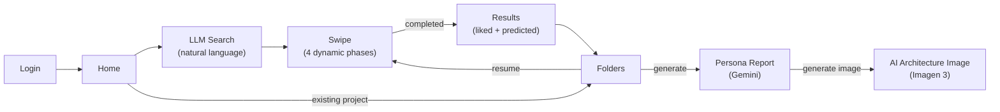
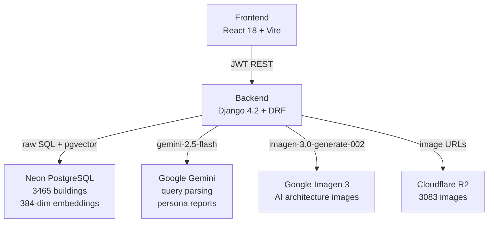
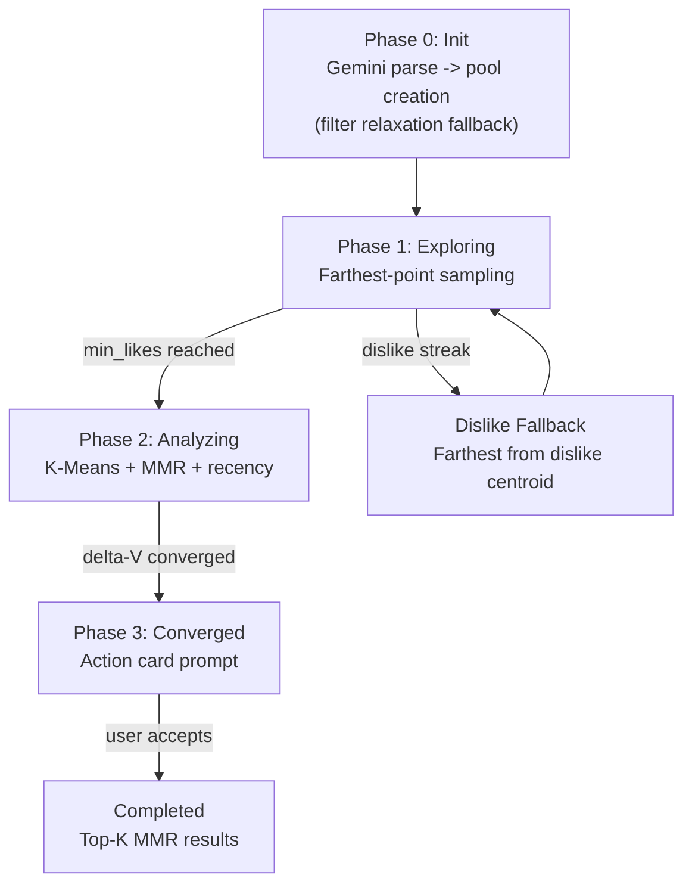
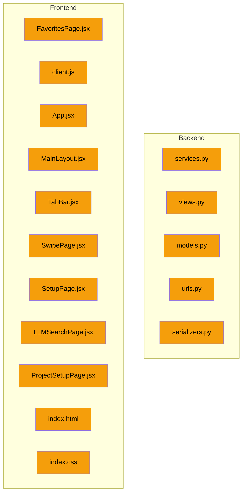

# System Report

> How the code works right now. Auto-updated by reporter after every commit.
> For what we're building: see Goal.md. For task status: see Task.md.

---

## User Flow

## System Architecture

## Algorithm Pipeline

## Backend Structure
| File | Responsibility |
|------|---------------|
| `engine.py` | Recommendation algorithm: pool creation, farthest-point, K-Means+MMR, convergence, top-K |
| `services.py` | Gemini LLM: query parsing (gemini-2.5-flash), persona report generation; Imagen 3: AI architecture image generation |
| `views.py` | All REST endpoints -- session CRUD, swipes, projects, images, auth, report image generation; `select_for_update()` on session query + `session.save()` before prefetch to prevent concurrent exposed_ids staleness |
| `config/settings.py` | RECOMMENDATION dict (12 hyperparameters), JWT config, DB config, CORS |
| `apps/accounts/views.py` | Google/Kakao/Naver OAuth, dev-login, JWT token management; all login views use `authentication_classes = []` |

## Frontend Structure
| File | Responsibility |
|------|---------------|
| `api/client.js` | API client with 10s fetch timeout, network retry (2x backoff), `normalizeCard()` field mapping, `callApi()` with JWT refresh, `socialLogin` clears stale tokens, `generateReportImage()` |
| `App.jsx` | Router, auth state, session management, project sync on login (incl. `reportImage` mapping), `initSession` stores `backendId` + `filter_relaxed`, swipe error handling, `handleImageGenerated` propagates image state |
| `SwipePage.jsx` | Card deck, swipe gestures, 3D flip, gallery, phase progress bar, "View Results" (converged/completed only), TutorialPopup, image error retry + fallback; safe-area height; 2-line title clamp |
| `TutorialPopup.jsx` | First-time user guide overlay with 4 steps, "Don't show again" checkbox (localStorage) |
| `FavoritesPage.jsx` | Project folders, persona report display with AI image generation button, "Generate Persona Report" button; safe-area height; 44px back button |
| `LLMSearchPage.jsx` | AI search input, Gemini integration; safe-area-adjusted fixed elements |
| `LoginPage.jsx` | Google auth-code flow login, `onNonOAuthError` popup handling |
| `TabBar.jsx` | Bottom navigation with safe-area-inset-bottom padding (content-box) |
| `ProjectSetupPage.jsx` | New project setup with folder name and area range; safe-area-adjusted layout |

## API Surface
| Method | Endpoint | Description |
|--------|----------|-------------|
| POST | `/api/v1/auth/social/google/` | Google login (accepts `access_token` or `code`) -> JWT |
| POST | `/api/v1/auth/token/refresh/` | Refresh access token |
| POST | `/api/v1/auth/logout/` | Blacklist refresh token |
| GET | `/api/v1/projects/` | List user's projects |
| POST | `/api/v1/projects/` | Create project |
| DELETE | `/api/v1/projects/{id}/` | Delete project |
| POST | `/api/v1/projects/{id}/report/generate/` | Generate persona report |
| POST | `/api/v1/projects/{id}/report/generate-image/` | Generate AI architecture image from persona report |
| POST | `/api/v1/analysis/sessions/` | Start swipe session (filter relaxation fallback, returns `filter_relaxed`) |
| POST | `/api/v1/analysis/sessions/{id}/swipes/` | Record swipe (dislike fallback tracks exposed_ids) |
| GET | `/api/v1/analysis/sessions/{id}/result/` | Get results |
| GET | `/api/v1/images/diverse-random/` | Get 10 diverse buildings |
| POST | `/api/v1/images/batch/` | Batch-fetch buildings by ID |
| POST | `/api/v1/parse-query/` | LLM query parsing (returns filter_priority) |
| POST | `/api/v1/auth/dev-login/` | Dev login (DEBUG-only, returns 404 without DEV_LOGIN_SECRET, rate-limited 5/min) |

## Feature Status (from checklist)

### Complete
- Google OAuth login (auth-code flow for mobile compatibility) + JWT (access 1hr, refresh 30d, blacklist)
- **Stale token defense:** frontend clears tokens before social login; backend login views skip JWT authentication
- 4-phase recommendation pipeline (exploring -> analyzing -> converged -> completed)
- Weighted scoring pool creation (CASE WHEN SQL, OR-based, filter_priority weights)
- **Filter relaxation fallback** in session creation (drop geo/numeric -> random pool)
- Gemini filter_priority end-to-end (parse-query -> session create -> pool scoring)
- LLM search seed IDs force-included in pool
- K-Means + MMR card selection with recency weighting
- **Recency weight math protection** -- `max(0, ...)` guard prevents amplification when `round_num < entry_round`
- Convergence detection via delta-V moving average
- Action card for graceful session exit with **improved messaging** (title + subtitle, clear swipe direction hints)
- **"View Results" button only shows on converged/completed phase** (not during analyzing)
- **Dislike fallback cards tracked in exposed_ids** (no card repetition)
- MMR-diversified top-k results
- Preference vector updates (like +0.5, dislike -1.0, L2-normalize)
- Natural language query parsing + persona report generation (Gemini)
- **AI architecture image generation** (Imagen 3 via google-genai SDK, base64 stored in project model)
- Project CRUD + sync from backend on login + batch-fetch building cards
- Images served from Cloudflare R2
- SwipePage (swipe gestures, 3D flip, gallery), FavoritesPage (folders, persona report + AI image)
- Dark/light theme, loading skeletons, image preloading, fullscreen gallery overlay
- Phase-aware progress bar, action card early exit, multi-step project setup
- Dev-login endpoint + debug overlay (automated testing)
- Vercel + Railway deployment configs, WhiteNoise, CORS (both :5173 and :5174)
- **Detailed error logging** for Google login failures (backend + frontend)
- **onNonOAuthError** handling for popup-blocked scenarios
- **Swipe error handling:** try-catch + 1 network retry + card revert + auto-dismissing error toast
- **API client resilience:** 10s fetch timeout (AbortController), 2x network retry with exponential backoff (300ms, 900ms)
- **Pool embedding caching:** frozenset key per pool, max 50 entries; eliminates repeated DB queries within a session
- **KMeans centroid caching:** like-vector fingerprint + round_num key, max 20 entries; skips recomputation on dislikes; n_init reduced 10->3
- **Double prefetch (2-card buffer):** backend returns `prefetch_image_2`; frontend shifts prefetch queue on each instant swap
- **Tutorial popup:** first-time SwipePage guide with 4 steps, "Don't show again" checkbox (localStorage `archithon_tutorial_dismissed`)
- **Image error handling:** retry once with `?retry=1` cache bust; fallback placeholder on permanent failure (no more infinite skeleton)
- **Swipe race condition guard (B5):** `swipeLock` useRef in `handleSwipeCard` + `onCardLeftScreen`; concurrent swipe requests blocked
- **Card overwrite fix (B6):** canInstantSwap path no longer overwrites `currentCard` when backend response diverges; prefetch queue updated only
- **Concurrent exposed_ids fix (B2v2):** `session.save()` called before prefetch calculation; `select_for_update()` on session query prevents stale reads
- **Mobile optimization (F3):** viewport-fit=cover, safe-area-inset-bottom on all pages/TabBar/fixed elements, 44px touch targets, text overflow clamp, reduced SwipePage padding

### Pending
- Kakao + Naver OAuth
- Backend integration tests

## Last Updated
- **Date:** 2026-04-04
- **Commits:** 797e619 (UX2), 3a0b305 (F3)
- **Phase:** Phase 5 New Features -- UX2 + F3 COMPLETED
- **Changes:**
  - `backend/apps/recommendation/services.py` -- `generate_persona_image()` using Imagen 3 via google-genai SDK
  - `backend/apps/recommendation/views.py` -- `ProjectReportImageView` endpoint
  - `backend/apps/recommendation/models.py` -- `report_image` TextField on Project
  - `backend/apps/recommendation/urls.py` -- `/projects/{id}/report/generate-image/` route
  - `backend/apps/recommendation/serializers.py` -- `report_image` in serializer
  - `frontend/src/pages/FavoritesPage.jsx` -- PersonaReport AI image button + display
  - `frontend/src/api/client.js` -- `generateReportImage()` function
  - `frontend/src/App.jsx` -- `handleImageGenerated`, `reportImage` mapping in project sync
  - `frontend/src/layouts/MainLayout.jsx` -- `onImageGenerated` prop pass-through
  - `frontend/index.html` -- viewport-fit=cover
  - `frontend/src/index.css` -- safe-area-bottom CSS variable
  - `frontend/src/components/TabBar.jsx` -- safe area bottom padding (content-box)
  - `frontend/src/pages/SwipePage.jsx` -- safe area height, reduced padding, title clamp
  - `frontend/src/pages/SetupPage.jsx` -- safe area height, 44px back button
  - `frontend/src/pages/LLMSearchPage.jsx` -- safe area height + fixed elements
  - `frontend/src/pages/ProjectSetupPage.jsx` -- safe area height, 44px back button

