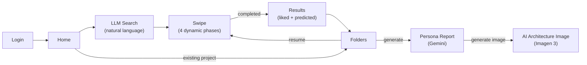
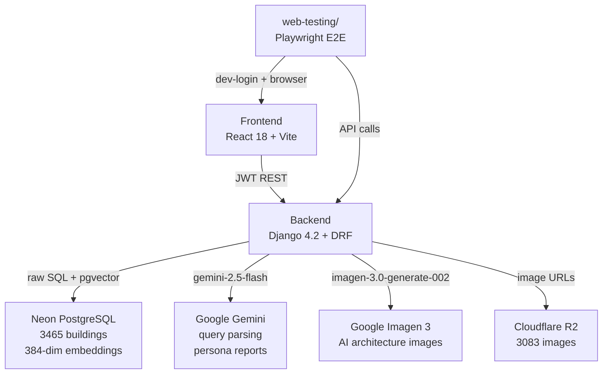
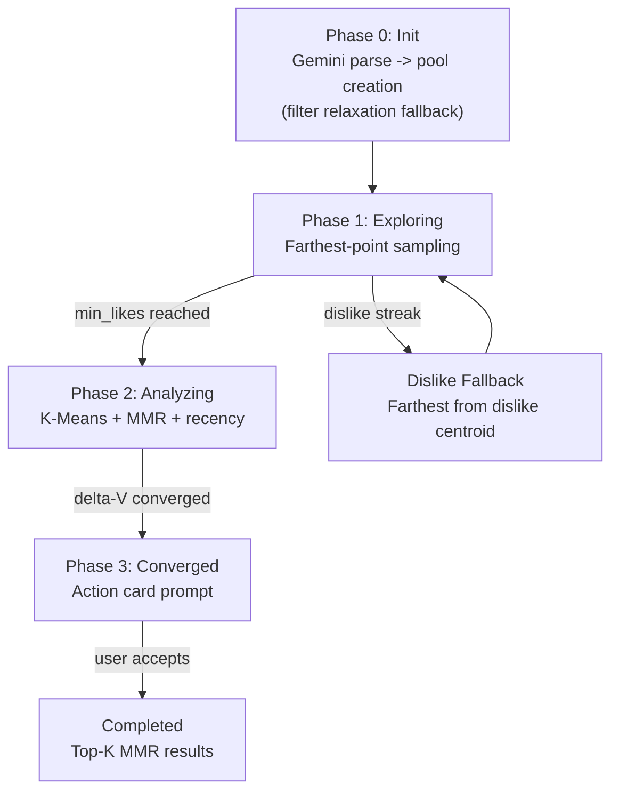
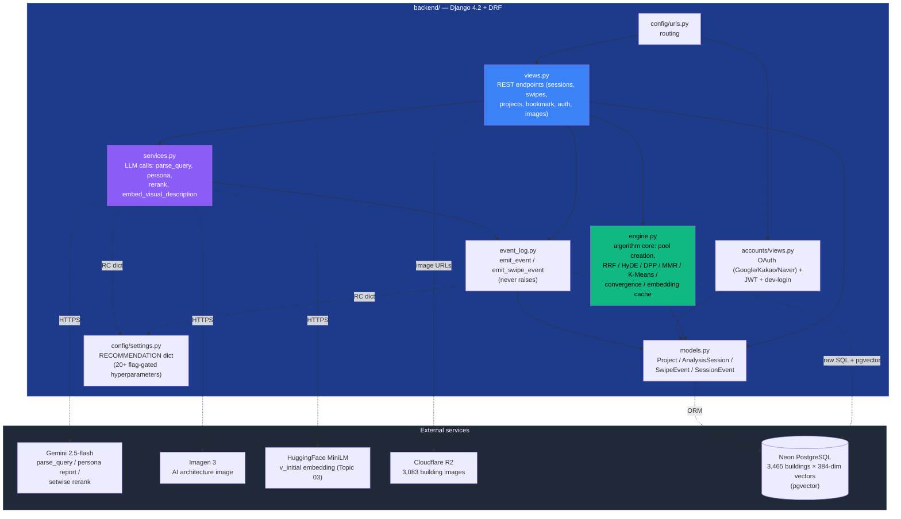
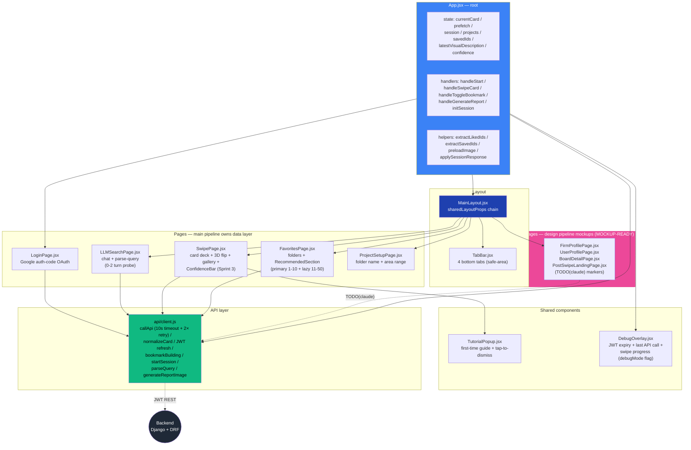
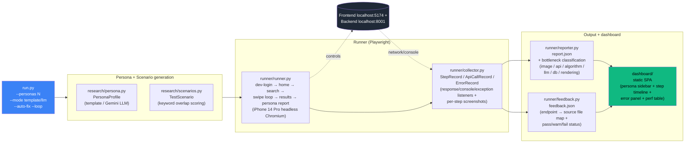
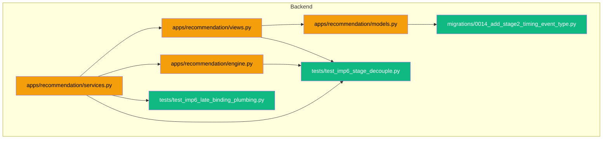

# System Report

> How the code works right now. Auto-updated by reporter after every commit.
> For what we're building: see Goal.md. For task status: see Task.md.
>
> **Format note**: each structure section has TWO views — a **Mermaid diagram first**
> (visual map for humans + first-pass agent orientation) and an **expanded prose table
> below** (full per-file responsibilities + change history annotations for agent reference
> during code work). Read the diagram for system shape; consult the table for details.

---

## User Flow


## System Architecture


## Algorithm Pipeline


## Backend Structure



**Read flow**: `views.py` is the orchestration layer — every REST request fans out to `engine.py` (algorithm), `services.py` (LLM/embedding), `models.py` (DB), and `event_log.py` (telemetry). External services are touched ONLY through `services.py` (Gemini / Imagen / HF) or `engine.py` (Postgres via raw SQL on `architecture_vectors`). Settings drive flag-gated behavior across both.

| File | Responsibility |
|------|---------------|
| `models.py` | Django ORM models: Project (liked_ids, disliked_ids, saved_ids, report, report_image, session_id), AnalysisSession (phase, pool_ids, exposed_ids, pref_vector, convergence_history, etc.), SwipeEvent (unique_together session+idempotency_key); **schema A3:** Project.liked_ids shape now list[{id, intensity}] (was list[str]); Project.saved_ids NEW (list[{id, saved_at}]) for top-K bookmark / primary-metric source; Project.disliked_ids unchanged; **A4 (§5.6/§6):** AnalysisSession gains 4 new fields (original_filters, original_filter_priority, original_seed_ids, current_pool_tier) for pool relaxation state across re-relaxation events; **A5 (§6):** new SessionEvent model (13 event types in choices, JSON payload, indexes on (session, created_at) + (event_type, created_at), user FK SET_NULL + session FK CASCADE both nullable for pre-session/pre-auth events); **Sprint 1:** SessionEvent.EVENT_TYPE_CHOICES gains 'parse_query_timing' (migration 0010 AlterField); **Topic 03 (Sprint 4):** AnalysisSession.v_initial JSONField (nullable); SessionEvent.EVENT_TYPE_CHOICES gains 'hyde_call_timing'; migration 0011 AddField + AlterField applied to dev DB; **Topic 01 (Sprint 4):** AnalysisSession.original_q_text TextField (nullable); SessionEvent.EVENT_TYPE_CHOICES gains 'hybrid_pool_timing'; migration 0012 AddField + AlterField applied to dev DB; **IMP-10 sub-task A (Spec v1.7 §11.1 + v1.8 §6):** AnalysisSession gains 3 nullable JSONFields — cosine_top10_ids, gemini_top10_ids, dpp_top10_ids (server-side-write-only, never echoed in any API response); migration 0013 AddField × 3 (all nullable, no default for existing rows); applied to dev DB **Sprint C / IMP-6 (1f55ec6 + 7348593):** `SessionEvent.EVENT_TYPE_CHOICES` gains `'stage2_timing'` choice; migration 0014 AlterField (application-level enum only — no PostgreSQL column change, fully reverse-safe). `stage2_timing` payload: 5 spec fields (`stage2_total_ms`, `gemini_visual_description_ms`, `hf_inference_ms`, `pool_rerank_ms=None`, `outcome`) + 6 diagnostic fields; 2 fields (`v_initial_ready_at_first_card`, `cards_exposed_when_ready`) deferred to Commit 3. |
| `event_log.py` | **A5:** session event log emit helpers; emit_event(event_type, session=None, user=None, **payload) never raises (failure → logger.warning + None); emit_swipe_event() convenience wrapper; per-session sequence_no for tie-break; created_at microsecond is primary order signal; **IMP-7 (Spec v1.6 §6):** emit_swipe_event signature extended with 7 optional kwargs (default None/False): cache_hit, cache_source, cache_partial_miss_count, prefetch_strategy, db_call_count, pool_escalation_fired, pool_signature_hash — backward compat preserved (existing callers pass nothing extra; new fields land on SessionEvent.payload); **IMP-10 sub-task A (Spec v1.8 §6):** NEW aggregate_session_clustering_stats(session_id) — Django ORM filter on SessionEvent (event_type='confidence_update', session_id); computes cluster_count_distribution (dict[str, int] — JSON key str-coerced for JSONField stability) + silhouette_score_p50 (float | None — median of silhouette_score values across all confidence_update events for session); used by SwipeView session_end emit; one extra SQL roundtrip at session_end is negligible; SQL-injection safe via ORM |
| `engine.py` | Recommendation algorithm: pool creation, farthest-point, K-Means+MMR, convergence, top-K; centroid cache key uses spread dimensions (0, 191, -1) for collision resistance; **pool-score normalization (Topic 12):** _build_score_cases returns 3-tuple with total_weight; create_bounded_pool divides score by total_weight via ::float cast -> [0,1] range; seed boost 1.1; **IMP-1 (Spec v1.1 §11.1):** farthest_point_from_pool max-max → max-min correctness fix (Gonzalez sampling) + NumPy batch matmul (C @ E.T) vectorization, ~22ms → ~1ms per call (20-50× speedup); signature preserved across all 12 production callers; **A4:** create_pool_with_relaxation() helper factors out 3-tier logic (full → drop geo/numeric → random) for reuse; refresh_pool_if_low() runs from SwipeView when remaining pool < 5, escalates to next tier and merges new candidates with exclude_ids = pool_ids + exposed_ids; **C-1 (Sprint 3, Investigation 13):** new compute_confidence(history, threshold, window=3) returns float [0,1] or None when n<window per Investigation 13 hide-bar semantic; threshold=0 div-by-zero guarded; **Topic 06 (Sprint 4):** adaptive_k_clustering_enabled flag → silhouette-based k {1,2} selection (threshold 0.15) via silhouette_samples + np.average weighted; soft_relevance_enabled flag → softmax-weighted relevance over centroid distances (numerically-stable). Both flags default OFF; **Topic 04 (Sprint 4):** compute_mmr_next gets λ ramp logic (λ(t) = λ_base · min(1, |exposed|/N_ref)) when mmr_lambda_ramp_enabled; new compute_dpp_topk(candidates, embeddings, q_values, k, alpha) with Wilhelm 2018 kernel (L_ii=q², L_ij=α·q_i·q_j·⟨v_i,v_j⟩) + Chen 2018 Cholesky-incremental greedy MAP O(N·k²). α clamped [0,1]. Singularity (residual<eps=1e-9) → pad q-ordered remaining. 2-phase fallback (embedding/q failure → ids[:k]; Cholesky exception → q-sorted top-k). Embeddings via get_pool_embeddings (NOT card dicts). **Composition (Sprint 4):** compute_dpp_topk gains q_override kwarg — when supplied, uses values directly (bypasses [0.4, 0.95] clip; RRF-rescaled values are already in [0.01, 1.0]); **Topic 03 (Sprint 4):** create_pool_with_relaxation + create_bounded_pool gain optional v_initial parameter; when None: byte-identical to baseline; when provided: pgvector <=> cosine sim blended via (filter_sum + hyde_weight·(1-<=>))/(total_weight+hyde_weight); all 3 HyDE SQL paths wrapped in try/except with non-recursive fallback to non-HyDE or _random_pool; failure event emitted with failure_type='hyde_pool_query'; refresh_pool_if_low passes session.v_initial to escalation calls; **Topic 01 (Sprint 4):** create_pool_with_relaxation + create_bounded_pool gain optional q_text parameter; when None and hybrid_retrieval_enabled=False (default): byte-identical to baseline; Mode H (hybrid_retrieval_enabled=True AND q_text non-empty): 4-CTE RRF SQL — candidates CTE (filter scores) → bm25_ranked CTE (ts_rank_cd on visual_description + tags + material_visual via plainto_tsquery(q_text, 'simple' dict)) → vector_ranked CTE (cosine ASC rank via embedding <=> v_initial::vector, Topic 03 v_initial reused — no extra HF call) → filter_ranked CTE → LEFT JOIN + COALESCE rrf_score = Σ 1/(k+rank_i) → ORDER BY DESC + LIMIT; channel skipping rank-level order-independent (vector channel silently omitted when v_initial=None; filter channel controlled by hybrid_filter_channel_enabled); Mode V falls through when Mode H gates fail and v_initial provided; Mode F (baseline) when no v_initial, no q_text; Mode H wrapped in try/except with 'failure' SessionEvent (failure_type='hybrid_pool_query', recovery_path='no_hybrid') + non-recursive inline fallback to Mode V/F; refresh_pool_if_low passes session.original_q_text to escalation calls for RRF persistence across pool exhaustion tier escalation; **IMP-7 (Spec v1.6 §11.1):** _pool_embedding_cache refactored from frozenset(pool_ids)-keyed (invalidated on every A4 escalation) to _building_embedding_cache: dict[building_id → np.ndarray L2-normalized 384-dim] (corpus-immutable, partial-miss path: only newly-added building_ids fetched from DB; hits accumulate over session lifetime across pool exhaustion escalations). FIFO eviction at _BUILDING_CACHE_MAX_SIZE wired via RC.get('pool_embedding_cache_max_size', 5000) — runtime-configurable. get_last_embedding_call_stats() returns per-call {hits, misses} dict; read by SwipeView immediately after get_pool_embeddings call (no race window). precompute_pool_embeddings(pool_ids) no-op gate reserved for IMP-8 async background warming (pool_precompute_enabled=False flag); **IMP-10 sub-task A (Spec v1.7 §11.1 + v1.8 §6):** NEW compute_corpus_rank(card_id, v_initial) — pgvector ROW_NUMBER OVER (ORDER BY embedding <=> %s::vector ASC) single query returns int rank (1=closest); SQL-injection safe via _vec_to_pg + parameterized %s; returns None on (no v_initial / SQL exception / card not found / wrong dim) — bookmark always succeeds regardless; NEW module-level _last_clustering_stats set by compute_taste_centroids (cluster_count_used int 1-or-2, silhouette_score float|None, soft_relevance_used bool, n_likes_at_decision int); get_last_clustering_stats() reads module-level state immediately after centroid call (no race window — same IMP-7 pattern); 3-tuple centroid cache extended to persist stats across cache hits **Sprint C / IMP-6 (1f55ec6 + 7348593):** NEW `_rank_with_v_initial(pool_ids, v_initial, exclude_ids)` — Commit 1 was pass-through placeholder returning `pool_ids`; Commit 2 replaced with real cosine-similarity ranking using `get_pool_embeddings` (IMP-7 cache, L2-normalized so cosine = dot product); defensive on None vector / empty pool / zero norm / missing embeddings. NEW `rerank_pool_with_v_initial(session, exposed_ids, initial_batch_ids)` — real plumbing with bounded scope `pool_ids \ (exposed_ids ∪ initial_batch_ids)` per Inv 17 §3d; has real cosine logic via `_rank_with_v_initial` in Commit 2 but NO production callers yet — `TODO(IMP-6 Commit 3)` marker for Regime 2/3 deferred. |
| `services.py` | Gemini LLM: query parsing (gemini-2.5-flash), persona report generation; Imagen 3: AI architecture image generation; retry wrapper with 1-retry + logging; **A5:** failure events emitted in parse_query + generate_persona_report exception handlers (4 call sites; error_message truncated to 200 chars to prevent traceback leakage); **Sprint 1 §3:** _CHAT_PHASE_SYSTEM_PROMPT replaces _PARSE_QUERY_PROMPT (Investigation 06 full system prompt + 9 few-shot examples); parse_query(conversation_history) multi-turn signature with backward-compat shim for legacy string; thinking_budget=0 on parse_query AND generate_persona_report (Spec v1.3 §11.1 IMP-4 push-gate-blocker fix); parse_query_timing event emitted after each Gemini call; **Topic 02 (Sprint 4):** rerank_candidates(candidates, liked_summary) + _liked_summary_for_rerank(session) helpers. _RERANK_SYSTEM_PROMPT + 5 few-shot examples lifted from Investigation 12 (English-only). thinking_budget=0 (IMP-4) + temperature=0.0 + JSON mime. Validation: set equality + length. Failure cascade: parse fail / partial / extra / duplicate / exception → emit failure event with failure_type='gemini_rerank' recovery_path='cosine_fallback' + return input order. Cross-session liked_summary truncated to most recent MAX_ENTRIES (recency); **Topic 03 (Sprint 4):** NEW embed_visual_description(text, session) — stdlib urllib HF Inference API call to paraphrase-multilingual-MiniLM-L12-v2 (384-dim); handles 1D + 2D HF response shapes; explicit urllib.error.HTTPError class capture (e.code preserved, body truncated 200 chars); failure cascade per spec §5.4: returns None on any failure + emits 'failure' SessionEvent with failure_type='hyde'; empty/None text short-circuits with no event emission; **IMP-5 (Spec v1.5 §11.1, c133787):** NEW `_ensure_chat_cache(client)` module-level lazy initializer — when `context_caching_enabled=False` (default) returns None immediately (no API/cache calls; clean fast-path); when True: content-hash cache name `archi-tinder-chat-{sha256(_CHAT_PHASE_SYSTEM_PROMPT)[:8]}` (load-bearing: prompt change → hash change → forced recreate), Django cache key identical; **80% Django TTL invariant** — `int(gemini_ttl * 0.8)` so Django always expires before Gemini (no stale-name 404 → no double-retry round-trip waste; 20% window absorbs SDK clock drift); on Gemini 404/exception: invalidate Django cache + log + recreate; on create failure: return None (caller falls back to system_instruction= path). parse_query integration: when cache_name available → GenerateContentConfig(cached_content=cache_name, ...) with system_instruction NOT passed (it's in cache); when None (flag OFF / failure) → existing system_instruction= path (byte-identical to pre-IMP-5). **parse_query_timing event 4 new fields per Spec v1.5 §6:** cache_hit (bool|None — True when usage_metadata.cached_content_token_count > 0), cached_input_tokens (int|None — from usage_metadata.cached_content_token_count), cache_name_hash (8-char SHA-256 prefix, PII-safe), caching_mode ('explicit'|'none'); existing 6 base fields preserved (gemini_total_ms / gemini_ttft_ms / gemini_gen_ms / gemini_input_tokens / gemini_output_tokens / gemini_thinking_tokens); **Sprint A Track 2 (Spec v1.9 M4, 834d36e):** NEW `_classify_query_complexity(raw_query)` heuristic — returns `'brutalist'` (≥3 token hits) / `'narrow'` (1-2) / `'barequery'` (0) / `'unknown'` (empty/None). 113 architectural domain tokens across 4 frozensets: STYLE_TOKENS (28, en+ko style labels incl. brutalist/modernist/역사주의…), PROGRAM_TOKENS (45, all 14 normalized program values + their Korean equivalents), MATERIAL_TOKENS (25, concrete/glass/steel/나무… + material_visual vocab), ADJECTIVE_TOKENS (15, spatial quality adjectives). Lookup: token in raw_query.lower() for single-word tokens; substring check for multi-word ('mixed use', 'rammed earth'). parse_query_timing SessionEvent payload extended with 2 additive fields: `clarification_fired` (bool|None — True when probe_needed=True from Gemini response field, authoritative not heuristic; False on terminal answer path; None when Gemini JSON malformed) + `query_complexity_class` (str — classifier output above). No migration (SessionEvent.payload is JSONField). Investigation 22 Phase 1 passive data accumulation unblocked (was permanently blocked without M4). Reviewer MINORs (6, non-blocking): split regex includes `-` (avant-garde/high-tech ~11% partially unreachable), multi-word tokens dead code (only substring path), final elif cosmetic unreachable, Korean '역사' ambiguous (station/history), doc count drift (claimed 110, actual 113 with union 112), vocab reconciliation across 3 sources routed to research as R-vocab-reconciliation. **Sprint B / Investigation 22 M1 refined (1b2bd21):** THREE-LAYER clarification cap — (1) PROMPT: NEW HARD CAP clause in `_CHAT_PHASE_SYSTEM_PROMPT` after existing 0/1/2-turn budget rule (tells Gemini to never ask 3rd clarifying question, overrides ALL other heuristics); (2) PYTHON SAFEGUARD: `parse_query()` post-parse check — `_user_turn_count = sum(1 for t in conv_hist if t.get('role') == 'user')`, if `>= 3` AND `probe_needed is True`: force `False` + single `logger.warning`; (3) TELEMETRY: NEW `m1_cap_forced_terminal: bool` field on `parse_query_timing` payload (True iff Python override fired; always bool never None). Threshold `>= 3` explicitly preserves Investigation 06 BareQuery 2-turn design intent (bare-string legacy → user_turn_count=1, cap never fires). UX trade-off: cap-fired terminal yields short ack reply + `visual_description` likely None + partial filters; HyDE V_initial skips cleanly on None. Cap-fire-rate observable via telemetry. Backward compat: 315 baseline tests preserved; JSONField payload addition is additive (no migration). **Sprint C / IMP-6 (1f55ec6 + 7348593):** NEW `parse_query_stage1()` — Stage 1 sync Gemini call using `_STAGE1_RESPONSE_SCHEMA` (Approach A schema enforcement — structurally excludes `visual_description` at Gemini generation time, not post-parse); output ~150-220 tokens (vs prior ~290-400); emits `parse_query_timing` with `stage='1'`; all IMP-4/IMP-5/M4/M1 behaviors preserved on ON path. NEW `generate_visual_description(raw_query, user, session)` — Stage 2 async function (~140-180 output tokens); calls existing Topic 03 `embed_visual_description` (HF Inference API, NOT a new dependency) + `set_cached_v_initial`; emits `stage2_timing` event; all exceptions caught — Stage 2 never propagates errors to user. NEW `_v_initial_cache_key(user_id, raw_query)` key `v_initial:{user_id}:{sha256(raw_query)[:16]}`. NEW `get_cached_v_initial` / `set_cached_v_initial` Django cache helpers (1h TTL). `parse_query()` dispatcher: when `stage_decouple_enabled=True` delegates to `parse_query_stage1()`; else existing path (byte-identical). |
| `views.py` | All REST endpoints -- session CRUD, swipes, projects, images, auth, report image generation; `select_for_update()` on session query + `session.save()` before prefetch to prevent concurrent exposed_ids staleness; persona report returns structured errors (502 with error_type); building_id validation returns 400; prefetch computed outside transaction.atomic(); pool_embeddings cached across transaction boundary (no redundant fetch for prefetch); dislike embeddings batch-fetched via get_pool_embeddings; **convergence signal integrity (Topic 10 Option A):** exploring -> analyzing transition clears `convergence_history` + `previous_pref_vector` (prevents cross-metric centroid-vs-pref_vector Delta-V); analyzing-phase Delta-V appended on every swipe (not gated by action == like) so `convergence_window` counts rounds, not likes; **A3:** _liked_id_only(liked_ids) helper handles legacy and new shape; swipe like-write appends {id, intensity} dict with optional intensity from request body (clamped [0,2], default 1.0); persona report path extracts plain IDs via helper; **A4:** SessionCreateView inline 3-tier replaced with engine.create_pool_with_relaxation() call (identical behavior); SwipeView calls refresh_pool_if_low() in normal swipe path AND action-card "Reset and keep going" branch (§5.6 "더 swipe" exhaustion most likely there); update_fields extended with pool_ids, pool_scores, current_pool_tier; **A5:** session_start + pool_creation events emitted in SessionCreateView; swipe event with timing_breakdown (lock_ms / embed_ms / select_ms / prefetch_ms / total_ms via _mark closure) emitted in SwipeView normal path; session_end emitted on action-card accept (end_reason='user_confirm'); **Sprint 1:** ParseQueryView accepts conversation_history list OR legacy query string; defensive input validation (history > 10 → 400, text > 2000 → 400, non-dict items → 400, role ∉ {user,model} → 400); **C-1:** SwipeView includes 'confidence' field in response (all 3 paths: normal-swipe computed, action-card reset null, action-card complete null); confidence_update event emitted when non-null with payload {confidence, dominant_attrs, action} (Spec v1.2 dislike-bias telemetry); **Topic 02:** SessionResultView gates on gemini_rerank_enabled flag + len(predicted_cards)>=2; reorders predicted_cards via card_by_id dict reconstruction with foreign-id guard; **Topic 04:** SessionResultView DPP block runs AFTER Topic 02 rerank (preserves cosine→rerank→DPP composition order). Gated on dpp_topk_enabled + len>=2 + session.like_vectors. import numpy hoisted to module top. **Topic 02 ∩ 04 composition (Investigation 07):** SessionResultView captures candidate_ids_cosine_order BEFORE reorder + rerank_rank_by_id sentinel. When both flags on, RRF fuse → min-max rescale to [0.01, 1.0] → DPP q_override. Failure cascade: rerank returning input order = sentinel stays None = DPP falls back to cosine q. **Sprint 4 §8 bookmark:** NEW ProjectBookmarkView (toggle save/unsave on saved_ids, idempotent, IDOR-safe ownership filter, rank_zone + provenance SessionEvent, ValidationError + timezone hoisted to module-level); **Topic 03 (Sprint 4):** SessionCreateView reads visual_description from request body (str + ≤5000 chars validation; silent coerce to None on invalid — security defense vs HF API cost amplification), calls embed_visual_description when hyde_vinitial_enabled, stores v_initial on session; session_start event populated with visual_description + v_initial_success (pre-existing # Topic 03 placeholder comments now wired); **Topic 01 (Sprint 4):** SessionCreateView reads query from request body (already present as raw_query feed); validates ≤1000 chars (security defense vs BM25 DoS amplification); threads as q_text into engine when hybrid_retrieval_enabled=True AND q_text non-empty; stores original_q_text on session for pool exhaustion escalation persistence; **IMP-7 (Spec v1.6 §6):** SwipeView.post captures _tier_before_refresh for pool_escalation_fired detection (compare tier after refresh_pool_if_low); reads get_last_embedding_call_stats() immediately after get_pool_embeddings call; computes pool_signature_hash as 16-char SHA-256 truncation of sorted pool_ids hex digest; passes all 7 §6 telemetry fields (cache_hit, cache_source, cache_partial_miss_count, prefetch_strategy, db_call_count, pool_escalation_fired, pool_signature_hash) to emit_swipe_event; **IMP-10 sub-task A (Spec v1.7 §11.1 + v1.8 §6):** SessionResultView now stores cosine_top10_ids + gemini_top10_ids + dpp_top10_ids onto session after each ranking channel runs — cosine always (baseline top-K before rerank/DPP), gemini_top10 set when rerank ran (provenance = "Gemini ranked it" — independent of whether order changed, per cycle 1 fix; the rerank_rank_by_id RRF sentinel still guards DPP q-override composition separately), dpp_top10 only when DPP ran; ProjectBookmarkView now reads real rank_corpus via engine.compute_corpus_rank(card_id, session.v_initial) when session.v_initial present (HyDE flag was on), falls back to None otherwise; provenance booleans populated from session's 3 top-10 lists (pre-migration sessions get None lists → all-False, same as before; new sessions get accurate provenance); SwipeView confidence_update event payload extended with 4 new fields from get_last_clustering_stats(): cluster_count_used, silhouette_score, soft_relevance_used, n_likes_at_decision; session_end event payload extended with 2 aggregated fields from event_log.aggregate_session_clustering_stats(): cluster_count_distribution, silhouette_score_p50; **IMP-8 (Spec v1.6 §11.1, 1491c5d):** NEW module-level `_async_prefetch_thread()` function: connection.close() at start + finally (drop parent's thread-local DB conn; also closes bg thread's conn in finally); receives snapshot args as deep copies (exposed_ids, pool_ids, pool_scores, like_vectors, current_pool_tier — NOT session object, avoids mutation race); computes prefetch_card + prefetch_card_2 via engine.compute_mmr_next + engine.get_building_card; writes to django.core.cache (key=`prefetch:{session_id}:{cache_round}` where cache_round = saved_current_round + 1, value={prefetch_card_id, prefetch_card_2_id, computed_at:ISO}, timeout=async_prefetch_cache_timeout_seconds); try/except wraps all bg work — exceptions logged as warning, not propagated (primary path is source of truth); SwipeView.post spawns daemon thread when async_prefetch_enabled=True; when async path: prefetch_card=None, prefetch_card_2=None in response (normalizeCard(null) → null at client.js:135); prefetch_strategy='async-thread' set BEFORE emit_swipe_event call (IMP-7 §6 telemetry field — was always 'sync' before, now accurate when async runs); when flag OFF (default): existing sync prefetch_card+_2 path runs unchanged **Sprint C / IMP-6 (1f55ec6 + 7348593):** NEW module-level `_spawn_stage2(raw_query, user, session)` — `threading.Thread(daemon=True)`, `finally: connection.close()` per IMP-8 pattern, fire-and-forget. `ParseQueryView.post()` spawns Stage 2 after `parse_query_stage1` returns on terminal turn (`probe_needed=False`); clarification turns skip spawn (filters unstable until terminal). `SessionCreateView.post()` gains 3-way branching gate: `if stage_decouple_enabled` reads V_initial from `get_cached_v_initial` (graceful fallback to filters-only on cache miss); `elif hyde_vinitial_enabled` existing Topic 03 sync HF path; `else` legacy path. `_raw_query_early` extraction moved earlier in `post()` flow (load-bearing for IMP-6 ON path). |
| `config/settings.py` | RECOMMENDATION dict (12 hyperparameters, `max_consecutive_dislikes=5`), JWT config, DB config (CONN_MAX_AGE=600), CORS; uses STORAGES dict (Django 4.2+ format) for WhiteNoise static files; **Topic 06:** RECOMMENDATION dict gains adaptive_k_clustering_enabled + soft_relevance_enabled (both default False); **Topic 02:** RECOMMENDATION dict gains gemini_rerank_enabled (default False); **Topic 04:** RECOMMENDATION dict gains 5 entries (mmr_lambda_ramp_enabled F, mmr_lambda_ramp_n_ref 10, dpp_topk_enabled F, dpp_alpha 1.0, dpp_singularity_eps 1e-9); **Topic 03:** RECOMMENDATION dict gains hyde_vinitial_enabled=False, hyde_hf_model='sentence-transformers/paraphrase-multilingual-MiniLM-L12-v2', hyde_hf_timeout_seconds=5, hyde_score_weight=50.0; HF_TOKEN loaded from os.getenv('HF_TOKEN', ''); **Topic 01:** RECOMMENDATION dict gains hybrid_retrieval_enabled=False (CRITICAL: default OFF for backward compat), hybrid_rrf_k=60 (Cormack et al. 2009), hybrid_bm25_dict='simple' (multilingual-safe, no per-locale stemming), hybrid_filter_channel_enabled=True; **IMP-7 (Spec v1.6 §11.1):** RECOMMENDATION dict gains pool_precompute_enabled=False (no-op gate, reserved for IMP-8 async warming), pool_embedding_cache_max_size=5000 (wired to _BUILDING_CACHE_MAX_SIZE via RC.get — runtime-configurable, ~5MB max at 5000 entries); **Spec v1.8 Topic 06 N≥4 cliff mitigation (da547cb):** min_likes_for_clustering 3 → 4 (cross-ref comment to Spec v1.8 Topic 06 status annotation + Investigation 21 §closure mitigation task + Investigation 09 worst-case window pathology; two-threshold distinction: this gate = K-Means activation, engine.py:1085 hardcoded gate = adaptive-k routing within K-Means, UNCHANGED); **IMP-8 (Spec v1.6 §11.1, 1491c5d):** RECOMMENDATION dict gains async_prefetch_enabled=False (CRITICAL: default OFF for safe rollout — flag-gates the background-thread prefetch path) + async_prefetch_cache_timeout_seconds=60 (TTL for prefetch cache entries written to django.core.cache); comment near CACHES setting documents LocMemCache vs Redis trade-off (single-worker dev OK; multi-worker prod should swap to django-redis, settings-only change); **IMP-5 (Spec v1.5 §11.1, c133787):** RECOMMENDATION dict gains context_caching_enabled=False (CRITICAL: default OFF — flag-gates the Gemini explicit context caching path; flip to True for production after multi-worker Redis backend swap) + context_caching_ttl_seconds=3600 (1h Gemini TTL; Django cache TTL computed as int(3600 * 0.8) = 2880s per 80% invariant); CACHES comment block now documents BOTH IMP-5 AND IMP-8 LocMemCache→Redis swap requirement for multi-worker prod (settings-only swap, no code touch — same swap satisfies both IMPs simultaneously) |
| `apps/recommendation/management/commands/validate_imp5.py` | NEW (6604296) Django management command for IMP-5 Tier 2 staging validation: `--mode={cached,control,both}` A/B comparator; Phase A (flag OFF) baseline + Phase B (flag ON) measurement + computed A/B delta; stdout markdown report + gitignored `backend/_validation_imp5.md` artifact; ORM-only queries (no SQL injection risk); flag restored in finally block. Empirical result (--mode=both, same-session 90s): 5.5% drop vs spec ≥50% predicted — mechanism verified, spec prediction invalidated. |
| `apps/recommendation/migrations/0014_add_stage2_timing_event_type.py` | **Sprint C / IMP-6 NEW (7348593):** `AlterField` on `SessionEvent.EVENT_TYPE_CHOICES` — adds `'stage2_timing'` choice; application-level enum only, no PostgreSQL column change, no data migration, fully reverse-safe. Prerequisite for `stage2_timing` events emitted by `generate_visual_description()` Stage 2 thread. |
| `apps/accounts/views.py` | Google/Kakao/Naver OAuth, dev-login, JWT token management; all login views use `authentication_classes = []` |
| `tests/conftest.py` | pytest fixtures: SQLite in-memory DB override, user_profile, auth_client, api_client |
| `tests/test_auth.py` | 7 auth integration tests (Google login mock, token refresh, logout, dev-login) |
| `tests/test_sessions.py` | 18+ session lifecycle tests (creation, swipes, idempotency, phase transitions, client-buffer merge, state resume, convergence signal integrity, pool-score normalization, project schema A3) with mocked engine.py; includes `TestConvergenceSignalIntegrity` for Topic 10 Option A fixes, `TestPoolScoreNormalization` for Topic 12 normalization, `TestProjectSchemaA3` (6 tests: like intensity dict, explicit intensity, clamp, legacy/new shape helper, saved_ids default, saved_ids serialized), `TestFarthestPointFromPool` (5 tests: max-min regression counterexample, none on no candidates, random on no exposed, skip missing embeddings, random when all exposed missing), `TestPoolExhaustionGuard` (5 tests: no-op above threshold, tier 1→2 escalate, tier 3 no-op, exclude exposed, fall-through to tier 3), and `TestSessionEventLogging` (5 tests: create + never-raise + sequence_no per session + integration session_create + integration swipe with timing); 54 total tests pass; **Topic 03:** 3 mock signatures updated to **kwargs for backward compat with new v_initial kwarg; **Spec v1.8 Topic 06 N≥4 cliff mitigation (da547cb):** NEW TestSpecV18Topic06N4Mitigation class (2 tests: test_n3_skips_kmeans_per_v18_mitigation — phase stays 'exploring' at N=3; test_n4_triggers_kmeans_per_v18_threshold — phase flips to 'analyzing' at N=4); existing K-Means activation tests updated (2 minor changes: range(3) → range(4) to match new threshold, semantics preserved) |
| `tests/test_projects.py` | 8 project + batch tests (CRUD, pagination, auth, building batch) |
| `tests/test_chat_phase.py` | **Sprint 1 NEW (10 tests):** TestChatPhaseParseQuery (5 tests: terminal 4-field, probe shape, multi-turn history, legacy string compat, Gemini failure + failure event); TestPreDeployStyleLabelGate (1 test: corpus label verification, skips on SQLite); TestGeneratePersonaReportThinkingBudget (1 test: thinking_budget=0); TestParseQueryTimingEvent (1 test: event emitted with usage_metadata); TestParseQueryInputValidation (2 tests: long history + invalid role 400) |
| `tests/test_confidence.py` | **C-1 NEW (12 tests, 1 commit):** TestConfidenceBar — Investigation 13 anchor values + window slicing + threshold guard + integration response (3 paths) + event emission |
| `tests/test_topic06.py` | **Topic 06 NEW (9 tests):** TestTopic06AdaptiveK — adaptive-k flag default + low/high silhouette branches + N<4 fallback + N=4 boundary + N=1 early return + soft-relevance default + enabled multi-centroid + single-centroid equivalence |
| `tests/test_topic02.py` | **Topic 02 NEW (16 tests):** TestRerankCandidates (14 unit: validation paths, failure cascade, prompt format, intensity tags, recency truncation) + TestSessionResultViewRerank (2 DB integration: flag-gated reorder + default-off no-op). |
| `tests/test_topic04.py` | **Topic 04 NEW (15 tests):** TestMmrLambdaRamp (4), TestDppTopK (7: empty/N<=k/α=0/α=1/singularity/exception/clamping), TestSessionResultDppIntegration (3: off/on/empty-likes-skip), + 1 early-return. |
| `tests/test_topic_composition.py` | **Composition NEW (5 tests):** TestTopic02DppComposition — both-on RRF q, rerank-off cosine q, rerank-returns-input fallback, q in [0.01, 1.0], all-equal RRF edge. |
| `tests/test_bookmark.py` | **Sprint 4 §8 NEW (20 tests):** TestBookmarkEndpoint -- save updates saved_ids; save idempotent; unsave removes; unsave on missing is no-op; invalid action/rank/card_id → 400; rank_zone 'primary' for rank<=10 / 'secondary' for rank>10; 404 on other-user project (IDOR guard); provenance defaults False. 144 total pass + 1 skipped. |
| `tests/test_hyde.py` | **Topic 03 NEW (22 tests, 5 classes):** TestEmbedVisualDescription — happy path 1D response, happy path 2D response; TestEmbedVisualDescriptionFailures — HTTPError 503, HTTPError 401, URLError, TimeoutError, JSONDecodeError, wrong response shape; TestEmbedVisualDescriptionFlagGating — flag OFF + visual_description in body → no HF call; TestSessionCreateViewHyDE — view-layer integration (flag ON path); TestHyDEInputValidation — oversized input (>5000 chars → no embed call), non-string input → coerce to None. 166 total pass + 1 skipped (+22 from baseline 144). |
| `tests/test_hybrid_retrieval.py` | **Topic 01 NEW (34 tests):** Mode dispatch (flag-OFF no-op, q_text-None no-op, flag-ON q_text-present → Mode H, flag-ON v_initial-None → BM25-only fallback, empty q_text → no Mode H); BM25 channel isolation; vector channel isolation (v_initial probe reuse from Topic 03); filter channel gating (hybrid_filter_channel_enabled=False → channel omitted); RRF fusion formula (Σ 1/(k+rank_i), k=60 default); try/except fallback to Mode V/F with 'failure' SessionEvent (failure_type='hybrid_pool_query', recovery_path='no_hybrid'); q_text ≤1000 char validation in SessionCreateView; original_q_text stored on session; refresh_pool_if_low forwards original_q_text on escalation; backward-compat sentinel (all Topic 03 (22) + all baseline (144) tests still pass). 200 total pass + 1 skipped (+34 new). |
| `tests/test_imp7_pool_cache.py` | **IMP-7 NEW (22 tests):** cache basics (hit/miss counts, L2-normalization invariant, FIFO eviction at max_size); critical regression test `TestEscalationCacheRetention` — pool growth [id1,id2,id3]→[id1..id5] produces 3 hits + 2 misses (NOT full invalidation as with old frozenset behavior); precompute helper (no-op gate); session-creation natural warming path; all 7 §6 telemetry fields present in swipe event payload; pool_escalation_fired flag in both directions. 200 → 222 pass + 1 skipped (+22 new). All 200 prior tests pass without modification — backward-compat confirmed. |
| `tests/test_imp10_topic06_telemetry.py` | **IMP-10 sub-task A + Topic 06 NEW (36 tests, 9 classes):** TestCorpusRankHelper (compute_corpus_rank happy path / no v_initial / SQL exception / card not found / wrong dim); TestComputeTasteCentroidsStats (_last_clustering_stats fields set correctly, cache hit restores stats); TestBookmarkRankCorpusFilling (rank_corpus filled when v_initial present, None when absent); TestBookmarkProvenance (cosine/gemini/dpp top-10 read from session, pre-migration None → all-False); TestSessionResultViewStoresTop10s (cosine always set, gemini_top10 set when rerank ran even if order unchanged — cycle 1 fix, dpp_top10 only when DPP ran); TestConfidenceUpdate4NewFields (4 new fields in event payload); TestSessionEndAggregationUnit (aggregate_session_clustering_stats math); TestSessionEndAggregationDB (session_end 2 new fields integration); TestBackwardCompat (222 baseline preserved, pre-migration sessions degrade gracefully). 222 → 258 pass + 1 skipped (+36 new). |
| `tests/test_imp8_async_prefetch.py` | **IMP-8 NEW (21 tests, 6 classes):** TestFlagGating (flag OFF → sync path, prefetch_strategy='sync'; flag ON → async path, prefetch_strategy='async-thread', prefetch_card=None in response); TestAsyncThreadComputesPrefetch (direct call to _async_prefetch_thread with connection.close patched — verifies cache write occurs, key format=`prefetch:{session_id}:{round}`, value contains expected prefetch_card_id + prefetch_card_2_id); TestAsyncThreadFailureGraceful (mock engine raises inside bg thread → primary swipe response still 200, exception logged not propagated); TestConnectionClosureOnExit (spy connection.close at start + in finally block); TestBackwardCompat (all 260 baseline tests pass; flag OFF byte-identical to pre-IMP-8); test_analyzing_phase_uses_compute_mmr_next + test_bg_thread_exception_swallowed_not_raised for coverage. Infrastructure: `_NoopThread` for SwipeView integration tests (records construction, never executes target, avoids bg thread closing test's live DB connection); direct-call tests patch connection.close to no-op; setup_method cache.clear() prevents LocMemCache pollution across tests. 260 → 281 pass + 1 skipped (+21 new). No migration. |
| `tests/test_imp5_context_caching.py` | **IMP-5 NEW (20 tests, 5 classes):** TestEnsureChatCacheLazyInit (flag OFF → returns None immediately / Django cache hit → returns name without Gemini call / Gemini validate OK → returns name + sets Django cache / Gemini 404 → invalidate Django + recreate / create failure → returns None); TestParseQueryWithCaching (cache_name set → cached_content in GenerateContentConfig, system_instruction NOT passed / cache_name None → existing system_instruction= path, byte-identical to pre-IMP-5); TestParseQueryTimingEventExtended (4 new fields in event: cache_hit, cached_input_tokens, cache_name_hash, caching_mode); TestContentHashInvalidation (prompt change → different hash → forced recreate, old name invalidated); TestBackwardCompat (all 281 baseline tests pass; flag OFF is byte-identical to pre-IMP-5). 281 → 301 pass + 1 skipped (+20 new). No migration. |
| `tests/test_m4_clarification_telemetry.py` | **Sprint A Track 2 NEW (14 tests, 2 classes):** TestQueryComplexityClassifier (10 unit tests: brutalist/narrow/barequery/unknown class thresholds; style/program/material token coverage; Korean token hits; multi-word token substring check; empty/None edge cases); TestM4PayloadFields (4 DB integration tests: clarification_fired=True when probe_needed; clarification_fired=False on terminal answer; query_complexity_class='brutalist' on qualifying query; both fields present in persisted parse_query_timing SessionEvent payload). 301 → 315 pass + 1 skipped (+14 new). No migration. No settings.py change. |
| `tests/test_m1_clarification_cap.py` | **Sprint B M1 NEW (13 tests):** test_cap_does_not_fire_on_first_user_turn (bare string + list), test_cap_does_not_fire_on_second_user_turn (BareQuery preserve), test_cap_fires_on_third_user_turn_when_gemini_ignores, test_cap_inactive_on_third_turn_when_gemini_returns_terminal, test_cap_preserves_brutalist_zero_turn_pattern, test_alternating_user_model_counting_correctness, test_cap_telemetry_field_present_in_payload (True/False cases), test_M4_telemetry_coexistence (additive on parse_query_timing), test_cap_does_not_affect_filters_shape_when_gemini_returns_partial_filters. 315 → 328 pass + 1 skipped (+13 new). All 315 baseline tests preserved. |
| `tests/test_imp6_late_binding_plumbing.py` | **Sprint C / IMP-6 Commit 1 NEW (1f55ec6):** Plumbing tests for V_initial cache helpers (`_v_initial_cache_key` key format, `get_cached_v_initial` miss/hit, `set_cached_v_initial` TTL), `_rank_with_v_initial` pass-through placeholder (returns input ids when flag OFF), `rerank_pool_with_v_initial` scaffold (no production callers), `_spawn_stage2` flag-gate (flag OFF → no thread spawned). 328 → 354 pass + 1 skipped (+26 new). 4 simulation tests later removed in Commit 2 (superseded by real integration tests in test_imp6_stage_decouple.py). |
| `tests/test_imp6_stage_decouple.py` | **Sprint C / IMP-6 Commit 2 NEW (7348593):** Integration tests for `parse_query_stage1` schema enforcement (visual_description excluded from Gemini output), `generate_visual_description` happy path + failure cascade (all exceptions caught), Stage 2 spawn on terminal turn, spawn skip on clarification turn (`probe_needed=True`), `_rank_with_v_initial` real cosine logic (L2-normalized dot product, None/empty/zero-norm defensive), `SessionCreateView` branching gate (stage_decouple ON with cache hit / ON with cache miss / OFF fallback to legacy), `stage2_timing` event payload fields (5 spec + 6 diagnostic). 354 → 381 pass + 1 skipped (+31 new, −4 removed simulation from Commit 1 = +27 net). All Sprint B / A / Sprint 4 baseline tests preserved. |

## Frontend Structure



**Layer ownership** (designer vs main per CLAUDE.md):
- **UI layer** (JSX styles, animations, colors, layout, `MOCK_*`): `designer` agent in design terminal — owns all `frontend/src/pages/*.jsx` UI sections.
- **Data layer** (`useState`, `useEffect`, `callApi`, hooks, error handling): `front-maker` in main pipeline — wires up the data flow.
- Same `.jsx` file may be touched by both terminals; Git's 3-way merge handles per-line splits.
- Reciprocal `TODO(claude):` (design → main) and `TODO(designer):` (main → design) markers coordinate cross-terminal asks.

| File | Responsibility |
|------|---------------|
| `api/client.js` | API client with 10s fetch timeout, network retry (2x backoff), `normalizeCard()` field mapping, `callApi()` with JWT refresh, `socialLogin` clears stale tokens, `generateReportImage()`; **Sprint 1:** parseQuery(input) accepts string OR conversation_history list; dispatches { query } or { conversation_history } body shape; **Sprint 4 §8:** bookmarkBuilding(projectId, cardId, action, rank, sessionId) toggle function; **Topic 03 (Sprint 4):** startSession optionally appends visual_description to POST body (omitted when null/undefined) |
| `App.jsx` | Router, auth state, session management, project sync on login (incl. `reportImage` mapping), `initSession` with try-catch-finally (setIsSwipeLoading in finally block prevents infinite spinner), explicit prefetch null reset, swipe error handling, `handleImageGenerated` propagates image state, `handleGenerateReport` propagates errors to caller, `preloadImage` with 1.5s timeout (does not block UI on slow CDN); **A3:** extractLikedIds(rawLikedIds) helper handles legacy list[str] and new list[{id, intensity}] shapes (3 sites in handleLogin); **C-1:** confidence propagated in applySessionResponse + handleSwipeCard with backward-compat (result.confidence ?? null); **Sprint 4 §8:** extractSavedIds(rawSavedIds) handles both {id, saved_at} dict and legacy string shapes; handleToggleBookmark with optimistic update + revert on backend error; sharedLayoutProps extended with savedIds + onToggleBookmark; **Topic 03 (Sprint 4):** 4-layer forwarding chain for visual_description: handleStart → handleUpdateWithImages → initSession → startSession; resume paths correctly bypass (no visual_description on resume) |
| `SwipePage.jsx` | Card deck, swipe gestures, PC keyboard swiping, 3D flip, gallery, phase progress bar, "View Results" (converged/completed only), TutorialPopup, image error retry + fallback; safe-area height; 2-line title clamp; currentCard renders over loading state (overlay spinner) without bulky buttons; **C-1 (Sprint 3):** ConfidenceBar component (inline styles, accent #ec4899) shown when confidence non-null; phase label REMOVED per spec; fallback counter ('{like_count}/3 likes to unlock' for exploring; '{current_round}/{total_rounds}' for others) when null; visible alongside action card during converged; hidden during completed |
| `TutorialPopup.jsx` | First-time user guide with responsive semi-transparent overlay (swipe vs arrow key hints), tap-to-dismiss (localStorage) |
| `FavoritesPage.jsx` | Project folders, persona report display with AI image generation button, "Generate Persona Report" button with error display; safe-area height; 44px back button; **Sprint 4 §8:** RecommendedSection sub-component with primary grid (rank 1-10) + IntersectionObserver lazy-loaded secondary grid (rank 11-50); ResultCard with star bookmark button (44px touch target, DESIGN.md §1.2 + §2.2 colors + aria-label); BuildingCard (liked section) unchanged |
| `LLMSearchPage.jsx` | AI search input, Gemini integration; safe-area-adjusted fixed elements, constrained horizontal scroll; **Sprint 1:** conversationHistory state alongside messages; probe path renders probe_question as AI bubble + accumulates history (turn 1+2); terminal path preserves existing flow; backward-compat: undefined probe_needed falls through to terminal; **Topic 03 (Sprint 4):** latestVisualDescription state stores visual_description from parse_query terminal response (mirrors latestFilters pattern); passed up to App.jsx via handleStart for forwarding to startSession |
| `LoginPage.jsx` | Google auth-code flow login, `onNonOAuthError` popup handling |
| `MainLayout.jsx` | Layout wrapper; sharedLayoutProps chain extended with onToggleBookmark passthrough to FavoritesPage (Sprint 4 §8) |
| `TabBar.jsx` | Bottom navigation with safe-area-inset-bottom padding (content-box) |
| `ProjectSetupPage.jsx` | New project setup with folder name and area range; safe-area-adjusted layout |

## Web Testing Structure



**Difference from `/review` Part B**: `web-testing/` is a standalone harness for one-shot persona-driven runs with full timing instrumentation + dashboard. `/review` Part B is the strict pre-push browser gate (multi-run B4 + spec-aligned latency budgets); inner-loop `web-tester` agent in the orchestrator pipeline is a fast single-persona variant. All three are complementary: `web-testing/` for ongoing perf tracking, `web-tester` for inner-loop sanity, `/review` Part B for push gating.

| File | Responsibility |
|------|---------------|
| `web-testing/research/persona.py` | PersonaProfile dataclass; template mode (random from pools) + LLM mode (Gemini); serializable to dict/JSON |
| `web-testing/research/scenarios.py` | TestScenario dataclass; keyword-overlap scoring for swipe decisions (program 3x, style 2x, atmosphere 2x, material 1x; threshold 0.35) |
| `web-testing/runner/runner.py` | Playwright E2E orchestration: dev-login -> home -> LLM search -> swipe loop -> results -> persona report; iPhone 14 Pro viewport; headless Chromium; 3-strategy swipe (locator -> viewport-center -> keyboard); screenshots on all steps; card visibility assertion; gesture/api/card/image timing breakdown; **Sprint A Track 1 (Spec v1.9 TTFC boundary, 80e37f3):** NEW `_canned_reply_for(persona)` helper returns persona-appropriate clarification answer (Brutalist/Korean/BareQuery branches); NEW `_detect_clarification_or_results(page, timeout)` detects whether the page landed on a clarification prompt vs results; Step B4 now runs multi-turn loop (max 3 turns): on each clarification turn, calls `_canned_reply_for` + marks `t_last_user_clarification_submit_ms`; dual-metric reporting: `ttfc_system_ms` (v1.9 system-attributable: last clarification submit → first card) + `latency_total_user_felt_ms` (pre-v1.9 total: initial NL submit → first card, preserved as observability non-gate metric) |
| `web-testing/runner/collector.py` | StepRecord, ApiCallRecord, ErrorRecord dataclasses; Collector class with response/console/exception listeners; screenshot capture per step |
| `web-testing/runner/reporter.py` | Generates report.json with summary stats, bottleneck classification (image_loading, api_call, algorithm_computation, llm_api, database_query, rendering) |
| `web-testing/runner/feedback.py` | Generates feedback.json mapping API endpoints to source files; performance cause hints; pass/warn/fail status; suggestion string |
| `web-testing/run.py` | CLI entry point: --personas N, --mode template/llm, --auto-fix, --loop N, --dashboard-only; symlinks latest report to dashboard/data/latest/ |
| `web-testing/dashboard/` | Static HTML/JS/CSS SPA: persona sidebar, step timeline viewer with timing breakdown, error panel, sortable performance table with gesture/api/card/image columns; timing-aware bottleneck classification; dark theme; CSS Grid layout |

## API Surface

```mermaid
flowchart LR
    subgraph AUTH["Auth lifecycle"]
        L1["POST /auth/social/google/<br/>POST /auth/dev-login/ (DEBUG only)"]
        L1 --> JT["JWT { access (1h), refresh (30d) }"]
        JT --> RF["POST /auth/token/refresh/<br/>(rotate + blacklist on refresh)"]
        JT --> LO["POST /auth/logout/<br/>(blacklist refresh)"]
    end

    subgraph SESSION["Swipe-session lifecycle (core flow)"]
        PQ["POST /parse-query/<br/>chat phase (0-2 turn probe)<br/>→ filters + raw_query + visual_description"]
        PQ --> CS["POST /analysis/sessions/<br/>create + pool ranking<br/>(Mode F / V / H dispatch)"]
        CS --> SW["POST /analysis/sessions/{id}/swipes/<br/>×N (idempotent per session)"]
        SW -->|converged| RES["GET /analysis/sessions/{id}/result/<br/>top-K MMR + DPP + rerank"]
        SW -.dislike streak / pool exhaustion.-> SW
    end

    subgraph PROJ["Project + bookmark + report"]
        PL["GET /projects/<br/>list user's projects"]
        PC["POST /projects/<br/>create + sync session"]
        PD["DELETE /projects/{id}/"]
        BK["POST /projects/{id}/bookmark/<br/>toggle save/unsave (rank_zone +<br/>provenance telemetry)"]
        RP["POST /projects/{id}/report/generate/<br/>Gemini persona report"]
        RPI["POST /projects/{id}/report/generate-image/<br/>Imagen 3"]
    end

    subgraph IMG["Image batch fetching"]
        DR["GET /images/diverse-random/<br/>10 buildings (cold-start seed)"]
        BAT["POST /images/batch/<br/>{ building_ids: [...] }"]
    end

    JT -.Authorization Bearer.-> SESSION
    JT -.Authorization Bearer.-> PROJ
    JT -.Authorization Bearer.-> IMG
    RES -.likes-->| | PROJ
    RES --> BK
    PROJ -.batch fetch building cards.-> BAT

    style AUTH fill:#1e3a8a,color:#fff
    style SESSION fill:#10b981,color:#000
    style PROJ fill:#ec4899,color:#fff
    style IMG fill:#8b5cf6,color:#fff
```

**Read flow**: a typical user session is `auth/social/google → parse-query (chat) → analysis/sessions (create) → swipes ×N → result → projects/{id}/bookmark + report/generate`. All endpoints under `/analysis/`, `/projects/`, and `/images/` require JWT; `auth/*` is the entry. Frontend calls go through `frontend/src/api/client.js` which handles JWT refresh on 401 and field normalization (camelCase → snake_case backend convention bridges in `normalizeCard`).

| Method | Endpoint | Description |
|--------|----------|-------------|
| POST | `/api/v1/auth/social/google/` | Google login (accepts `access_token` or `code`) -> JWT |
| POST | `/api/v1/auth/token/refresh/` | Refresh access token |
| POST | `/api/v1/auth/logout/` | Blacklist refresh token |
| GET | `/api/v1/projects/` | List user's projects |
| POST | `/api/v1/projects/` | Create project |
| DELETE | `/api/v1/projects/{id}/` | Delete project |
| POST | `/api/v1/projects/{id}/report/generate/` | Generate persona report (502 on Gemini failure with error_type) |
| POST | `/api/v1/projects/{id}/report/generate-image/` | Generate AI architecture image from persona report |
| POST | `/api/v1/analysis/sessions/` | Start swipe session (filter relaxation fallback, returns `filter_relaxed`); optional body field `visual_description` (str, ≤5000 chars; silent coerce on invalid) — when hyde_vinitial_enabled, embedded and stored as v_initial for pool cosine reranking; `query` body field (≤1000 chars) threaded as q_text into pool RRF ranking when hybrid_retrieval_enabled=True AND non-empty — activates Mode H BM25+vector+filter RRF fusion; stored as original_q_text on session for pool exhaustion escalation |
| POST | `/api/v1/analysis/sessions/{id}/swipes/` | Record swipe (idempotency scoped to session, dislike fallback tracks exposed_ids, 400 on missing building_id); request body accepts optional `intensity` float for like action (defaults 1.0, clamped to [0, 2]) |
| GET | `/api/v1/analysis/sessions/{id}/result/` | Get results |
| GET | `/api/v1/images/diverse-random/` | Get 10 diverse buildings |
| POST | `/api/v1/images/batch/` | Batch-fetch buildings by ID |
| POST | `/api/v1/parse-query/` | LLM query parsing -- accepts legacy `{ query: string }` OR new `{ conversation_history: [...] }` (list of {role, text} dicts, max 10 items, text max 2000 chars, role ∈ {user,model}; invalid → 400); response: terminal path returns `{ filters, filter_priority, raw_query, visual_description, reply }`, probe path returns `{ probe_needed: true, probe_question, reply }` |
| POST | `/api/v1/projects/{id}/bookmark/` | Toggle bookmark on a building in a project; request: {card_id, action: 'save'|'unsave', rank: 1-100, session_id?}; response: {saved_ids, count}; IDOR-safe (404 on other-user project); idempotent; emits bookmark SessionEvent with rank_zone ('primary'<=10/'secondary'>10), rank_corpus (real int when session.v_initial present via compute_corpus_rank — pgvector ROW_NUMBER rank; None for HyDE-off sessions or on failure), provenance booleans (real values from session.cosine_top10_ids / gemini_top10_ids / dpp_top10_ids; all-False for pre-migration sessions or when flags off) |
| POST | `/api/v1/auth/dev-login/` | Dev login (DEBUG-only, returns 404 without DEV_LOGIN_SECRET, rate-limited 5/min) |

## Feature Status (from checklist)

### Complete
- Google OAuth login (auth-code flow for mobile compatibility) + JWT (access 1hr, refresh 30d, blacklist)
- **Stale token defense:** frontend clears tokens before social login; backend login views skip JWT authentication
- 4-phase recommendation pipeline (exploring -> analyzing -> converged -> completed)
- Weighted scoring pool creation (CASE WHEN SQL, OR-based, filter_priority weights)
- **Filter relaxation fallback** in session creation (drop geo/numeric -> random pool)
- Gemini filter_priority end-to-end (parse-query -> session create -> pool scoring)
- LLM search seed IDs force-included in pool
- K-Means + MMR card selection with recency weighting
- **Recency weight math protection** -- `max(0, ...)` guard prevents amplification when `round_num < entry_round`
- Convergence detection via delta-V moving average
- Action card for graceful session exit with **improved messaging** (title + subtitle, clear swipe direction hints)
- **"View Results" button only shows on converged/completed phase** (not during analyzing)
- **Dislike fallback cards tracked in exposed_ids** (no card repetition)
- MMR-diversified top-k results
- Preference vector updates (like +0.5, dislike -1.0, L2-normalize)
- Natural language query parsing + persona report generation (Gemini)
- **Gemini retry logic** -- 1 retry with 1s delay, specific error logging per attempt
- **Structured Gemini errors** -- persona report returns error_type + detail on failure, frontend shows error text
- **AI architecture image generation** (Imagen 3 via google-genai SDK, base64 stored in project model)
- Project CRUD + sync from backend on login + batch-fetch building cards
- Images served from Cloudflare R2
- SwipePage (swipe gestures, 3D flip, gallery), FavoritesPage (folders, persona report + AI image)
- Dark/light theme, loading skeletons, image preloading, fullscreen gallery overlay
- Phase-aware progress bar, action card early exit, multi-step project setup
- Dev-login endpoint + debug overlay (automated testing)
- Vercel + Railway deployment configs, WhiteNoise, CORS (both :5173 and :5174)
- **Detailed error logging** for Google login failures (backend + frontend)
- **onNonOAuthError** handling for popup-blocked scenarios
- **Swipe error handling:** try-catch + 1 network retry + card revert + auto-dismissing error toast
- **API client resilience:** 10s fetch timeout (AbortController), 2x network retry with exponential backoff (300ms, 900ms)
- **Pool embedding caching (IMP-7, Spec v1.6 §11.1):** per-building-id immutable cache (dict[building_id → L2-normalized 384-dim np.ndarray]); corpus is read-only so per-building embeddings never invalidate — cache hits accumulate over session lifetime even across A4 pool exhaustion escalations (old frozenset(pool_ids) key was invalidated on every escalation). Partial-miss path fetches only newly-added building_ids from DB. FIFO eviction at pool_embedding_cache_max_size (default 5000, runtime-configurable). Expected select_ms 300ms → ~50ms. §6 swipe.timing_breakdown extended with 7 new telemetry fields for IMP-7/8/9 verification: cache_hit, cache_source, cache_partial_miss_count, prefetch_strategy, db_call_count, pool_escalation_fired, pool_signature_hash. §4 per-swipe budget ratification: outer gate widened 700ms → 1500ms; backend sub-budget added total_ms < 1000ms. Companion to v1.4 parse-query Tier 1.1 framing — spec catching up to Neon-RTT reality. Re-tightening pathway: IMP-7 → ~600ms, IMP-8 → ~300ms, INFRA-1 → ~50-100ms.
- **KMeans centroid caching:** like-vector fingerprint + round_num key, max 20 entries; skips recomputation on dislikes; n_init reduced 10->3
- **Double prefetch (2-card buffer):** backend returns `prefetch_image_2`; frontend shifts prefetch queue on each instant swap
- **Gemini UI/UX Polish:** Chat overlay width constrained to fix horizontal scroll bug, responsive semi-transparent overlay for tutorials, PC keyboard left/right swiping functionality, and removal of intrusive UI buttons on SwipePage.
- **Tutorial popup:** first-time SwipePage visually upgraded guide, tap-to-dismiss (localStorage `archithon_tutorial_dismissed`)
- **Image error handling:** retry once with `?retry=1` cache bust; fallback placeholder on permanent failure (no more infinite skeleton)
- **Swipe race condition guard (B5):** `swipeLock` useRef in `handleSwipeCard` + `onCardLeftScreen`; concurrent swipe requests blocked
- **Card overwrite fix (B6):** canInstantSwap path no longer overwrites `currentCard` when backend response diverges; prefetch queue updated only
- **Concurrent exposed_ids fix (B2v2):** `session.save()` called before prefetch calculation; `select_for_update()` on session query prevents stale reads
- **Mobile optimization (F3):** viewport-fit=cover, safe-area-inset-bottom on all pages/TabBar/fixed elements, 44px touch targets, text overflow clamp, reduced SwipePage padding
- **Backend integration tests (INFRA1):** 23 pytest tests (7 auth + 8 session lifecycle + 8 project/batch) with SQLite in-memory DB and mocked engine.py
- **Idempotency scoped to session (INFRA2):** SwipeEvent unique_together (session, idempotency_key) instead of global unique
- **total_rounds removed (INFRA3):** field removed from AnalysisSession model, migration 0006
- **console.error cleanup (INFRA4):** removed from 8 UI locations, kept in api/client.js graceful catch blocks
- **initSession infinite spinner fix:** try-catch-finally in App.jsx ensures `setIsSwipeLoading(false)` runs even when `api.startSession()` throws; catch resets card state and shows error toast; prefetch explicitly set to null when absent
- **Centroid cache key collision fix:** `compute_taste_centroids()` cache key changed from first-3-dimensions to spread dimensions (0, 191, -1) with `round(..., 6)` for float stability across 384-dim vectors
- **building_id validation in SwipeView:** returns 400 Bad Request if `building_id` is missing or empty, preventing corrupted swipe state
- **Narrow transaction scope in SwipeView:** prefetch computation moved outside `transaction.atomic()`; session data copied to locals before lock release; improved response times under concurrent load
- **SwipePage loading priority:** `currentCard` always renders when present (overlay spinner), full skeleton `LoadingCard` only when `currentCard` is null
- **Codebase audit cleanup (AUDIT1):** removed unused deps (@react-spring/web, react-masonry-css, @playwright/test), dead CSS (.masonry-grid, .swipe-card), dead env var (VITE_GEMINI_API_KEY), dead fallback (predicted_like_images); consolidated tests to backend/tests/; STORAGES dict replaces deprecated STATICFILES_STORAGE; optuna moved to requirements-dev.txt; .gitignore gaps fixed
- **E2E visual test runner (TEST1):** Playwright-based `web-testing/` module with persona-driven scenarios, screenshot capture, report/feedback JSON, and static dashboard SPA
- **E2E runner fixes (TEST3):** Screenshots on all swipe steps (was 10/30), card image visibility check after screenshot, gesture/api/card/image timing breakdown in step metadata; 3-strategy swipe gesture (locator -> viewport-center -> keyboard); dashboard timing display in step cards and performance table; validated across 57 personas (20 loops x 3)
- **Swipe API latency optimizations (PERF1):** pool_embeddings cached across transaction boundary (eliminates redundant get_pool_embeddings call in prefetch section); dislike embeddings batch-fetched via single get_pool_embeddings call (was N individual get_building_embedding calls); CONN_MAX_AGE=600 for DB connection reuse; preloadImage 1.5s timeout prevents UI blocking on slow CDN
- **Convergence detection signal integrity (Topic 10 Option A, Sprint 0 Tier A Critical):** two unconditional structural fixes in SwipeView. Bug 1 -- exploring -> analyzing transition now clears `convergence_history` and `previous_pref_vector` so the first analyzing Delta-V is not a cross-metric `||centroid - pref_vector||`. Bug 2 -- analyzing-phase Delta-V append is no longer gated by `action == 'like'`, so `convergence_window=3` correctly counts rounds rather than likes. Known accepted side effect per spec: dislike Delta-V < like Delta-V biases the moving average downward on dislike-heavy sequences.
- **Pre-push review workflow (`/review`):** unified review-terminal slash command at `.claude/commands/review.md`; invoked via `/review` OR natural language ("리뷰해줘", "review please", "검토해줘") per CLAUDE.md "Natural language review trigger"; **push-gate scope** via `origin/main..HEAD` (unpushed commits only) with optional user-supplied range; `git fetch origin main` refresh before scope computation; runs Part A (7-axis static review writes `.claude/reviews/{sha_short}.md` + `latest.md`), conditional Part B (strict browser verification — 3 personas × ≥25 swipes, spec-aligned latency budgets, zero-tolerance error gates, edge cases — runs only when UI-affecting paths in scope), and Part C (HEAD/origin/main drift checks). Emits unified REVIEW-PASSED/REVIEW-ABORTED/REVIEW-FAIL to Task.md Handoffs. Complementary to fast inner-loop `reviewer`/`security-manager`/`web-tester`, not a replacement
- **Pool score normalization (Topic 12, Sprint 0 A1):** _build_score_cases() returns total_weight alongside cases and params; create_bounded_pool SQL output is normalized via ((sum)::float / total_weight), producing scores in [0,1] regardless of active-filter count. Seed boost is clean 1.1. Fixes weight-scale drift across queries with different filter counts (3-filter max 6 vs 8-filter max 36). Tier-grouping at views.py:188 unchanged behaviorally since defaultdict sorts int or float keys identically.
- **Max consecutive dislikes 10 → 5 (Sprint 0 A2, Section 5.1):** silent dislike fallback (engine.get_dislike_fallback) now fires after 5 consecutive dislikes rather than 10. settings.py canonical value + views.py RC.get() fallbacks + tools/algorithm_tester.py PRODUCTION_PARAMS baseline all aligned. Faster cadence lowers dead-time before the engine pivots away from mismatched neighborhoods. Per spec this is silent normal-flow auto-correction (no user notice).
- **Project schema migration (Sprint 0 A3, spec Section 7):** Project.liked_ids shape now list[{id, intensity}] with backfill default 1.0 (migration 0007). NEW Project.saved_ids field (list[{id, saved_at}]) plumbed as primary-metric source for top-K bookmark (Section 8). disliked_ids unchanged. Backend _liked_id_only and frontend extractLikedIds helpers handle both legacy and new shapes for backward compat. Sets up Sprint 3 A-1 (Love intensity 1.8) and Sprint 4 result-page bookmark UI. No bookmark endpoint yet -- saved_ids is read-only on serializer.
- **Farthest-point correctness + vectorization (Spec v1.1 §11.1 IMP-1):** engine.py farthest_point_from_pool was max-max (picked near-duplicates of exposed items) due to inverted accumulator; fixed to max-min per Gonzalez 2-approximation. Bundled with NumPy batch matmul vectorization (replaces ~7500 individual np.dot calls with single BLAS call) for 20-50× speedup. Bug was invisible to integration tests because test_sessions.py:54 mocks the function; new TestFarthestPointFromPool unit tests catch the regression directly. All 12 production callers (views.py × 10, algorithm_tester.py × 2) unaffected — signature + return contract preserved. Topic 11's "Gonzalez bound" and Section 4 C-3 Better layer 3 ("first 3-5 diverse seed cards") now actually deliver diverse selection.
- **Pool exhaustion guard (Sprint 0 A4, §5.6 + §6):** when remaining pool drops below 5 buildings during swiping, auto-escalate to next filter relaxation tier (Tier 1 full → Tier 2 drop geo/numeric → Tier 3 random) and merge new candidates with exclude_ids = pool_ids + exposed_ids. Migration 0008 adds 4 internal session fields for relaxation state. Backward-compat: legacy sessions (pre-0008) get default tier 1 + empty filters; if they exhaust mid-swipe, fall through to tier 3 random — graceful degradation. SessionCreateView's inline 3-tier logic refactored out into reusable engine.create_pool_with_relaxation() helper.
- **§6 Session logging infrastructure (Sprint 0 A5):** SessionEvent model + emit_event helper; 13 event types (10 v1.0 + 3 v1.1: pool_creation, cohort_assignment, probe_turn). Wired NOW in existing endpoints — session_start + pool_creation (SessionCreateView), swipe with timing_breakdown (SwipeView), session_end (action-card accept), failure (services.py exception handlers). Wired LATER as features ship — tag_answer/confidence_update (Sprint 3), bookmark/detail_view/external_url_click/session_extend (Sprint 4 result page), probe_turn (Sprint 1 chat), cohort_assignment (A/B). emit_event never raises so logging cannot crash a request. Foundation for V_initial bit hypothesis measurement (Topic 03), latency budget validation (Investigation 01 O1), bandit/CF training data accumulation (Topic 05/07), Topic 09 ANN trigger detection. Migration 0009 pure CreateModel.
- **Chat phase rewrite + IMP-4 push-gate fix (Sprint 1, Spec v1.3 §3 + §11.1 IMP-4):** parse_query rewritten per Investigation 06 — multi-turn 0-2 probe architecture (one Gemini call per user turn, conversation_history as Content list), 4-field terminal output (filters, filter_priority, raw_query, visual_description) + reply, probe variant for ambiguous input. 9 few-shot examples (skip/1-turn/2-turn × Korean/English/mixed). Backward-compat: legacy single-string still works; LLMSearchPage handles probe_needed=true. IMP-4: thinking_config=ThinkingConfig(thinking_budget=0) on parse_query + generate_persona_report; expected ~1000-1500ms p50 (vs prior 5496ms FAIL). parse_query_timing event (mandatory IMP-4 companion) + migration 0010. ParseQueryView input validation (history len/text len/role whitelist 400 reject). Resolves §10 #5 (bare query Example 7), §10 #7 (Korean bilingual), and v1.1 SPEC-UPDATED probe_turn event (probe_needed branch in payload). conversation history persistence: frontend-ephemeral per Investigation 06 default.
- **Confidence bar (Sprint 3 C-1, Spec §4 + Investigation 13):** engine.compute_confidence(history, threshold, window=3) → float [0,1] or null per spec formula `1 − min(1, avg(last 3 Δv) / ε_threshold)`. SwipeView response gains 'confidence' field across all 3 paths. Frontend ConfidenceBar in SwipePage replaces phase label per spec ("Phase 이름 UI에서 제거"); fallback counter when bar hidden. confidence_update event emitted with action field for Spec v1.2 dislike-bias telemetry. 1-line interpretation text deferred to Sprint 4 (attribute-name layer not yet wired). Sprint 3 partial — A-1 + B-1 still blocked on user decisions.
- **Adaptive k + soft-assignment relevance (Sprint 4 Topic 06):** Two orthogonal flag-gated K-Means + MMR improvements. adaptive_k_clustering_enabled: silhouette-based k=1 vs k=2 selection (threshold 0.15) when N>=4 — degrades to single global centroid on weak cluster signal. soft_relevance_enabled: softmax over centroid similarities (vs hard max) for less brittle multi-modal relevance. Both flags default OFF (backward-compat). Implementation uses silhouette_samples + np.average(weights=like_weights) for sklearn 1.6.1 API compat (silhouette_score lacks sample_weight kwarg in this version). Optuna search space additions deferred to future tuning commit.
- **Gemini setwise rerank (Sprint 4 Topic 02, Spec §11 + Investigation 12):** Gemini 2.5-flash setwise rerank of cosine-ranked top-K at session result time. Off swipe hot path. Output is full ordering (sets up Topic 02 ∩ 04 RRF fusion in upcoming Option α composition). thinking_budget=0 + temp=0 + JSON mime for deterministic structured extraction. _RERANK_SYSTEM_PROMPT + 5 few-shot examples (English-only by construction; corpus fields are English regardless of user locale). Validation strict (set + length). Silent graceful failure to cosine ordering. Cost ~$0.002-0.0028/session within spec target. Flag default OFF; enables via RECOMMENDATION['gemini_rerank_enabled']=True.
- **DPP greedy MAP + MMR λ ramp (Sprint 4 Topic 04, Spec §11 + Investigation 14):** Two orthogonal flag-gated diversity improvements. (a) MMR λ ramp: per-swipe λ scales with |exposed|/N_ref — relevance-heavy at start, diversity-heavy as exposure accumulates. (b) DPP greedy MAP at session-final top-K via Wilhelm 2018 kernel + Chen 2018 Cholesky-incremental algorithm. α default 1.0 (Wilhelm full-form; Optuna sweep [0.5, 1.0] post-launch). Standalone q = max centroid cosine (RRF rescale + composition with Topic 02 = next task). Both flags default OFF; SessionResultView DPP runs AFTER Topic 02 rerank when both compose.
- **Topic 02 ∩ 04 Option α composition (Sprint 4, Investigation 07):** rerank-then-diversify pipeline. When both gemini_rerank_enabled AND dpp_topk_enabled, cosine-K → rerank → RRF fuse rank pairs → min-max rescale to [0.01, 1.0] → DPP greedy MAP. Single integration point per Investigation 07 (q_i swap). Standalone behaviors of either Topic preserved when only one flag on. Failure cascade silent per spec §5.4. Sprint 4 algorithm batch (Topic 06 + 02 + 04 + composition) milestone reached — all 4 features flag-gated, default OFF, ready for joint Optuna tuning post §6 logging accumulation.
- **Sprint 4 §8 Result page bookmark (Investigation 08):** ProjectBookmarkView at POST /api/v1/projects/{id}/bookmark/ -- toggle save/unsave idempotent, IDOR-safe ownership check (404 on other-user project), rank_zone classification (primary rank<=10 / secondary rank>10 per Spec v1.2 §6 req #4), bookmark SessionEvent with provenance booleans (in_cosine_top10, in_gemini_top10, in_dpp_top10 default False) + rank_corpus null placeholder. Frontend: FavoritesPage RecommendedSection with primary (1-10) + IntersectionObserver lazy-loaded secondary (11-50) grids, ResultCard with star bookmark button (optimistic toggle + revert), extractSavedIds backward-compat helper in App.jsx. 20 new tests (144 total pass + 1 skipped).
- **HyDE V_initial scaffolding (Sprint 4 Topic 03, Spec §11 Topic 03, flag-gated default OFF):** embed_visual_description() via stdlib urllib + HuggingFace Inference API (paraphrase-multilingual-MiniLM-L12-v2, 384-dim). When hyde_vinitial_enabled=False (default): zero runtime behavior change — no HF call, pool SQL identical, session.v_initial=None. When enabled: parse_query visual_description embedded to V_initial, blended into pool-creation cosine reranking via pgvector <=> operator. Graceful failure cascade (failure event failure_type='hyde') at both embed and pool-query stages with non-recursive fallback. Input validation (5000 char ceiling, str type check) prevents HF API cost amplification. Migration 0011 applied. 22 new tests (166 total pass + 1 skipped). Frontend data-layer plumbing only (no UI change): visual_description forwarded through App.jsx 4-layer chain to startSession POST body.
- **Hybrid Retrieval RRF (Sprint 4 Topic 01, Spec §11 Topic 01, flag-gated default OFF):** Mode H pool creation at session start — Reciprocal Rank Fusion of 3 channels: BM25 (tsvector ts_rank_cd on visual_description + tags + material_visual via plainto_tsquery(raw_query, 'simple' dict) — multilingual-safe; per-locale stemming deferred), vector (pgvector cosine via embedding <=> v_initial::vector — Topic 03 v_initial reused as probe, no extra HF API call), filter (existing CASE-WHEN filter scoring as 3rd channel, gated by hybrid_filter_channel_enabled=True default). RRF formula Σ 1/(k+rank_i), k=60 (Cormack et al. 2009). Channel skipping is rank-level order-independent per spec v1.5 §11 Topic 01: vector channel silently omitted when v_initial=None; filter channel omitted when no filters active. Mode dispatch: Mode H when hybrid_retrieval_enabled=True AND q_text non-empty; Mode V (Topic 03) falls through if Mode H gates fail and v_initial provided; Mode F (baseline) otherwise. Mode H wrapped in try/except — on exception emits 'failure' SessionEvent (failure_type='hybrid_pool_query', recovery_path='no_hybrid') + inline non-recursive fallback to Mode V/F. query ≤1000 char validation (security defense vs DoS amplification). original_q_text stored on session; refresh_pool_if_low forwards it on escalation so RRF persists across pool exhaustion tier escalation. No frontend changes — raw_query already sent as query field since Sprint 1 chat phase rewrite. Migration 0012 applied. 34 new tests (200 total pass + 1 skipped). With flag OFF (default): zero runtime change; q_text param ignored; migration additive only.
- **IMP-10 sub-task A + Topic 06 telemetry (Spec v1.7 §11.1 IMP-10 + v1.8 §6, telemetry-only):** Fills 2 hardcoded sentinel fields and extends 2 event payloads. Telemetry-only batch — no algorithm logic changes; all 222 baseline tests preserved byte-identical; backward compat: pre-migration sessions (None top-10 lists) degrade to all-False provenance same as before. (a) bookmark.rank_corpus filled: NEW engine.compute_corpus_rank(card_id, v_initial) pgvector ROW_NUMBER int rank (1=closest), SQL-injection safe, returns None on failure — bookmark always succeeds; ProjectBookmarkView calls when session.v_initial present. (b) bookmark.provenance filled: AnalysisSession gains 3 nullable JSONFields (cosine_top10_ids, gemini_top10_ids, dpp_top10_ids); SessionResultView populates after each ranking channel; ProjectBookmarkView reads from session. (c) confidence_update event extended with 4 new fields (cluster_count_used, silhouette_score, soft_relevance_used, n_likes_at_decision) via module-level _last_clustering_stats in engine (IMP-7 pattern). (d) session_end event extended with 2 aggregated fields (cluster_count_distribution dict, silhouette_score_p50 float|None) via NEW event_log.aggregate_session_clustering_stats(session_id). Migration 0013 (3 AddField, all nullable). 222 → 258 pass + 1 skipped (+36 new tests in test_imp10_topic06_telemetry.py, 9 classes).
- **Spec v1.8 Topic 06 N≥4 cliff mitigation (da547cb):** Single-line settings retune: `min_likes_for_clustering` 3 → 4 per Spec v1.8 Topic 06 + Investigation 21 §closure. Defers K-Means activation until N≥4 to mitigate Investigation 09 worst-case window (1 Love + 2 Likes at N=3 forced k=2 collapsed one centroid onto the Love, producing degraded recs during exploring→analyzing rounds 3-7). At N=3, phase stays 'exploring' and centroid-of-likes path runs (clean single-centroid degraded behavior, no centroid collapse risk). Two-threshold distinction preserved: settings.py `min_likes_for_clustering=4` (K-Means activation gate) vs engine.py:1085 hardcoded `len(weighted_likes) >= 4` (adaptive-k routing gate within K-Means path, UNCHANGED). 258 → 260 pass + 1 skipped (+2 new tests in TestSpecV18Topic06N4Mitigation). No migration, no schema change, no algorithm code change. Backward-compat: existing sessions unaffected (runtime threshold read per-swipe).
- **Async prefetch background thread (Spec v1.6 §11.1 IMP-8, 1491c5d) — Sprint 4.5 IMP-7+IMP-8 stack:** Moves prefetch_card + prefetch_card_2 computation off the primary swipe response path into a background daemon thread, eliminating ~310ms of perceived latency per swipe. Flag-gated (`async_prefetch_enabled=False`) — default OFF for safe rollout. **Half-A-only design (write-only cache):** 310ms savings come from removing prefetch FROM the response path; Half-B ("next swipe reads cache to skip MMR") deferred for staleness safety — cache schema already correct, future Half-B layers on top via cache.get() at primary path start. Implementation: module-level `_async_prefetch_thread()` in views.py captures snapshot args (deep copies of pool_ids/pool_scores/like_vectors/exposed_ids/current_pool_tier — NOT the session object — to avoid mutation race); spawned as daemon thread after session.save(); writes to django.core.cache (key=`prefetch:{session_id}:{round}`, TTL=60s); bg exceptions logged + swallowed (primary path unchanged). When async: prefetch_card=None + prefetch_card_2=None in response (normalizeCard(null) handles gracefully); prefetch_strategy='async-thread' now accurate in IMP-7 §6 telemetry. No migration. 260 → 281 pass + 1 skipped (+21 new tests in test_imp8_async_prefetch.py). **Combined IMP-7+IMP-8 impact per spec v1.6 §4 re-tightening pathway**: total_ms ~600ms → ~300ms. Production rollout: deploy with flag OFF → swap CACHES to django-redis for multi-worker → flag flip → monitor prefetch_strategy='async-thread' in swipe events.
- **IMP-5 staging validation (2026-04-27, 6604296):** `validate_imp5` Django management command empirically verifies IMP-5 Gemini context caching A/B. `--mode={cached,control,both}` runs Phase A (flag OFF baseline) and/or Phase B (flag ON cached). Empirical result (--mode=both, 10 queries/phase, same-session 90s window): Phase A median 2904ms / Phase B median 2743ms — **A/B delta 161ms / 5.5%** (vs spec §11.1 predicted ≥50% / 1400-1800ms). Mechanism verified correct (100% cache_hit, 5919 cached tokens, caching_mode='explicit'). **Diagnosis**: Gemini 2.5-flash baseline dropped ~3200→~2900ms since spec written; output-generation latency now dominates the floor; cached input tokens reduce billing cost but NOT wall time at 5919-token scale. **Implications**: (1) spec §11.1 IMP-5 predicted savings need empirical revision (research terminal SPEC-UPDATED task); (2) spec §4 TTFC re-tightening pathway via IMP-5 alone invalidated; (3) IMP-6 (2-stage decouple, Investigation 17) becomes structural-fix candidate; (4) production flag flip not justified for latency — cost-flip decision is separate (Gemini token billing reduction is real). Output `backend/_validation_imp5.md` is gitignored (`_validation_*.md` added to .gitignore line 35). Reviewer MINORs non-blocking (Phase A __lt vs Phase B __lte cosmetic inconsistency; event_iter drift if fallback parse_query emits extra event — 0/0 fallback in current run so empirical result correct). Security PASS (7 areas: no secret leakage, no SQL injection, no path traversal, no arbitrary code, flag restored in finally, gitignore coverage confirmed).
- **Gemini explicit context caching (Spec v1.5 §11.1 IMP-5, c133787) — Sprint 4.5 IMP-5+IMP-8 stack:** Pre-uploads `_CHAT_PHASE_SYSTEM_PROMPT` (5924 tokens) to Gemini's explicit cache so token loading cost is amortized across parse_query calls. Flag-gated (`context_caching_enabled=False`) — default OFF. **Lazy-init pattern:** `_ensure_chat_cache(client)` is called per parse_query invocation — returns None immediately when flag OFF (zero overhead); when True, checks Django cache by content-hash name first, validates with Gemini on hit, creates on miss. **Content-hash invariant:** cache name `archi-tinder-chat-{sha256(_CHAT_PHASE_SYSTEM_PROMPT)[:8]}` — prompt change → hash change → forced recreate (no stale cache risk). **80% Django TTL invariant:** Django cache key expires at `int(gemini_ttl * 0.8)` to guarantee Django always expires before Gemini — prevents stale-name 404 and double-retry round-trip waste; 20% window absorbs SDK clock drift. When cache available: `GenerateContentConfig(cached_content=cache_name)` with `system_instruction` NOT in the call (it's already in the cache). Fallback to existing `system_instruction=_CHAT_PHASE_SYSTEM_PROMPT` path on any failure (byte-identical to pre-IMP-5). **4 new parse_query_timing fields per Spec v1.5 §6:** `cache_hit` (True when usage_metadata.cached_content_token_count > 0), `cached_input_tokens`, `cache_name_hash` (8-char SHA-256, PII-safe), `caching_mode` ('explicit'|'none'). Expected per-Gemini-call savings when flag ON: ~3246ms → ~1400-1800ms; TTFC ~2300-2700ms (back into v1.0 aspirational range). **IMP-5 + IMP-8 share LocMemCache→Redis swap requirement** for multi-worker prod (CACHES comment documents both). 281 → 301 pass + 1 skipped (+20 new tests in test_imp5_context_caching.py). No migration. Pipeline: back-maker → reviewer FAIL (1 MAJOR + 2 MINOR: 80% TTL was missing, test tighten, caches.get defensive) + security PASS → fix-loop cycle 1 (80% TTL + test tighten + caches.get SKIP-DOCUMENTED) → reviewer PASS → git-manager. Production rollout: same Redis swap as IMP-8 → flip context_caching_enabled=True → A/B validate parse_query_timing caching_mode='explicit' cohort vs 'none' cohort.
- **Sprint C / IMP-6 2-stage decouple bundle (2026-04-28, 1f55ec6 + 7348593):** Two-commit structural latency fix. Commit 1 (late-binding plumbing): V_initial cache helpers (`_v_initial_cache_key`, `get_cached_v_initial`, `set_cached_v_initial`), `_rank_with_v_initial` pass-through placeholder, `rerank_pool_with_v_initial` dead-code scaffold, `stage_decouple_enabled` flag added to RECOMMENDATION dict (default False) — all OFF paths byte-identical to pre-IMP-6. Commit 2 (PRIMARY structural fix): `parse_query()` split into `parse_query_stage1()` (sync, user-blocking, ~150-220 output tokens; `_STAGE1_RESPONSE_SCHEMA` structurally excludes `visual_description` at generation time via Approach A schema enforcement) + `generate_visual_description()` (async daemon thread via `_spawn_stage2()` in views.py, `threading.Thread(daemon=True)` + `finally: connection.close()` per IMP-8 pattern, ~140-180 output tokens, calls existing Topic 03 HyDE `embed_visual_description` + `set_cached_v_initial`, all exceptions caught). `_rank_with_v_initial` upgraded from placeholder to real cosine logic (L2-normalized dot product via IMP-7 embedding cache, defensive on None/empty/zero-norm). `rerank_pool_with_v_initial` plumbing real (bounded scope `pool_ids \ (exposed_ids ∪ initial_batch_ids)` per Inv 17 §3d) but NO production callers yet — `TODO(IMP-6 Commit 3)` marker for Regime 2/3 deferred. `SessionCreateView` gains 3-way branching gate (`stage_decouple_enabled` reads V_initial from Django cache on cache hit, filters-only on miss; `hyde_vinitial_enabled` existing Topic 03 sync path; else legacy). `ParseQueryView` spawns Stage 2 on terminal turn only. Migration 0014 AlterField adds `stage2_timing` to SessionEvent choices (application-level enum, no schema change). `stage2_timing` event payload: 5 spec fields (`stage2_total_ms`, `gemini_visual_description_ms`, `hf_inference_ms`, `pool_rerank_ms=None`, `outcome`) + 6 diagnostic fields; 2 deferred to Commit 3. 328 → 354 pass + 1 skipped (Commit 1, +26 new) → 381 passed + 1 skipped (Commit 2, +27 net = 31 new − 4 removed simulation tests). Expected production outcome when `stage_decouple_enabled` flipped ON post-canary: ~45-55% Gemini wall drop / ~30-35% TTFC drop / restores spec v1.0 aspirational <3-4s outer budget invalidated by IMP-5 empirical data.
- **Sprint B / Investigation 22 M1 refined clarification cap (2026-04-28, 1b2bd21):** Three-layer enforcement — (1) PROMPT HARD CAP clause in `_CHAT_PHASE_SYSTEM_PROMPT` instructing Gemini to never ask a 3rd clarifying question; (2) PYTHON SAFEGUARD in `parse_query()` post-parse: count user turns from conversation_history, if `>= 3` AND `probe_needed is True`, force `probe_needed = False` with a single `logger.warning`; (3) TELEMETRY: `m1_cap_forced_terminal: bool` field added to `parse_query_timing` SessionEvent payload (True iff Python override fired, always bool never None). Cap threshold `>= 3` (NOT >= 2) explicitly preserves Investigation 06 BareQuery 2-turn clarification design intent — 0-turn skip (Brutalist) and 1-turn (narrow) flows unchanged. Backward compat: bare-string single-turn (legacy callers) wraps to user_turn_count=1; cap never fires. JSONField payload addition is additive — no migration. UX trade-off documented: cap-fired terminal yields short ack reply + `visual_description` likely None + partial filters; HyDE V_initial skips cleanly on None. 315 → 328 passed + 1 skipped (+13 new tests in `test_m1_clarification_cap.py`). All 315 baseline tests preserved. Pipeline: back-maker → reviewer PASS (0 findings, 10 acceptance criteria clean) + security PASS (6 areas clean) → git-manager. Investigation 22 main-pipeline M-mitigation set complete: M1+M4 shipped, M2/M3 no-op, M5 designer territory.
- **Sprint A bundle (2026-04-28): TTFC v1.9 measurement boundary fix + M4 clarification telemetry — Investigation 22 Phase 1 unblocked:** Two-commit Sprint A: **(Track 1, 80e37f3)** Spec v1.8→v1.9 TTFC redefinition implemented in `/review` Step B4 and `web-testing/runner/runner.py` — measurement boundary corrected to system-attributable latency only (`t_last_user_clarification_submit → t_first_card_visible`; excludes user-paced clarification reading/typing). Multi-turn loop added to Step B4 (max 3 turns) with `_canned_reply_for()` + `_detect_clarification_or_results()` helpers. Dual-metric reporting: `ttfc_system_ms` (gate) + `latency_total_user_felt_ms` (observability non-gate). Pre-v1.9, Part B was FAILing mechanically across 9 cycles on user reading time even though no system-attributable latency regressed; fix restores gate diagnostic value. Backend untouched (20 IMP-5 tests still pass). **(Track 2, 834d36e)** M4 Investigation 22 mitigation — NEW `_classify_query_complexity()` heuristic with 113 architectural domain tokens (style+program+material+adjective; en+ko). Two additive fields on `parse_query_timing` SessionEvent: `clarification_fired` (bool|None, authoritative from Gemini `probe_needed` field — NOT heuristic) + `query_complexity_class` (str). Investigation 22 Phase 1 passive data accumulation (n≥30 Brutalist trials) CAN NOW BEGIN — was permanently blocked without M4. No migration (JSONField payload). 301 → 315 pass + 1 skipped (+14 new tests). Reviewer 6 MINORs non-blocking (vocab/regex hygiene); R-vocab-reconciliation routed to research terminal.

### Pending
- Kakao + Naver OAuth

## Last Updated (Claude)
- **Date:** 2026-04-28
- **Commits:** `1f55ec6` -- feat: IMP-6 Commit 1 (2d): late-binding V_initial plumbing (default OFF) | `7348593` -- feat: IMP-6 Commit 2 (2c): parse_query split + Stage 2 thread (PRIMARY structural latency fix)
- **Files changed:** `backend/apps/recommendation/services.py` | `backend/apps/recommendation/views.py` | `backend/apps/recommendation/engine.py` | `backend/apps/recommendation/models.py` | `backend/apps/recommendation/migrations/0014_add_stage2_timing_event_type.py` (NEW) | `backend/tests/test_imp6_late_binding_plumbing.py` (NEW) | `backend/tests/test_imp6_stage_decouple.py` (NEW)
- **Phase:** Sprint C / IMP-6 2-stage decouple bundle. Commit 1 adds late-binding V_initial plumbing (V_initial cache helpers, `_rank_with_v_initial` pass-through placeholder, `rerank_pool_with_v_initial` dead-code scaffold, `stage_decouple_enabled` flag — all OFF by default, byte-identical to pre-IMP-6). Commit 2 ships the PRIMARY structural latency fix: `parse_query()` split into `parse_query_stage1()` (sync, user-blocking, ~150-220 output tokens vs prior ~290-400) + `generate_visual_description()` (async daemon thread via `_spawn_stage2()`), `_rank_with_v_initial()` upgraded to real cosine logic (IMP-7 cache), `rerank_pool_with_v_initial()` plumbing real but NO production callers yet (TODO IMP-6 Commit 3). Expected outcome when flag flipped ON: ~45-55% Gemini wall drop / ~30-35% TTFC drop / restores spec v1.0 aspirational <3-4s outer budget post-canary. 354 (Commit 1) → 381 passed + 1 skipped (Commit 2, +27 net = 31 new − 4 removed simulation tests).
- **Changes:**
  - `backend/apps/recommendation/services.py` -- MODIFIED Sprint C: (1) NEW `parse_query_stage1()` — Stage 1 sync Gemini call with `_STAGE1_RESPONSE_SCHEMA` (structurally EXCLUDES visual_description property, Approach A schema enforcement); returns filters+reply+filter_priority+raw_query+probe_* fields; emits parse_query_timing with `stage='1'`; preserves IMP-4+IMP-5+M4+M1 behavior; output ~150-220 tokens; (2) NEW `generate_visual_description(raw_query, user, session)` — Stage 2 async function generating visual_description text (~140-180 output tokens), calling existing `embed_visual_description` (HF API, NOT a new dependency — existing Topic 03 HyDE scaffolding), calling `set_cached_v_initial`, emitting `stage2_timing` event; all exceptions caught — Stage 2 errors never propagate to user; (3) NEW `_v_initial_cache_key(user_id, raw_query)` — key `v_initial:{user_id}:{sha256(raw_query)[:16]}`; (4) NEW `get_cached_v_initial(user_id, raw_query)` / `set_cached_v_initial(...)` — 1h TTL Django cache helpers; (5) `parse_query()` dispatcher updated: when `stage_decouple_enabled=True` delegates to `parse_query_stage1()`, otherwise falls through to existing path (byte-identical OFF path)
  - `backend/apps/recommendation/views.py` -- MODIFIED Sprint C: (1) NEW module-level `_spawn_stage2(raw_query, user, session)` — `threading.Thread(daemon=True)`, `finally: connection.close()` per IMP-8 pattern, fire-and-forget; (2) `ParseQueryView.post()` — spawns Stage 2 after `parse_query_stage1` returns on terminal turn (`probe_needed=False`); clarification turns skip spawn (filters unstable until terminal turn); (3) `SessionCreateView.post()` — 3-way branching gate: `if stage_decouple_enabled` reads V_initial from Django cache (`get_cached_v_initial`), falls back to filters-only on cache miss; `elif hyde_vinitial_enabled` — existing Topic 03 sync HF path; `else` — legacy path; `_raw_query_early` extraction moved earlier in `post()` flow (load-bearing for IMP-6 ON path)
  - `backend/apps/recommendation/engine.py` -- MODIFIED Sprint C: (1) `_rank_with_v_initial(pool_ids, v_initial, exclude_ids)` — Commit 1 was pass-through placeholder; Commit 2 replaced with real cosine-similarity ranking using `get_pool_embeddings` (IMP-7 cache); L2-normalized so cosine = dot product; defensive on None vector / empty pool / zero norm / missing embeddings; (2) `rerank_pool_with_v_initial(session, exposed_ids, initial_batch_ids)` — real plumbing with bounded scope `pool_ids \ (exposed_ids ∪ initial_batch_ids)` per Inv 17 §3d; has real cosine logic via `_rank_with_v_initial` in Commit 2 but NO production callers yet (TODO(IMP-6 Commit 3) marker for Regime 2/3 deferred)
  - `backend/apps/recommendation/models.py` -- MODIFIED Sprint C: `SessionEvent.EVENT_TYPE_CHOICES` gains `'stage2_timing'` choice (migration 0014 AlterField — application-level enum only, no PostgreSQL schema change, reverse-safe)
  - `backend/apps/recommendation/migrations/0014_add_stage2_timing_event_type.py` -- NEW: `AlterField` on `SessionEvent.EVENT_TYPE_CHOICES` only; no new columns, no data migration, fully reverse-safe
  - `backend/tests/test_imp6_late_binding_plumbing.py` -- NEW (Commit 1): plumbing tests for V_initial cache helpers, `_rank_with_v_initial` pass-through, `rerank_pool_with_v_initial` scaffold, `_spawn_stage2` flag-gate; 328 → 354 pass + 1 skipped (+26 new); 4 simulation tests later removed in Commit 2 (superseded by real integration tests)
  - `backend/tests/test_imp6_stage_decouple.py` -- NEW (Commit 2): integration tests for `parse_query_stage1` schema enforcement (visual_description excluded), `generate_visual_description` happy path + failure cascade, Stage 2 spawn on terminal turn, spawn skip on clarification turn, `_rank_with_v_initial` real cosine logic, `SessionCreateView` branching gate (stage_decouple ON / OFF / cache miss), `stage2_timing` event payload fields; 354 → 381 pass + 1 skipped (+31 new, −4 removed simulation = +27 net)
- **Verification:** 354 (Commit 1) → 381 passed + 1 skipped (Commit 2). All Sprint B / Sprint A / Sprint 4 baseline tests preserved. Migration 0014 AlterField only (no schema change). Pipeline: back-maker → reviewer → security → git-manager (both commits). `stage_decouple_enabled=False` default — production paths byte-identical to pre-IMP-6 until flag flipped.
- **Summary:** Sprint C IMP-6 2-stage decouple bundle ships in two commits: Commit 1 (late-binding plumbing, ~0% latency win) + Commit 2 (PRIMARY structural fix — parse_query split into Stage 1 sync user-blocking call + Stage 2 async daemon thread for visual_description + HF embedding). Expected ~45-55% Gemini wall drop / ~30-35% TTFC drop when `stage_decouple_enabled` flipped ON post-canary, restoring spec v1.0 aspirational <3-4s outer budget invalidated by IMP-5 empirical data.
- **Change diagram:**


## Last Updated (Designer)

> Owned by the design terminal (`designer` agent). Successor to the prior antigravity
> (Gemini) terminal. Main pipeline NEVER overwrites this section — see CLAUDE.md
> `## Rules`. Entries newest-first.

- **Date:** 2026-04-28 (cross-site consistency pass + 4 user requests)
- **Phase:** Site-wide audit against SwipePage canon → DESIGN.md additions (§3.5.4 hero flip variant, §3.5.5 scroll arrows + soft gradient, §3.6 Profile Action Row, §3.7 Compact stats row, §3.8 font-weight discipline) → 7-file implementation pass via `design-ui-maker`.
- **User feedback addressed (4 explicit asks):**
  1. **Board back gallery scroll cue** ("뒤집은 다음에 좌우 스크롤을 해야하는데, 아무런 표시가 없어서 어떻게 해야하는지 감을 못 잡겠네") — added §3.5.5 mandatory chevron-left/right scroll indicators (32px dark-blur discs, `pointerEvents: 'none'`, vertically centered) to UserProfile BoardCard back face.
  2. **Board back action-bar boundary softening** ("뒷부분은 칼같이 view gallery 영역이랑 구분되는게 아쉬워") — replaced single-stop gradient `linear-gradient(to top, rgba(0,0,0,0.95) 20%, transparent 100%)` with 4-stop soft gradient `linear-gradient(to top, rgba(0,0,0,0.96) 0%, rgba(0,0,0,0.65) 45%, rgba(0,0,0,0.18) 80%, transparent 100%)` + bumped padding `16` → `'20px 16px 16px'` so the fade lands above the button.
  3. **Profile hero flip — bio ↔ persona** ("프로필 상단에 느낌도 뭔가 앞면은 소개글이 있고, 그거를 뒤집으면 페르소나가 보이면 재미있을 것 같아") — UserProfilePage hero now embeds NEW `BioPersonaFlipCard` (front: italic bio + "tap to reveal persona" caption; back: persona_type gradient text + one_liner + Styles/Programs chip rows + MBTI bottom-right). Symmetric `DescriptionAboutFlipCard` on FirmProfilePage (front: italic description 3-line clamp; back: full description + Founded + Location footer).
  4. **Instagram-style Follow row** ("팔로워 같은 경우에는 팔로잉 버튼을 누를 수 있게 되어야겠지? 이 영역에 해당하는 버튼이나 작동 방식은 인스타를 좀 참고해봐") — NEW §3.6 Profile Action Row with Follow / Following ▼ toggle (gradient pink-rose ↔ surface bg + chevron-down) + ghost Message icon button. Hover lift + scale-press feedback. UserProfile renders only when `!isMe`; FirmProfile always renders (no isMe for offices).
- **Audit findings — site-wide drift:**
  - Consistent (on §3.5 spec): SwipePage canonical card, BoardDetailPage, PostSwipeLandingPage, LLMSearchPage, TabBar.
  - Drift fixed this batch: UserProfile + FirmProfile (now with hero flip + Instagram action row); fontWeight 800/900 violations across LoginPage, SetupPage, SwipePage (3 sites), MainLayout, FavoritesPage (3 sites); FavoritesPage PersonaReport off-brand purple flood (`#a78bfa`, `rgba(139,92,246,…)`).
  - Drift KNOWN BUT DEFERRED to next batch (intentionally out of scope to keep this PR focused): FavoritesPage `ResultCard` / `BuildingCard` / `ProjectCard` predate §3.5.1 image-overlay spec (radius 12, fontSize 11 titles, no hover lift, no §3.5.2 RICH PATTERN). Recommend converting to §3.5.1 + §3.5.2 in a follow-up batch — bigger refactor warrants its own commit because FavoritesPage is the most data-coupled page.
- **Changes:**
  - `DESIGN.md` -- ADDED ~225 lines across 5 sub-sections.
    - §3.5.4 extended with "Hero Flip variant (text-on-surface, profile pages)" paragraph — codifies the rotateY mechanic for non-image flip cards (background `var(--color-surface)`, soft border, internal radial-gradient pink glow, "tap to reveal" caption).
    - §3.5.5 extended with "Mandatory scroll indicators (chevron arrows)" + "Action bar gradient softening" sub-sections — fixes the user's two BoardCard back-face complaints by codifying the missing affordance + smoother boundary as design rules, not page-specific patches.
    - §3.6 NEW: "Profile Action Row (Instagram pattern)" — full state machine (Follow gradient ↔ Following ▼ surface), Message ghost button, transitions, when to omit (`isMe`).
    - §3.7 NEW: "Compact stats row (Instagram pattern)" — three-column inline stats (Boards/Followers/Following or Projects/Followers/Following) with 1px vertical dividers, 18/700 number + 12/500 label, 44px touch targets.
    - §3.8 NEW: "Font-weight discipline (site-wide)" — 700 maximum anywhere in the app; explicit table mapping role → weight; calls out specific pages where 800/900 drift had accumulated.
  - `frontend/src/pages/UserProfilePage.jsx` -- BoardCard back face: added two §3.5.5 chevron scroll indicators (left+right, dark-blur discs, `zIndex: 2`, `pointerEvents: 'none'`); replaced action bar gradient with 4-stop soft fade; padding bump. Hero rebuilt — dropped legacy `StatsCard` + `PersonaFlipCard` components (their content now lives in the hero); added §3.7 compact stats row (Boards/Followers/Following with `Fragment` + 3 TODO(claude) markers); added NEW `BioPersonaFlipCard` component (§3.5.4 Hero Flip variant) that flips bio ↔ persona; added §3.6 action row when `!isMe` (Follow/Following toggle + Message ghost). Existing `isFollowing` / `setIsFollowing` / `handleToggleFollow` state preserved verbatim — no new data hooks. New `useState(Fragment)` import only.
  - `frontend/src/pages/FirmProfilePage.jsx` -- Symmetric to UserProfile. Dropped legacy `StatsCard` + `AboutFlipCard` components. Added NEW `DescriptionAboutFlipCard` (§3.5.4 Hero Flip variant — front 3-line italic description preview, back full description + Founded + Location footer). Added §3.7 stats row (Projects/Followers/Following with 3 TODO(claude) markers). Added §3.6 action row (always rendered for office profiles — no `isMe` exception). Added `useState` for `isFollowing` + `followerCount` (UI toggles only, matching UserProfile pattern); `handleToggleFollow` + `handleMessage` with TODO(claude) markers.
  - `frontend/src/pages/FavoritesPage.jsx` -- TASK 3 + TASK 4. Three `fontWeight: 800` → `700` (Project Folders header, FolderDetail project name, PersonaReport persona_type). All seven off-brand purple values across `PersonaReport` + Generate Persona Report button + `SectionLabel` accent → brand pink-rose: `#a78bfa` → `#ec4899`, `rgba(139,92,246,X)` → `rgba(236,72,153,X)`, plus the wrapper gradient endpoint `rgba(236,72,153,0.06)` → `rgba(244,63,94,0.06)` (pink → rose, mirrors brand CTA gradient direction). Zero data-layer touches — no api.* / useState / useEffect modified.
  - `frontend/src/pages/LoginPage.jsx` -- ArchiTinder h1 fontWeight 900 → 700.
  - `frontend/src/pages/SetupPage.jsx` -- Header h1 fontWeight 900 → 700.
  - `frontend/src/pages/SwipePage.jsx` -- Three sites: ActionCard h2 (800 → 700), "All done!" h2 (800 → 700), sticky-header h1 (900 → 700). TinderCard data flow / pendingAction / swipedCardId / useEffect entirely untouched.
  - `frontend/src/layouts/MainLayout.jsx` -- Empty-swipe ArchiTinder p fontWeight 900 → 700.
- **Sub-agent delegation note:** Substantial multi-file refactor (7 files, ~600 net LOC change) delegated to `design-ui-maker` per the design pipeline plan §2. **Native spawn this time** — `design-ui-maker.md` was already on disk + already committed at session resume, so the harness picked it up directly with no general-purpose substitution required. Sub-agent reported back with explicit per-task DESIGN.md section conformance, off-brand color audit, and 4 small judgment calls (italic text alignment inheritance, `Fragment` import, gradient endpoint pink → rose, scroll-indicator z-index layering). All judgment calls accepted as-is. Designer (this session) wrote DESIGN.md additions directly first (designer's exclusive write territory), then dispatched the sub-agent with a brief that pointed to the new sections as authoritative source.
- **Verification:**
  - ESLint clean on all 7 modified files (`npx eslint --max-warnings=0`, run twice — confirmed)
  - Vite build passes (81 modules, 399.85 KB bundle, 546 ms)
  - Off-brand color grep across `frontend/src/`: zero hits for `#8b5cf6`, `#a78bfa`, `139,92,246`
  - fontWeight 800/900 grep across `frontend/src/`: zero remaining
  - Frontend dev server (localhost:5174) HTTP 200 + backend (localhost:8001) reachable; manual browser walkthrough deferred to user's morning review (per the user's "한숨 자고 올테니까 스터디 좀 하고 있어보렴" instruction)
  - 14 TODO(claude) markers (10 new in stats rows + handlers; 4 pre-existing preserved verbatim) + 1 TODO(designer) marker preserved (Follow spinner UI)
- **Summary:** Cross-site consistency pass driven by user's site-wide audit request ("프론트쪽을 한번 쭉 검토하면서… DESIGN.md에 업데이트하거나 수정해야할 내용은 없는지, 페이지들 중에 좀 느낌이 다른 페이지는 없는지"). Translated 4 specific feedback items + 1 site-wide cleanup directive into 5 DESIGN.md sub-section additions, then implementation across 7 files. Two profile pages now feature Instagram-style hero flips + stats rows + action rows; board back gallery has scroll affordance + softer action-bar boundary; FavoritesPage PersonaReport is on-brand pink instead of off-brand purple; whole site converged to ≤700 fontWeight per new §3.8 discipline rule. **FavoritesPage card-system modernization (ResultCard/BuildingCard/ProjectCard → §3.5.1+§3.5.2) intentionally deferred to a separate batch** — surfaced explicitly in audit summary above so the user can decide whether the next batch tackles it.

---

- **Date:** 2026-04-26 (morning unification, after user review of last night's batch)
- **Phase:** Profile-page unification per DESIGN.md §3.5 Card System — addresses 5 user feedback points from morning review of the prior PROF3+PROF4 redesigns
- **Changes:**
  - `DESIGN.md` -- ADDED §3.5 Card System (5 sub-sections, ~150 lines) as the new authoritative spec for every card surface across the app. §3.5.1 image-overlay default (no default light border, hover lift -4px + brand-pink border `rgba(236,72,153,0.55)`, mandatory `boxShadow` for dark-mode depth, transition 0.25s cubic-bezier(0.4,0,0.2,1) on transform AND border-color). §3.5.2 text hierarchy (title 18/700 white 2-line clamp + meta 12 italic `rgba(255,255,255,0.55)`). §3.5.3 corner chips (top-right, blur backdrop 999px pill, branded variants for PUBLIC/match-score and destructive variant for PRIVATE). §3.5.4 flip card (3D rotateY perspective 1200, transformStyle preserve-3d, 0.5s cubic-bezier, backfaceVisibility hidden + WebKit prefix, nested-button click-stopping). §3.5.5 card-back swipe-style image gallery (full-bleed horizontal scroll-snap-x mandatory, each slide flex 0 0 100%, scrollbar hidden via `.hide-scrollbar` class, persistent action bar at bottom). Codifies what was previously inconsistent across pages — addresses user feedback point 5 ("카드 디자인과 위에 정보를 표기하는 방식들이 제각각이라 통일성이 없게 느껴져").
  - `frontend/src/pages/FirmProfilePage.jsx` -- FULL REWRITE to mirror UserProfilePage structure (user feedback point 4 — "office랑 user 페이지는 본질적으로 같은 페이지인데, 인스타 프로필 중에 블루마크 있는 것처럼 그정도 차이"). Hero now uses circular logo + brand pink-rose halo glow + name+verified-mark inline + italic muted description + User-style icon-pill action row (Website/Email) — replaced the chunky ActionButton + Chip/ChipIcon helpers + meta-strip (location/founded/projects). NEW mid-section flex 2-col row containing StatsCard (Following / Followers using new MOCK_OFFICE fields) + AboutFlipCard (front: 2-line description preview; back: full description + Founded year + Location). ProjectCard rewritten per DESIGN.md §3.5.1 + §3.5.2 + §3.5.3 — transparent default border (removed the old white border per user feedback point 3 — "평소에 흰색 테두리가 있는거는 좀 아쉬워"), hover lift + pink border, 18/700 title + 12 italic 0.55 meta `{city} · {year}`, default-variant program corner chip. ArticleCard updated to §3.5.1 (transparent default border + hover lift + pink border) while preserving its content-specific left accent border + source pill differentiator. MOCK_OFFICE adds 2 new fields (`follower_count: 1247`, `following_count: 38`) each with TODO(claude) marker requesting backend extension to "Firm/Office Profile" contract.
  - `frontend/src/pages/UserProfilePage.jsx` -- FULL REWRITE to mirror FirmProfilePage structure. Hero: REMOVED the MBTI chip from name row (user feedback point 2 — "이름 옆에 INTJ 이런거는 필요없는거 같고"); MBTI surfaces subtly inside the persona flip card back face. Mid-section: extracted StatsCard from hero column into NEW flex 2-col row paired with NEW PersonaFlipCard per §3.5.4 (front: small "PERSONA" caps label + persona_type as gradient text headline `linear-gradient(135deg, #ec4899, #f43f5e)` via WebkitBackgroundClip:'text' + tap-to-reveal hint; back: italic one_liner + Styles chip row + Programs chip row + subtle MBTI bottom-right). Old standalone Persona section deleted. BoardCard rewritten — hover (lift + pink border) moved to OUTER perspective wrapper so it doesn't desync from the inner flip transform; front face per §3.5.1 + §3.5.2 + §3.5.3 (no default border, 18/700 title + 12 italic meta `{building_count} photos · {date}`, PUBLIC=branded chip + PRIVATE=destructive chip per §3.5.3 variants); dropped the dense 2-col Created/Saved/Visibility metadata grid. Back face REPLACED 2-col thumbnail grid with §3.5.5 swipe-style horizontal full-bleed gallery (user feedback point 1 — "카드 스와이핑 했을 때처럼 이미지가 각각 꽉 차고 스크롤로 넘기는 방식") — scroll-snap-x mandatory, .hide-scrollbar class, persistent "View Gallery · N photos" action bar with gradient-blend at bottom. Stabilized `MOCK_USER.boards[].building_count` from `Math.random()` to deterministic formula since value renders in two places (front meta + View Gallery button) and would mismatch on re-render.
  - `frontend/src/index.css` -- ADDED `.hide-scrollbar` cross-browser utility class (lines 154-155) per DESIGN.md §3.5.5 swipe-style card-back requirement. `scrollbar-width: none` (Firefox) + `-ms-overflow-style: none` (IE/Edge legacy) + `.hide-scrollbar::-webkit-scrollbar { display: none }` (WebKit). Used by UserProfilePage BoardCard back-face swipe gallery; reusable for any future scroll surface.
- **Sub-agent delegation note:** Substantial 2-page rewrite + utility addition delegated to `design-ui-maker` per the design pipeline plan §2. Same harness limitation as last night (newly-defined design-* sub-agent types not loaded mid-session) → substituted via `general-purpose` with the EXACT brief intended for `design-ui-maker` prefixed by an explicit substitution note. Designer (this session) wrote the DESIGN.md §3.5 spec directly first (designer's exclusive write territory + single-file edit), then dispatched the sub-agent with a brief that pointed to the new spec as authoritative source. Sub-agent reported back with explicit §3.5.x conformance citations per card surface, mirror-symmetry checklist, and 6 judgment-call notes for designer review.
- **Sub-agent judgment calls (preserved as-is, surfaced for user morning review):**
  1. Office logo: changed from rounded-square (borderRadius: 24) to circle (borderRadius: 50%) to mirror UserProfile avatar exactly under "fundamentally identical" requirement. Logos typically aren't perfect circles — designer/user may want to override back to rounded-square if office visual identity is meaningfully distinct.
  2. User action pills: bumped minHeight from 36 → 44 to satisfy hard 44px touch-target requirement. Visual change to existing User page not in feedback list — surfaced for awareness.
  3. Follow button placement when `!isMe`: chose "full-width below the 2-col mid-section row" over "inline with row" — cleaner mobile fall-through + clear visual primacy for primary CTA.
  4. BoardCard hover-vs-flip interaction: hover (translateY + pink border) placed on OUTER perspective container with matching border-radius 20 + transparent default border so the pink border is flush with the rounded faces. Prevents hover desync when the inner flip is mid-rotation.
  5. Persona one_liner kept the "..." quote marks on the back face — feels appropriate for a "spoken" character snippet; easy to drop if user prefers cleaner italic-only.
  6. Stabilized `MOCK_USER.boards[].building_count` from `Math.random()` to deterministic formula `8 + (i*7) % 47` — value rendered twice (front meta line + View Gallery button label) so determinism prevents per-render mismatch.
- **Verification:**
  - ESLint clean on both pages (`npx eslint --max-warnings=0`)
  - Vite build passes (81 modules transformed, 624ms, no errors) — extra confidence beyond lint
  - Mirror-symmetry confirmed: identical sticky header pattern (back left + centered title + symmetric right slot), identical hero column max-width 480 with halo-glow circular avatar/logo + name (with verified mark on Office only) + italic muted description + icon-pill action row, identical mid-section flex 2-col Stats + FlipCard with `flex: '1 1 280px'` + `minHeight: 180` + `gap: 18` (wraps below ~580px), identical max-width 1100 page container, identical section header style
  - Off-brand colors: zero hits across both pages (`grep -E '#8b5cf6|#a78bfa|#fb923c|tailwind|@tailwind'`)
  - 7 TODO(claude) markers total: FirmProfile 4 (existing data fetch + project click + 2 NEW for follower_count/following_count), UserProfile 3 (existing thumbnails extension + isMe check + follow handler — all preserved verbatim)
  - 1 TODO(designer) marker preserved verbatim (UserProfile follow-button spinner UI when wired)
  - DESIGN.md §3.5 conformance: Office project card (§3.5.1+§3.5.2+§3.5.3 default chip), Office article card (§3.5.1 + content accent), User board card front (§3.5.1+§3.5.2+§3.5.3 PUBLIC=branded/PRIVATE=destructive + §3.5.4 flip parent), User board card back (§3.5.4 + §3.5.5 swipe gallery), About flip card (§3.5.4 text variant), Persona flip card (§3.5.4 text variant)
  - `.hide-scrollbar` class added to index.css and consumed by UserProfile BoardCard back face
  - **Manual browser visual review NOT performed** — same overnight-batch rationale; user is reviewing now and gave this batch as morning-review feedback. The 6 judgment calls above are the items most likely to need user input; all other items match user feedback verbatim.
- **Summary:** Morning iteration on last night's PROF3+PROF4 work, addressing all 5 feedback points: (1) BoardCard back face → swipe-style horizontal full-bleed images per new DESIGN.md §3.5.5; (2) MBTI chip removed + Persona becomes flip card (cuts desktop scroll via 2-col Stats+Persona row); (3) Office cherry-picked User strengths (action pill style, card text hierarchy) + got NEW follower/following stats + lost the white default card border; (4) Office and User now structurally mirror each other (identical hero, mid-section, grid pattern) with content differences only (verified mark vs follow button, About flip vs Persona flip); (5) DESIGN.md §3.5 Card System codified as the authoritative spec for every card surface — both pages explicitly cite §3.5.x compliance per surface in the sub-agent's report. Three files touched (DESIGN.md + 2 pages + index.css utility); ~150 lines of new design system spec; ~1300 lines of frontend rewrites/edits.

---

- **Date:** 2026-04-26
- **Phase:** Phase 13–16 mockup batch — antigravity-era page redesigns + new mockup pages
- **Changes:**
  - `.claude/agents/design-ui-maker.md` -- NEW: sub-agent for substantial JSX/styles work (full page rewrites, multi-file inline-style refactors per DESIGN.md directive). UI layer only; designer parent commits + emits handoffs.
  - `.claude/agents/design-mockup-maker.md` -- NEW: sub-agent for brand-new page mockups with `MOCK_*` constants matching designer.md API contract shapes. Drops `TODO(claude):` markers for backend wiring. UI layer only; no `useEffect`/`callApi`/data-fetching; no `api/client.js` edits.
  - `frontend/src/pages/FirmProfilePage.jsx` -- FULL REWRITE per DESIGN.md (PROF3 polish). Fixed broken `</div>` structure that visually broke the description (line 145 of prior version), unified jarring 480/1000 max-width split into single max-1100 responsive container, added 44px back button to sticky header (`useNavigate(-1)`), replaced off-brand purple `#8b5cf6` glow with brand pink/rose, added meta-chip strip (location · founded year · project count) under name+verified badge, hover-lift + brand-tint borders on project cards, redesigned articles list with left accent border + source pill chip + hover lift, refined logo glow to single brand-pink soft glow. Programs normalized to CLAUDE.md vocabulary (Public/Museum/Office/Mixed Use/Education) replacing prior off-vocab values. MOCK_OFFICE shape preserved field-for-field per designer.md "Firm/Office Profile" contract. 2 TODO(claude) markers dropped (data fetch via officeId, project click navigation).
  - `frontend/src/pages/UserProfilePage.jsx` -- FULL REWRITE per DESIGN.md (PROF4 polish). Added 44px back button to sticky header, ambient glow + avatar halo switched from off-brand purple to brand pink-rose gradient, added MBTI chip beside display_name, added Instagram/email pill row using `external_links`, restored persona section as polished card (gradient `persona_type` headline via WebkitBackgroundClip + italic `one_liner` + Styles/Programs chip rows), unified 480/1000 split into max-1100 container with 480 hero column, polished BoardCard front-face meta strip (12px tightened) + corner visibility chip (PUBLIC=brand-pink, PRIVATE=destructive #ef4444 replacing lock icon), follow-button transform transition + `TODO(designer):` marker for spinner UI when wired, theme/logout icon row in sticky header right (isMe-only) wired to existing sharedLayoutProps. Existing `TODO(claude):` markers (line 216, 219) preserved verbatim. New `TODO(claude)` for `boards[].thumbnails[6]` backend extension. MOCK_USER shape preserved per designer.md "User Profile" contract.
  - `frontend/src/pages/PostSwipeLandingPage.jsx` -- NEW MOCKUP PAGE (REC1+REC4). "MATCHED!" celebratory results screen shown after swipe-session completion. Sticky brand-gradient header with 44px back/share buttons; celebratory hero with persona/stat chips ("BASED ON YOUR TASTE" caps label + persona + swipes_analyzed + likes_count); sticky 3-tab bar (Projects / Offices / Users) with index-based animated underline (cubic-bezier 0.3s); responsive grid (auto-fill min 280px, gap 20) of three card variants — image-overlay project cards (4:5 with match_score chip + bottom gradient + 2-line title), split-layout office cards (1:1, white logo top half on transparent-tolerant bg), haloed user cards (96-104px avatar + brand-glow halo + shared_likes meta); per-tab empty state; ambient pink radial glow; safe-area aware. MOCK_LANDING follows designer.md "Post-Swipe Landing (MATCHED! Tabs)" contract field-for-field + 3 documented top-level additions (`persona_label`, `swipes_analyzed`, `likes_count`) with TODO(claude) markers requesting backend inclusion. 5 TODO(claude) markers total. Local `useState` for activeTab UI-only.
  - `frontend/src/pages/BoardDetailPage.jsx` -- NEW MOCKUP PAGE (BOARD3+SOC2+SOC3). Shared/public board detail view for viewing OTHER users' curated boards — distinct from FavoritesPage's `FolderDetail` (which is own-private project view with delete/generate-report/bookmark). Cinematic hero cover (280-360px responsive, `object-fit: cover` background image with gradient fade to page bg) + sticky transparent header (back, share); hero content overlaps cover bottom (visibility chip PUBLIC=brand-pink/PRIVATE=destructive + 2-line clamp board name + clickable owner row with avatar+name+chevron → `useNavigate(/user/${owner.user_id})` + meta strip "{n} buildings · {n} ❤"); brand-gradient reaction pill (♡ Love this → ♥ Loved · {count}, scale 1.02 hover / 0.98 press) with local optimistic state via `useState`; auto-fill 260px buildings grid with 4:5 image-overlay tiles (program chip top-right, name + architect/year on bottom gradient); empty state for boards with no buildings. MOCK_BOARD follows designer.md "Board Detail" contract field-for-field + 1 documented top-level addition (`cover_image_url`) with TODO(claude) marker. 6 TODO(claude) markers total: data fetch, cover_image_url backend field, building card click, boardId useParams driver, reaction toggle POST/DELETE, share button.
  - `frontend/src/App.jsx` -- ADDED imports for `PostSwipeLandingPage` and `BoardDetailPage`; ADDED routes `/matched/:sessionId`, `/board/:boardId`, plus `/user/:userId` for non-self profiles (was only `/user/me`). All inside the protected MainLayout block so TabBar remains accessible. Pure JSX-layer additions; no data-layer code touched. New mockup pages don't receive `{...sharedLayoutProps}` spread (they're MOCK_*-driven and don't need it).
  - `frontend/src/layouts/MainLayout.jsx` -- EXTENDED top-right header chrome hide condition (theme toggle + logout floating buttons) to also suppress on `/matched/*` and `/board/*` paths — both new pages own their sticky header with their own back button, so the floating chrome would be visually redundant. Removed pre-existing dead `const isHome = ...` (lint surfaced it as unused; one-line cleanup; not state, not behavior).
- **Sub-agent delegation note:** This batch was delegated to four sub-agents per the design pipeline plan (`/Users/kms_laptop/.claude/plans/tidy-crunching-walrus.md` §2): two full-page rewrites to `design-ui-maker` and two new mockup pages to `design-mockup-maker`. The native sub-agent types defined in `.claude/agents/design-{ui-maker,mockup-maker}.md` were created during the same session and not yet loaded by the harness, so each was substituted via `general-purpose` with the EXACT brief intended for the design-* type prefixed by an explicit substitution note. Semantic delegation preserved — each sub-agent operated within a strict file allow-list, ran ESLint, and verified MOCK_* shapes against designer.md contract field-by-field before reporting back. Designer (this session) reviewed each report, ran a second lint pass, added App.jsx routes + MainLayout chrome condition, and committed in three separate commits. See `feedback_designer_delegation.md` memory for the harness limitation + workaround note.
- **Verification:**
  - ESLint clean on all 4 designed pages + App.jsx + MainLayout.jsx (`npx eslint --max-warnings=0`)
  - All 4 sub-agent reports confirmed MOCK_* shapes match designer.md API contract field-by-field
  - Off-brand color check: zero hits for `#8b5cf6`, `#a78bfa`, `#fb923c`, Tailwind class names across the 4 designed pages
  - CSS vars used (color-text-dim, color-text-dimmer, color-text-muted, color-header-bg) verified present in `frontend/src/index.css` for both dark and light themes
  - 16 `TODO(claude):` markers dropped (FirmProfile 2, UserProfile 3, PostSwipeLanding 5, BoardDetail 6) for main pipeline pickup
  - `MOCKUP-READY:` signals appended to `.claude/Task.md ## Handoffs` for both new pages
  - **Manual browser visual review NOT performed** — overnight design batch; user will review on next morning per the user's explicit request ("내일 아침에 내가 일어나서 한번 검토해보고 수정사항을 알려줄게")
- **Summary:** First substantive design-pipeline batch since the bootstrap commit a35f03f. Replaces the two ugly antigravity mockups (FirmProfile + UserProfile) with on-brand, layout-coherent rewrites, and ships two new mockup pages (PostSwipeLanding, BoardDetail) that unblock Phase 16 (REC1/REC4 MATCHED screen + recommendation tabs) and Phase 14-15 (BOARD3 board view + SOC2/3 reaction system) for main pipeline API integration. Six files in `frontend/`, two new sub-agent files in `.claude/agents/`, two routes added to `App.jsx`, one chrome condition extended in `MainLayout.jsx`. Total ~2700 LOC of new/rewritten frontend.

---

- **Date:** 2026-04-06
- **Phase:** UI/UX Polish (legacy antigravity entry)
- **Changes:**
  - `frontend/src/pages/LLMSearchPage.jsx` -- Fixed horizontal overflow scrolling for the AI chat output.
  - `frontend/src/pages/SwipePage.jsx` -- Configured keyboard shortcut (ArrowLeft/ArrowRight) for PC user swiping and removed action buttons.
  - `frontend/src/components/TutorialPopup.jsx` -- Created transparent responsive overlay avoiding rigid modals.
- **Verification:** Visually verified on localhost.
