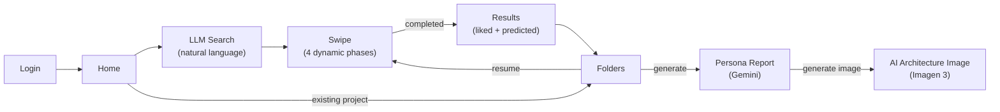
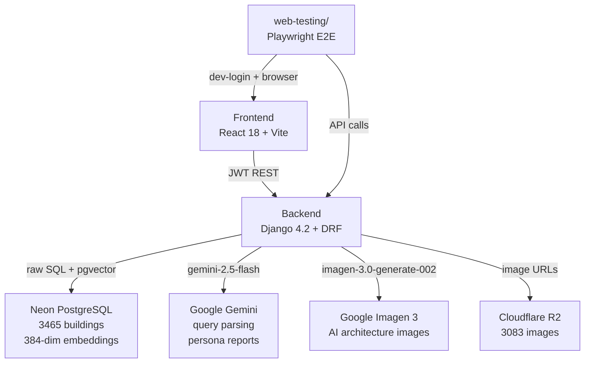
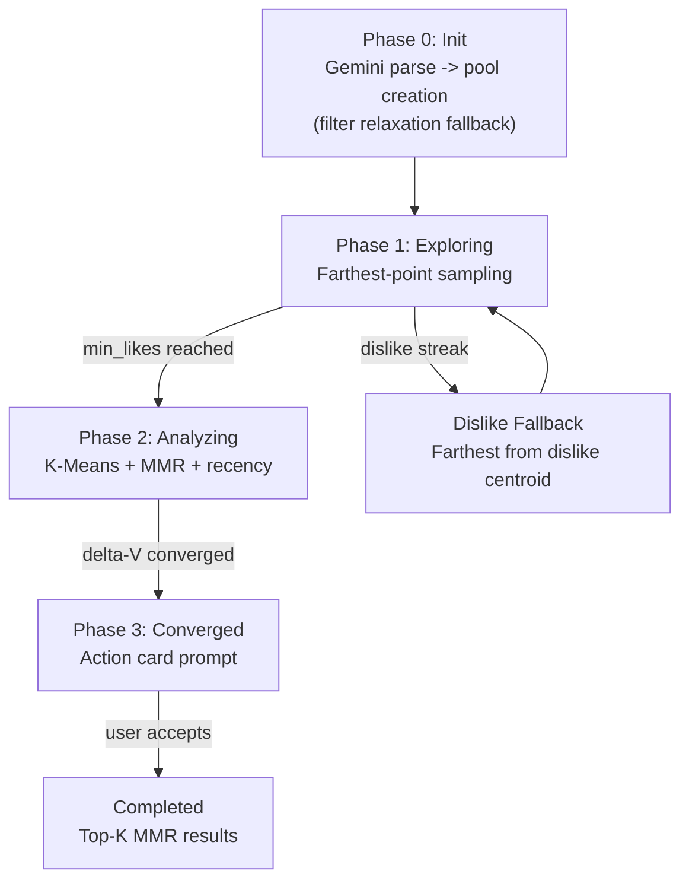
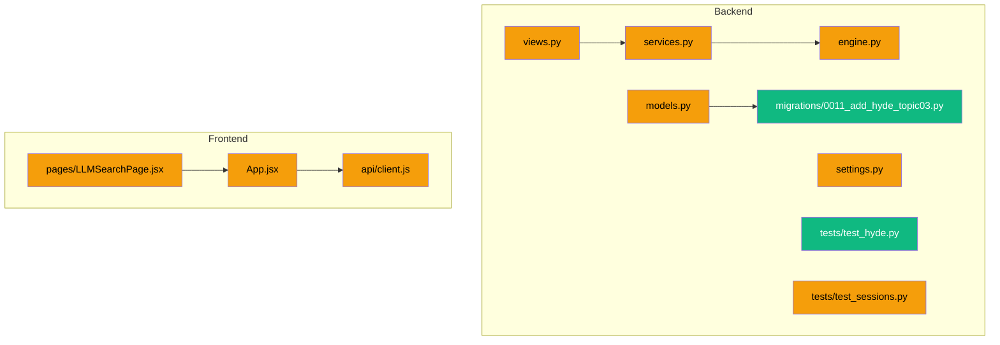

# System Report

> How the code works right now. Auto-updated by reporter after every commit.
> For what we're building: see Goal.md. For task status: see Task.md.

---

## User Flow

## System Architecture

## Algorithm Pipeline

## Backend Structure
| File | Responsibility |
|------|---------------|
| `models.py` | Django ORM models: Project (liked_ids, disliked_ids, saved_ids, report, report_image, session_id), AnalysisSession (phase, pool_ids, exposed_ids, pref_vector, convergence_history, etc.), SwipeEvent (unique_together session+idempotency_key); **schema A3:** Project.liked_ids shape now list[{id, intensity}] (was list[str]); Project.saved_ids NEW (list[{id, saved_at}]) for top-K bookmark / primary-metric source; Project.disliked_ids unchanged; **A4 (§5.6/§6):** AnalysisSession gains 4 new fields (original_filters, original_filter_priority, original_seed_ids, current_pool_tier) for pool relaxation state across re-relaxation events; **A5 (§6):** new SessionEvent model (13 event types in choices, JSON payload, indexes on (session, created_at) + (event_type, created_at), user FK SET_NULL + session FK CASCADE both nullable for pre-session/pre-auth events); **Sprint 1:** SessionEvent.EVENT_TYPE_CHOICES gains 'parse_query_timing' (migration 0010 AlterField); **Topic 03 (Sprint 4):** AnalysisSession.v_initial JSONField (nullable); SessionEvent.EVENT_TYPE_CHOICES gains 'hyde_call_timing'; migration 0011 AddField + AlterField applied to dev DB |
| `event_log.py` | **A5:** session event log emit helpers; emit_event(event_type, session=None, user=None, **payload) never raises (failure → logger.warning + None); emit_swipe_event() convenience wrapper; per-session sequence_no for tie-break; created_at microsecond is primary order signal |
| `engine.py` | Recommendation algorithm: pool creation, farthest-point, K-Means+MMR, convergence, top-K; centroid cache key uses spread dimensions (0, 191, -1) for collision resistance; **pool-score normalization (Topic 12):** _build_score_cases returns 3-tuple with total_weight; create_bounded_pool divides score by total_weight via ::float cast -> [0,1] range; seed boost 1.1; **IMP-1 (Spec v1.1 §11.1):** farthest_point_from_pool max-max → max-min correctness fix (Gonzalez sampling) + NumPy batch matmul (C @ E.T) vectorization, ~22ms → ~1ms per call (20-50× speedup); signature preserved across all 12 production callers; **A4:** create_pool_with_relaxation() helper factors out 3-tier logic (full → drop geo/numeric → random) for reuse; refresh_pool_if_low() runs from SwipeView when remaining pool < 5, escalates to next tier and merges new candidates with exclude_ids = pool_ids + exposed_ids; **C-1 (Sprint 3, Investigation 13):** new compute_confidence(history, threshold, window=3) returns float [0,1] or None when n<window per Investigation 13 hide-bar semantic; threshold=0 div-by-zero guarded; **Topic 06 (Sprint 4):** adaptive_k_clustering_enabled flag → silhouette-based k {1,2} selection (threshold 0.15) via silhouette_samples + np.average weighted; soft_relevance_enabled flag → softmax-weighted relevance over centroid distances (numerically-stable). Both flags default OFF; **Topic 04 (Sprint 4):** compute_mmr_next gets λ ramp logic (λ(t) = λ_base · min(1, |exposed|/N_ref)) when mmr_lambda_ramp_enabled; new compute_dpp_topk(candidates, embeddings, q_values, k, alpha) with Wilhelm 2018 kernel (L_ii=q², L_ij=α·q_i·q_j·⟨v_i,v_j⟩) + Chen 2018 Cholesky-incremental greedy MAP O(N·k²). α clamped [0,1]. Singularity (residual<eps=1e-9) → pad q-ordered remaining. 2-phase fallback (embedding/q failure → ids[:k]; Cholesky exception → q-sorted top-k). Embeddings via get_pool_embeddings (NOT card dicts). **Composition (Sprint 4):** compute_dpp_topk gains q_override kwarg — when supplied, uses values directly (bypasses [0.4, 0.95] clip; RRF-rescaled values are already in [0.01, 1.0]); **Topic 03 (Sprint 4):** create_pool_with_relaxation + create_bounded_pool gain optional v_initial parameter; when None: byte-identical to baseline; when provided: pgvector <=> cosine sim blended via (filter_sum + hyde_weight·(1-<=>))/(total_weight+hyde_weight); all 3 HyDE SQL paths wrapped in try/except with non-recursive fallback to non-HyDE or _random_pool; failure event emitted with failure_type='hyde_pool_query'; refresh_pool_if_low passes session.v_initial to escalation calls |
| `services.py` | Gemini LLM: query parsing (gemini-2.5-flash), persona report generation; Imagen 3: AI architecture image generation; retry wrapper with 1-retry + logging; **A5:** failure events emitted in parse_query + generate_persona_report exception handlers (4 call sites; error_message truncated to 200 chars to prevent traceback leakage); **Sprint 1 §3:** _CHAT_PHASE_SYSTEM_PROMPT replaces _PARSE_QUERY_PROMPT (Investigation 06 full system prompt + 9 few-shot examples); parse_query(conversation_history) multi-turn signature with backward-compat shim for legacy string; thinking_budget=0 on parse_query AND generate_persona_report (Spec v1.3 §11.1 IMP-4 push-gate-blocker fix); parse_query_timing event emitted after each Gemini call; **Topic 02 (Sprint 4):** rerank_candidates(candidates, liked_summary) + _liked_summary_for_rerank(session) helpers. _RERANK_SYSTEM_PROMPT + 5 few-shot examples lifted from Investigation 12 (English-only). thinking_budget=0 (IMP-4) + temperature=0.0 + JSON mime. Validation: set equality + length. Failure cascade: parse fail / partial / extra / duplicate / exception → emit failure event with failure_type='gemini_rerank' recovery_path='cosine_fallback' + return input order. Cross-session liked_summary truncated to most recent MAX_ENTRIES (recency); **Topic 03 (Sprint 4):** NEW embed_visual_description(text, session) — stdlib urllib HF Inference API call to paraphrase-multilingual-MiniLM-L12-v2 (384-dim); handles 1D + 2D HF response shapes; explicit urllib.error.HTTPError class capture (e.code preserved, body truncated 200 chars); failure cascade per spec §5.4: returns None on any failure + emits 'failure' SessionEvent with failure_type='hyde'; empty/None text short-circuits with no event emission |
| `views.py` | All REST endpoints -- session CRUD, swipes, projects, images, auth, report image generation; `select_for_update()` on session query + `session.save()` before prefetch to prevent concurrent exposed_ids staleness; persona report returns structured errors (502 with error_type); building_id validation returns 400; prefetch computed outside transaction.atomic(); pool_embeddings cached across transaction boundary (no redundant fetch for prefetch); dislike embeddings batch-fetched via get_pool_embeddings; **convergence signal integrity (Topic 10 Option A):** exploring -> analyzing transition clears `convergence_history` + `previous_pref_vector` (prevents cross-metric centroid-vs-pref_vector Delta-V); analyzing-phase Delta-V appended on every swipe (not gated by action == like) so `convergence_window` counts rounds, not likes; **A3:** _liked_id_only(liked_ids) helper handles legacy and new shape; swipe like-write appends {id, intensity} dict with optional intensity from request body (clamped [0,2], default 1.0); persona report path extracts plain IDs via helper; **A4:** SessionCreateView inline 3-tier replaced with engine.create_pool_with_relaxation() call (identical behavior); SwipeView calls refresh_pool_if_low() in normal swipe path AND action-card "Reset and keep going" branch (§5.6 "더 swipe" exhaustion most likely there); update_fields extended with pool_ids, pool_scores, current_pool_tier; **A5:** session_start + pool_creation events emitted in SessionCreateView; swipe event with timing_breakdown (lock_ms / embed_ms / select_ms / prefetch_ms / total_ms via _mark closure) emitted in SwipeView normal path; session_end emitted on action-card accept (end_reason='user_confirm'); **Sprint 1:** ParseQueryView accepts conversation_history list OR legacy query string; defensive input validation (history > 10 → 400, text > 2000 → 400, non-dict items → 400, role ∉ {user,model} → 400); **C-1:** SwipeView includes 'confidence' field in response (all 3 paths: normal-swipe computed, action-card reset null, action-card complete null); confidence_update event emitted when non-null with payload {confidence, dominant_attrs, action} (Spec v1.2 dislike-bias telemetry); **Topic 02:** SessionResultView gates on gemini_rerank_enabled flag + len(predicted_cards)>=2; reorders predicted_cards via card_by_id dict reconstruction with foreign-id guard; **Topic 04:** SessionResultView DPP block runs AFTER Topic 02 rerank (preserves cosine→rerank→DPP composition order). Gated on dpp_topk_enabled + len>=2 + session.like_vectors. import numpy hoisted to module top. **Topic 02 ∩ 04 composition (Investigation 07):** SessionResultView captures candidate_ids_cosine_order BEFORE reorder + rerank_rank_by_id sentinel. When both flags on, RRF fuse → min-max rescale to [0.01, 1.0] → DPP q_override. Failure cascade: rerank returning input order = sentinel stays None = DPP falls back to cosine q. **Sprint 4 §8 bookmark:** NEW ProjectBookmarkView (toggle save/unsave on saved_ids, idempotent, IDOR-safe ownership filter, rank_zone + provenance SessionEvent, ValidationError + timezone hoisted to module-level); **Topic 03 (Sprint 4):** SessionCreateView reads visual_description from request body (str + ≤5000 chars validation; silent coerce to None on invalid — security defense vs HF API cost amplification), calls embed_visual_description when hyde_vinitial_enabled, stores v_initial on session; session_start event populated with visual_description + v_initial_success (pre-existing # Topic 03 placeholder comments now wired) |
| `config/settings.py` | RECOMMENDATION dict (12 hyperparameters, `max_consecutive_dislikes=5`), JWT config, DB config (CONN_MAX_AGE=600), CORS; uses STORAGES dict (Django 4.2+ format) for WhiteNoise static files; **Topic 06:** RECOMMENDATION dict gains adaptive_k_clustering_enabled + soft_relevance_enabled (both default False); **Topic 02:** RECOMMENDATION dict gains gemini_rerank_enabled (default False); **Topic 04:** RECOMMENDATION dict gains 5 entries (mmr_lambda_ramp_enabled F, mmr_lambda_ramp_n_ref 10, dpp_topk_enabled F, dpp_alpha 1.0, dpp_singularity_eps 1e-9); **Topic 03:** RECOMMENDATION dict gains hyde_vinitial_enabled=False, hyde_hf_model='sentence-transformers/paraphrase-multilingual-MiniLM-L12-v2', hyde_hf_timeout_seconds=5, hyde_score_weight=50.0; HF_TOKEN loaded from os.getenv('HF_TOKEN', '') |
| `apps/accounts/views.py` | Google/Kakao/Naver OAuth, dev-login, JWT token management; all login views use `authentication_classes = []` |
| `tests/conftest.py` | pytest fixtures: SQLite in-memory DB override, user_profile, auth_client, api_client |
| `tests/test_auth.py` | 7 auth integration tests (Google login mock, token refresh, logout, dev-login) |
| `tests/test_sessions.py` | 18+ session lifecycle tests (creation, swipes, idempotency, phase transitions, client-buffer merge, state resume, convergence signal integrity, pool-score normalization, project schema A3) with mocked engine.py; includes `TestConvergenceSignalIntegrity` for Topic 10 Option A fixes, `TestPoolScoreNormalization` for Topic 12 normalization, `TestProjectSchemaA3` (6 tests: like intensity dict, explicit intensity, clamp, legacy/new shape helper, saved_ids default, saved_ids serialized), `TestFarthestPointFromPool` (5 tests: max-min regression counterexample, none on no candidates, random on no exposed, skip missing embeddings, random when all exposed missing), `TestPoolExhaustionGuard` (5 tests: no-op above threshold, tier 1→2 escalate, tier 3 no-op, exclude exposed, fall-through to tier 3), and `TestSessionEventLogging` (5 tests: create + never-raise + sequence_no per session + integration session_create + integration swipe with timing); 54 total tests pass; **Topic 03:** 3 mock signatures updated to **kwargs for backward compat with new v_initial kwarg |
| `tests/test_projects.py` | 8 project + batch tests (CRUD, pagination, auth, building batch) |
| `tests/test_chat_phase.py` | **Sprint 1 NEW (10 tests):** TestChatPhaseParseQuery (5 tests: terminal 4-field, probe shape, multi-turn history, legacy string compat, Gemini failure + failure event); TestPreDeployStyleLabelGate (1 test: corpus label verification, skips on SQLite); TestGeneratePersonaReportThinkingBudget (1 test: thinking_budget=0); TestParseQueryTimingEvent (1 test: event emitted with usage_metadata); TestParseQueryInputValidation (2 tests: long history + invalid role 400) |
| `tests/test_confidence.py` | **C-1 NEW (12 tests, 1 commit):** TestConfidenceBar — Investigation 13 anchor values + window slicing + threshold guard + integration response (3 paths) + event emission |
| `tests/test_topic06.py` | **Topic 06 NEW (9 tests):** TestTopic06AdaptiveK — adaptive-k flag default + low/high silhouette branches + N<4 fallback + N=4 boundary + N=1 early return + soft-relevance default + enabled multi-centroid + single-centroid equivalence |
| `tests/test_topic02.py` | **Topic 02 NEW (16 tests):** TestRerankCandidates (14 unit: validation paths, failure cascade, prompt format, intensity tags, recency truncation) + TestSessionResultViewRerank (2 DB integration: flag-gated reorder + default-off no-op). |
| `tests/test_topic04.py` | **Topic 04 NEW (15 tests):** TestMmrLambdaRamp (4), TestDppTopK (7: empty/N<=k/α=0/α=1/singularity/exception/clamping), TestSessionResultDppIntegration (3: off/on/empty-likes-skip), + 1 early-return. |
| `tests/test_topic_composition.py` | **Composition NEW (5 tests):** TestTopic02DppComposition — both-on RRF q, rerank-off cosine q, rerank-returns-input fallback, q in [0.01, 1.0], all-equal RRF edge. |
| `tests/test_bookmark.py` | **Sprint 4 §8 NEW (20 tests):** TestBookmarkEndpoint -- save updates saved_ids; save idempotent; unsave removes; unsave on missing is no-op; invalid action/rank/card_id → 400; rank_zone 'primary' for rank<=10 / 'secondary' for rank>10; 404 on other-user project (IDOR guard); provenance defaults False. 144 total pass + 1 skipped. |
| `tests/test_hyde.py` | **Topic 03 NEW (22 tests, 5 classes):** TestEmbedVisualDescription — happy path 1D response, happy path 2D response; TestEmbedVisualDescriptionFailures — HTTPError 503, HTTPError 401, URLError, TimeoutError, JSONDecodeError, wrong response shape; TestEmbedVisualDescriptionFlagGating — flag OFF + visual_description in body → no HF call; TestSessionCreateViewHyDE — view-layer integration (flag ON path); TestHyDEInputValidation — oversized input (>5000 chars → no embed call), non-string input → coerce to None. 166 total pass + 1 skipped (+22 from baseline 144). |

## Frontend Structure
| File | Responsibility |
|------|---------------|
| `api/client.js` | API client with 10s fetch timeout, network retry (2x backoff), `normalizeCard()` field mapping, `callApi()` with JWT refresh, `socialLogin` clears stale tokens, `generateReportImage()`; **Sprint 1:** parseQuery(input) accepts string OR conversation_history list; dispatches { query } or { conversation_history } body shape; **Sprint 4 §8:** bookmarkBuilding(projectId, cardId, action, rank, sessionId) toggle function; **Topic 03 (Sprint 4):** startSession optionally appends visual_description to POST body (omitted when null/undefined) |
| `App.jsx` | Router, auth state, session management, project sync on login (incl. `reportImage` mapping), `initSession` with try-catch-finally (setIsSwipeLoading in finally block prevents infinite spinner), explicit prefetch null reset, swipe error handling, `handleImageGenerated` propagates image state, `handleGenerateReport` propagates errors to caller, `preloadImage` with 1.5s timeout (does not block UI on slow CDN); **A3:** extractLikedIds(rawLikedIds) helper handles legacy list[str] and new list[{id, intensity}] shapes (3 sites in handleLogin); **C-1:** confidence propagated in applySessionResponse + handleSwipeCard with backward-compat (result.confidence ?? null); **Sprint 4 §8:** extractSavedIds(rawSavedIds) handles both {id, saved_at} dict and legacy string shapes; handleToggleBookmark with optimistic update + revert on backend error; sharedLayoutProps extended with savedIds + onToggleBookmark; **Topic 03 (Sprint 4):** 4-layer forwarding chain for visual_description: handleStart → handleUpdateWithImages → initSession → startSession; resume paths correctly bypass (no visual_description on resume) |
| `SwipePage.jsx` | Card deck, swipe gestures, PC keyboard swiping, 3D flip, gallery, phase progress bar, "View Results" (converged/completed only), TutorialPopup, image error retry + fallback; safe-area height; 2-line title clamp; currentCard renders over loading state (overlay spinner) without bulky buttons; **C-1 (Sprint 3):** ConfidenceBar component (inline styles, accent #ec4899) shown when confidence non-null; phase label REMOVED per spec; fallback counter ('{like_count}/3 likes to unlock' for exploring; '{current_round}/{total_rounds}' for others) when null; visible alongside action card during converged; hidden during completed |
| `TutorialPopup.jsx` | First-time user guide with responsive semi-transparent overlay (swipe vs arrow key hints), tap-to-dismiss (localStorage) |
| `FavoritesPage.jsx` | Project folders, persona report display with AI image generation button, "Generate Persona Report" button with error display; safe-area height; 44px back button; **Sprint 4 §8:** RecommendedSection sub-component with primary grid (rank 1-10) + IntersectionObserver lazy-loaded secondary grid (rank 11-50); ResultCard with star bookmark button (44px touch target, DESIGN.md §1.2 + §2.2 colors + aria-label); BuildingCard (liked section) unchanged |
| `LLMSearchPage.jsx` | AI search input, Gemini integration; safe-area-adjusted fixed elements, constrained horizontal scroll; **Sprint 1:** conversationHistory state alongside messages; probe path renders probe_question as AI bubble + accumulates history (turn 1+2); terminal path preserves existing flow; backward-compat: undefined probe_needed falls through to terminal; **Topic 03 (Sprint 4):** latestVisualDescription state stores visual_description from parse_query terminal response (mirrors latestFilters pattern); passed up to App.jsx via handleStart for forwarding to startSession |
| `LoginPage.jsx` | Google auth-code flow login, `onNonOAuthError` popup handling |
| `MainLayout.jsx` | Layout wrapper; sharedLayoutProps chain extended with onToggleBookmark passthrough to FavoritesPage (Sprint 4 §8) |
| `TabBar.jsx` | Bottom navigation with safe-area-inset-bottom padding (content-box) |
| `ProjectSetupPage.jsx` | New project setup with folder name and area range; safe-area-adjusted layout |

## Web Testing Structure
| File | Responsibility |
|------|---------------|
| `web-testing/research/persona.py` | PersonaProfile dataclass; template mode (random from pools) + LLM mode (Gemini); serializable to dict/JSON |
| `web-testing/research/scenarios.py` | TestScenario dataclass; keyword-overlap scoring for swipe decisions (program 3x, style 2x, atmosphere 2x, material 1x; threshold 0.35) |
| `web-testing/runner/runner.py` | Playwright E2E orchestration: dev-login -> home -> LLM search -> swipe loop -> results -> persona report; iPhone 14 Pro viewport; headless Chromium; 3-strategy swipe (locator -> viewport-center -> keyboard); screenshots on all steps; card visibility assertion; gesture/api/card/image timing breakdown |
| `web-testing/runner/collector.py` | StepRecord, ApiCallRecord, ErrorRecord dataclasses; Collector class with response/console/exception listeners; screenshot capture per step |
| `web-testing/runner/reporter.py` | Generates report.json with summary stats, bottleneck classification (image_loading, api_call, algorithm_computation, llm_api, database_query, rendering) |
| `web-testing/runner/feedback.py` | Generates feedback.json mapping API endpoints to source files; performance cause hints; pass/warn/fail status; suggestion string |
| `web-testing/run.py` | CLI entry point: --personas N, --mode template/llm, --auto-fix, --loop N, --dashboard-only; symlinks latest report to dashboard/data/latest/ |
| `web-testing/dashboard/` | Static HTML/JS/CSS SPA: persona sidebar, step timeline viewer with timing breakdown, error panel, sortable performance table with gesture/api/card/image columns; timing-aware bottleneck classification; dark theme; CSS Grid layout |

## API Surface
| Method | Endpoint | Description |
|--------|----------|-------------|
| POST | `/api/v1/auth/social/google/` | Google login (accepts `access_token` or `code`) -> JWT |
| POST | `/api/v1/auth/token/refresh/` | Refresh access token |
| POST | `/api/v1/auth/logout/` | Blacklist refresh token |
| GET | `/api/v1/projects/` | List user's projects |
| POST | `/api/v1/projects/` | Create project |
| DELETE | `/api/v1/projects/{id}/` | Delete project |
| POST | `/api/v1/projects/{id}/report/generate/` | Generate persona report (502 on Gemini failure with error_type) |
| POST | `/api/v1/projects/{id}/report/generate-image/` | Generate AI architecture image from persona report |
| POST | `/api/v1/analysis/sessions/` | Start swipe session (filter relaxation fallback, returns `filter_relaxed`); optional body field `visual_description` (str, ≤5000 chars; silent coerce on invalid) — when hyde_vinitial_enabled, embedded and stored as v_initial for pool cosine reranking |
| POST | `/api/v1/analysis/sessions/{id}/swipes/` | Record swipe (idempotency scoped to session, dislike fallback tracks exposed_ids, 400 on missing building_id); request body accepts optional `intensity` float for like action (defaults 1.0, clamped to [0, 2]) |
| GET | `/api/v1/analysis/sessions/{id}/result/` | Get results |
| GET | `/api/v1/images/diverse-random/` | Get 10 diverse buildings |
| POST | `/api/v1/images/batch/` | Batch-fetch buildings by ID |
| POST | `/api/v1/parse-query/` | LLM query parsing -- accepts legacy `{ query: string }` OR new `{ conversation_history: [...] }` (list of {role, text} dicts, max 10 items, text max 2000 chars, role ∈ {user,model}; invalid → 400); response: terminal path returns `{ filters, filter_priority, raw_query, visual_description, reply }`, probe path returns `{ probe_needed: true, probe_question, reply }` |
| POST | `/api/v1/projects/{id}/bookmark/` | Toggle bookmark on a building in a project; request: {card_id, action: 'save'|'unsave', rank: 1-100, session_id?}; response: {saved_ids, count}; IDOR-safe (404 on other-user project); idempotent; emits bookmark SessionEvent with rank_zone ('primary'<=10/'secondary'>10), rank_corpus null placeholder, provenance booleans |
| POST | `/api/v1/auth/dev-login/` | Dev login (DEBUG-only, returns 404 without DEV_LOGIN_SECRET, rate-limited 5/min) |

## Feature Status (from checklist)

### Complete
- Google OAuth login (auth-code flow for mobile compatibility) + JWT (access 1hr, refresh 30d, blacklist)
- **Stale token defense:** frontend clears tokens before social login; backend login views skip JWT authentication
- 4-phase recommendation pipeline (exploring -> analyzing -> converged -> completed)
- Weighted scoring pool creation (CASE WHEN SQL, OR-based, filter_priority weights)
- **Filter relaxation fallback** in session creation (drop geo/numeric -> random pool)
- Gemini filter_priority end-to-end (parse-query -> session create -> pool scoring)
- LLM search seed IDs force-included in pool
- K-Means + MMR card selection with recency weighting
- **Recency weight math protection** -- `max(0, ...)` guard prevents amplification when `round_num < entry_round`
- Convergence detection via delta-V moving average
- Action card for graceful session exit with **improved messaging** (title + subtitle, clear swipe direction hints)
- **"View Results" button only shows on converged/completed phase** (not during analyzing)
- **Dislike fallback cards tracked in exposed_ids** (no card repetition)
- MMR-diversified top-k results
- Preference vector updates (like +0.5, dislike -1.0, L2-normalize)
- Natural language query parsing + persona report generation (Gemini)
- **Gemini retry logic** -- 1 retry with 1s delay, specific error logging per attempt
- **Structured Gemini errors** -- persona report returns error_type + detail on failure, frontend shows error text
- **AI architecture image generation** (Imagen 3 via google-genai SDK, base64 stored in project model)
- Project CRUD + sync from backend on login + batch-fetch building cards
- Images served from Cloudflare R2
- SwipePage (swipe gestures, 3D flip, gallery), FavoritesPage (folders, persona report + AI image)
- Dark/light theme, loading skeletons, image preloading, fullscreen gallery overlay
- Phase-aware progress bar, action card early exit, multi-step project setup
- Dev-login endpoint + debug overlay (automated testing)
- Vercel + Railway deployment configs, WhiteNoise, CORS (both :5173 and :5174)
- **Detailed error logging** for Google login failures (backend + frontend)
- **onNonOAuthError** handling for popup-blocked scenarios
- **Swipe error handling:** try-catch + 1 network retry + card revert + auto-dismissing error toast
- **API client resilience:** 10s fetch timeout (AbortController), 2x network retry with exponential backoff (300ms, 900ms)
- **Pool embedding caching:** frozenset key per pool, max 50 entries; eliminates repeated DB queries within a session
- **KMeans centroid caching:** like-vector fingerprint + round_num key, max 20 entries; skips recomputation on dislikes; n_init reduced 10->3
- **Double prefetch (2-card buffer):** backend returns `prefetch_image_2`; frontend shifts prefetch queue on each instant swap
- **Gemini UI/UX Polish:** Chat overlay width constrained to fix horizontal scroll bug, responsive semi-transparent overlay for tutorials, PC keyboard left/right swiping functionality, and removal of intrusive UI buttons on SwipePage.
- **Tutorial popup:** first-time SwipePage visually upgraded guide, tap-to-dismiss (localStorage `archithon_tutorial_dismissed`)
- **Image error handling:** retry once with `?retry=1` cache bust; fallback placeholder on permanent failure (no more infinite skeleton)
- **Swipe race condition guard (B5):** `swipeLock` useRef in `handleSwipeCard` + `onCardLeftScreen`; concurrent swipe requests blocked
- **Card overwrite fix (B6):** canInstantSwap path no longer overwrites `currentCard` when backend response diverges; prefetch queue updated only
- **Concurrent exposed_ids fix (B2v2):** `session.save()` called before prefetch calculation; `select_for_update()` on session query prevents stale reads
- **Mobile optimization (F3):** viewport-fit=cover, safe-area-inset-bottom on all pages/TabBar/fixed elements, 44px touch targets, text overflow clamp, reduced SwipePage padding
- **Backend integration tests (INFRA1):** 23 pytest tests (7 auth + 8 session lifecycle + 8 project/batch) with SQLite in-memory DB and mocked engine.py
- **Idempotency scoped to session (INFRA2):** SwipeEvent unique_together (session, idempotency_key) instead of global unique
- **total_rounds removed (INFRA3):** field removed from AnalysisSession model, migration 0006
- **console.error cleanup (INFRA4):** removed from 8 UI locations, kept in api/client.js graceful catch blocks
- **initSession infinite spinner fix:** try-catch-finally in App.jsx ensures `setIsSwipeLoading(false)` runs even when `api.startSession()` throws; catch resets card state and shows error toast; prefetch explicitly set to null when absent
- **Centroid cache key collision fix:** `compute_taste_centroids()` cache key changed from first-3-dimensions to spread dimensions (0, 191, -1) with `round(..., 6)` for float stability across 384-dim vectors
- **building_id validation in SwipeView:** returns 400 Bad Request if `building_id` is missing or empty, preventing corrupted swipe state
- **Narrow transaction scope in SwipeView:** prefetch computation moved outside `transaction.atomic()`; session data copied to locals before lock release; improved response times under concurrent load
- **SwipePage loading priority:** `currentCard` always renders when present (overlay spinner), full skeleton `LoadingCard` only when `currentCard` is null
- **Codebase audit cleanup (AUDIT1):** removed unused deps (@react-spring/web, react-masonry-css, @playwright/test), dead CSS (.masonry-grid, .swipe-card), dead env var (VITE_GEMINI_API_KEY), dead fallback (predicted_like_images); consolidated tests to backend/tests/; STORAGES dict replaces deprecated STATICFILES_STORAGE; optuna moved to requirements-dev.txt; .gitignore gaps fixed
- **E2E visual test runner (TEST1):** Playwright-based `web-testing/` module with persona-driven scenarios, screenshot capture, report/feedback JSON, and static dashboard SPA
- **E2E runner fixes (TEST3):** Screenshots on all swipe steps (was 10/30), card image visibility check after screenshot, gesture/api/card/image timing breakdown in step metadata; 3-strategy swipe gesture (locator -> viewport-center -> keyboard); dashboard timing display in step cards and performance table; validated across 57 personas (20 loops x 3)
- **Swipe API latency optimizations (PERF1):** pool_embeddings cached across transaction boundary (eliminates redundant get_pool_embeddings call in prefetch section); dislike embeddings batch-fetched via single get_pool_embeddings call (was N individual get_building_embedding calls); CONN_MAX_AGE=600 for DB connection reuse; preloadImage 1.5s timeout prevents UI blocking on slow CDN
- **Convergence detection signal integrity (Topic 10 Option A, Sprint 0 Tier A Critical):** two unconditional structural fixes in SwipeView. Bug 1 -- exploring -> analyzing transition now clears `convergence_history` and `previous_pref_vector` so the first analyzing Delta-V is not a cross-metric `||centroid - pref_vector||`. Bug 2 -- analyzing-phase Delta-V append is no longer gated by `action == 'like'`, so `convergence_window=3` correctly counts rounds rather than likes. Known accepted side effect per spec: dislike Delta-V < like Delta-V biases the moving average downward on dislike-heavy sequences.
- **Pre-push review workflow (`/review`):** unified review-terminal slash command at `.claude/commands/review.md`; invoked via `/review` OR natural language ("리뷰해줘", "review please", "검토해줘") per CLAUDE.md "Natural language review trigger"; **push-gate scope** via `origin/main..HEAD` (unpushed commits only) with optional user-supplied range; `git fetch origin main` refresh before scope computation; runs Part A (7-axis static review writes `.claude/reviews/{sha_short}.md` + `latest.md`), conditional Part B (strict browser verification — 3 personas × ≥25 swipes, spec-aligned latency budgets, zero-tolerance error gates, edge cases — runs only when UI-affecting paths in scope), and Part C (HEAD/origin/main drift checks). Emits unified REVIEW-PASSED/REVIEW-ABORTED/REVIEW-FAIL to Task.md Handoffs. Complementary to fast inner-loop `reviewer`/`security-manager`/`web-tester`, not a replacement
- **Pool score normalization (Topic 12, Sprint 0 A1):** _build_score_cases() returns total_weight alongside cases and params; create_bounded_pool SQL output is normalized via ((sum)::float / total_weight), producing scores in [0,1] regardless of active-filter count. Seed boost is clean 1.1. Fixes weight-scale drift across queries with different filter counts (3-filter max 6 vs 8-filter max 36). Tier-grouping at views.py:188 unchanged behaviorally since defaultdict sorts int or float keys identically.
- **Max consecutive dislikes 10 → 5 (Sprint 0 A2, Section 5.1):** silent dislike fallback (engine.get_dislike_fallback) now fires after 5 consecutive dislikes rather than 10. settings.py canonical value + views.py RC.get() fallbacks + tools/algorithm_tester.py PRODUCTION_PARAMS baseline all aligned. Faster cadence lowers dead-time before the engine pivots away from mismatched neighborhoods. Per spec this is silent normal-flow auto-correction (no user notice).
- **Project schema migration (Sprint 0 A3, spec Section 7):** Project.liked_ids shape now list[{id, intensity}] with backfill default 1.0 (migration 0007). NEW Project.saved_ids field (list[{id, saved_at}]) plumbed as primary-metric source for top-K bookmark (Section 8). disliked_ids unchanged. Backend _liked_id_only and frontend extractLikedIds helpers handle both legacy and new shapes for backward compat. Sets up Sprint 3 A-1 (Love intensity 1.8) and Sprint 4 result-page bookmark UI. No bookmark endpoint yet -- saved_ids is read-only on serializer.
- **Farthest-point correctness + vectorization (Spec v1.1 §11.1 IMP-1):** engine.py farthest_point_from_pool was max-max (picked near-duplicates of exposed items) due to inverted accumulator; fixed to max-min per Gonzalez 2-approximation. Bundled with NumPy batch matmul vectorization (replaces ~7500 individual np.dot calls with single BLAS call) for 20-50× speedup. Bug was invisible to integration tests because test_sessions.py:54 mocks the function; new TestFarthestPointFromPool unit tests catch the regression directly. All 12 production callers (views.py × 10, algorithm_tester.py × 2) unaffected — signature + return contract preserved. Topic 11's "Gonzalez bound" and Section 4 C-3 Better layer 3 ("first 3-5 diverse seed cards") now actually deliver diverse selection.
- **Pool exhaustion guard (Sprint 0 A4, §5.6 + §6):** when remaining pool drops below 5 buildings during swiping, auto-escalate to next filter relaxation tier (Tier 1 full → Tier 2 drop geo/numeric → Tier 3 random) and merge new candidates with exclude_ids = pool_ids + exposed_ids. Migration 0008 adds 4 internal session fields for relaxation state. Backward-compat: legacy sessions (pre-0008) get default tier 1 + empty filters; if they exhaust mid-swipe, fall through to tier 3 random — graceful degradation. SessionCreateView's inline 3-tier logic refactored out into reusable engine.create_pool_with_relaxation() helper.
- **§6 Session logging infrastructure (Sprint 0 A5):** SessionEvent model + emit_event helper; 13 event types (10 v1.0 + 3 v1.1: pool_creation, cohort_assignment, probe_turn). Wired NOW in existing endpoints — session_start + pool_creation (SessionCreateView), swipe with timing_breakdown (SwipeView), session_end (action-card accept), failure (services.py exception handlers). Wired LATER as features ship — tag_answer/confidence_update (Sprint 3), bookmark/detail_view/external_url_click/session_extend (Sprint 4 result page), probe_turn (Sprint 1 chat), cohort_assignment (A/B). emit_event never raises so logging cannot crash a request. Foundation for V_initial bit hypothesis measurement (Topic 03), latency budget validation (Investigation 01 O1), bandit/CF training data accumulation (Topic 05/07), Topic 09 ANN trigger detection. Migration 0009 pure CreateModel.
- **Chat phase rewrite + IMP-4 push-gate fix (Sprint 1, Spec v1.3 §3 + §11.1 IMP-4):** parse_query rewritten per Investigation 06 — multi-turn 0-2 probe architecture (one Gemini call per user turn, conversation_history as Content list), 4-field terminal output (filters, filter_priority, raw_query, visual_description) + reply, probe variant for ambiguous input. 9 few-shot examples (skip/1-turn/2-turn × Korean/English/mixed). Backward-compat: legacy single-string still works; LLMSearchPage handles probe_needed=true. IMP-4: thinking_config=ThinkingConfig(thinking_budget=0) on parse_query + generate_persona_report; expected ~1000-1500ms p50 (vs prior 5496ms FAIL). parse_query_timing event (mandatory IMP-4 companion) + migration 0010. ParseQueryView input validation (history len/text len/role whitelist 400 reject). Resolves §10 #5 (bare query Example 7), §10 #7 (Korean bilingual), and v1.1 SPEC-UPDATED probe_turn event (probe_needed branch in payload). conversation history persistence: frontend-ephemeral per Investigation 06 default.
- **Confidence bar (Sprint 3 C-1, Spec §4 + Investigation 13):** engine.compute_confidence(history, threshold, window=3) → float [0,1] or null per spec formula `1 − min(1, avg(last 3 Δv) / ε_threshold)`. SwipeView response gains 'confidence' field across all 3 paths. Frontend ConfidenceBar in SwipePage replaces phase label per spec ("Phase 이름 UI에서 제거"); fallback counter when bar hidden. confidence_update event emitted with action field for Spec v1.2 dislike-bias telemetry. 1-line interpretation text deferred to Sprint 4 (attribute-name layer not yet wired). Sprint 3 partial — A-1 + B-1 still blocked on user decisions.
- **Adaptive k + soft-assignment relevance (Sprint 4 Topic 06):** Two orthogonal flag-gated K-Means + MMR improvements. adaptive_k_clustering_enabled: silhouette-based k=1 vs k=2 selection (threshold 0.15) when N>=4 — degrades to single global centroid on weak cluster signal. soft_relevance_enabled: softmax over centroid similarities (vs hard max) for less brittle multi-modal relevance. Both flags default OFF (backward-compat). Implementation uses silhouette_samples + np.average(weights=like_weights) for sklearn 1.6.1 API compat (silhouette_score lacks sample_weight kwarg in this version). Optuna search space additions deferred to future tuning commit.
- **Gemini setwise rerank (Sprint 4 Topic 02, Spec §11 + Investigation 12):** Gemini 2.5-flash setwise rerank of cosine-ranked top-K at session result time. Off swipe hot path. Output is full ordering (sets up Topic 02 ∩ 04 RRF fusion in upcoming Option α composition). thinking_budget=0 + temp=0 + JSON mime for deterministic structured extraction. _RERANK_SYSTEM_PROMPT + 5 few-shot examples (English-only by construction; corpus fields are English regardless of user locale). Validation strict (set + length). Silent graceful failure to cosine ordering. Cost ~$0.002-0.0028/session within spec target. Flag default OFF; enables via RECOMMENDATION['gemini_rerank_enabled']=True.
- **DPP greedy MAP + MMR λ ramp (Sprint 4 Topic 04, Spec §11 + Investigation 14):** Two orthogonal flag-gated diversity improvements. (a) MMR λ ramp: per-swipe λ scales with |exposed|/N_ref — relevance-heavy at start, diversity-heavy as exposure accumulates. (b) DPP greedy MAP at session-final top-K via Wilhelm 2018 kernel + Chen 2018 Cholesky-incremental algorithm. α default 1.0 (Wilhelm full-form; Optuna sweep [0.5, 1.0] post-launch). Standalone q = max centroid cosine (RRF rescale + composition with Topic 02 = next task). Both flags default OFF; SessionResultView DPP runs AFTER Topic 02 rerank when both compose.
- **Topic 02 ∩ 04 Option α composition (Sprint 4, Investigation 07):** rerank-then-diversify pipeline. When both gemini_rerank_enabled AND dpp_topk_enabled, cosine-K → rerank → RRF fuse rank pairs → min-max rescale to [0.01, 1.0] → DPP greedy MAP. Single integration point per Investigation 07 (q_i swap). Standalone behaviors of either Topic preserved when only one flag on. Failure cascade silent per spec §5.4. Sprint 4 algorithm batch (Topic 06 + 02 + 04 + composition) milestone reached — all 4 features flag-gated, default OFF, ready for joint Optuna tuning post §6 logging accumulation.
- **Sprint 4 §8 Result page bookmark (Investigation 08):** ProjectBookmarkView at POST /api/v1/projects/{id}/bookmark/ -- toggle save/unsave idempotent, IDOR-safe ownership check (404 on other-user project), rank_zone classification (primary rank<=10 / secondary rank>10 per Spec v1.2 §6 req #4), bookmark SessionEvent with provenance booleans (in_cosine_top10, in_gemini_top10, in_dpp_top10 default False) + rank_corpus null placeholder. Frontend: FavoritesPage RecommendedSection with primary (1-10) + IntersectionObserver lazy-loaded secondary (11-50) grids, ResultCard with star bookmark button (optimistic toggle + revert), extractSavedIds backward-compat helper in App.jsx. 20 new tests (144 total pass + 1 skipped).
- **HyDE V_initial scaffolding (Sprint 4 Topic 03, Spec §11 Topic 03, flag-gated default OFF):** embed_visual_description() via stdlib urllib + HuggingFace Inference API (paraphrase-multilingual-MiniLM-L12-v2, 384-dim). When hyde_vinitial_enabled=False (default): zero runtime behavior change — no HF call, pool SQL identical, session.v_initial=None. When enabled: parse_query visual_description embedded to V_initial, blended into pool-creation cosine reranking via pgvector <=> operator. Graceful failure cascade (failure event failure_type='hyde') at both embed and pool-query stages with non-recursive fallback. Input validation (5000 char ceiling, str type check) prevents HF API cost amplification. Migration 0011 applied. 22 new tests (166 total pass + 1 skipped). Frontend data-layer plumbing only (no UI change): visual_description forwarded through App.jsx 4-layer chain to startSession POST body.

### Pending
- Kakao + Naver OAuth

## Last Updated (Claude)
- **Date:** 2026-04-26
- **Commits:** 6f4b76f -- feat: Topic 03 HyDE V_initial via HuggingFace Inference API (default OFF)
- **Phase:** Sprint 4 Topic 03 -- HyDE V_initial scaffolding, flag-gated default OFF, prerequisite for Topic 01 hybrid retrieval
- **Changes:**
  - `backend/apps/recommendation/services.py` -- NEW embed_visual_description(): stdlib urllib HF Inference API (paraphrase-multilingual-MiniLM-L12-v2); 1D/2D response shapes; HTTPError class capture; failure cascade per §5.4; empty/None short-circuit
  - `backend/apps/recommendation/engine.py` -- create_pool_with_relaxation + create_bounded_pool gain optional v_initial parameter; HyDE SQL blending via pgvector <=>; non-recursive fallback; refresh_pool_if_low forwards session.v_initial
  - `backend/apps/recommendation/views.py` -- SessionCreateView: visual_description validation (str + ≤5000 chars; silent coerce); embed call when flag ON; v_initial stored on session; session_start event fields wired
  - `backend/apps/recommendation/models.py` -- AnalysisSession.v_initial JSONField (nullable); SessionEvent EVENT_TYPE_CHOICES gains 'hyde_call_timing'
  - `backend/apps/recommendation/migrations/0011_add_hyde_topic03.py` -- NEW: AddField (v_initial) + AlterField (event_type choices); applied to dev DB
  - `backend/config/settings.py` -- RECOMMENDATION dict: hyde_vinitial_enabled=False, hyde_hf_model, hyde_hf_timeout_seconds=5, hyde_score_weight=50.0; HF_TOKEN from os.getenv
  - `backend/tests/test_hyde.py` -- NEW: 22 tests across 5 classes (happy paths, failure cascades, flag-gating, view integration, input validation); 166 total pass + 1 skipped
  - `backend/tests/test_sessions.py` -- 3 mock signatures updated to **kwargs for v_initial backward compat
  - `frontend/src/api/client.js` -- startSession optionally appends visual_description (omitted when null/undefined)
  - `frontend/src/pages/LLMSearchPage.jsx` -- latestVisualDescription state from parse_query terminal response
  - `frontend/src/App.jsx` -- 4-layer forwarding: handleStart → handleUpdateWithImages → initSession → startSession; resume paths bypass
- **Verification:** 166 pass + 1 skipped (+22 new). With flag OFF (default) zero runtime behavior change: no HF call, pool SQL identical, v_initial=None, session_start fields False/None. UI-affecting paths in scope (views.py + frontend) — Part B will trigger on /review.
- **Summary:** Spec §11 Topic 03 HyDE V_initial scaffolding — embeds Gemini parse_query visual_description via HF Inference API into V_initial, blended into pool-creation cosine reranking via pgvector <=>. Flag-gated default OFF for backward compat; byte-identical to baseline when disabled. Prerequisite for Topic 01 hybrid retrieval (V_initial as RRF vector probe).
- **Change diagram:**

## Last Updated (Designer)

> Owned by the design terminal (`designer` agent). Successor to the prior antigravity
> (Gemini) terminal. Main pipeline NEVER overwrites this section — see CLAUDE.md
> `## Rules`. Entries newest-first.

- **Date:** 2026-04-26 (morning unification, after user review of last night's batch)
- **Phase:** Profile-page unification per DESIGN.md §3.5 Card System — addresses 5 user feedback points from morning review of the prior PROF3+PROF4 redesigns
- **Changes:**
  - `DESIGN.md` -- ADDED §3.5 Card System (5 sub-sections, ~150 lines) as the new authoritative spec for every card surface across the app. §3.5.1 image-overlay default (no default light border, hover lift -4px + brand-pink border `rgba(236,72,153,0.55)`, mandatory `boxShadow` for dark-mode depth, transition 0.25s cubic-bezier(0.4,0,0.2,1) on transform AND border-color). §3.5.2 text hierarchy (title 18/700 white 2-line clamp + meta 12 italic `rgba(255,255,255,0.55)`). §3.5.3 corner chips (top-right, blur backdrop 999px pill, branded variants for PUBLIC/match-score and destructive variant for PRIVATE). §3.5.4 flip card (3D rotateY perspective 1200, transformStyle preserve-3d, 0.5s cubic-bezier, backfaceVisibility hidden + WebKit prefix, nested-button click-stopping). §3.5.5 card-back swipe-style image gallery (full-bleed horizontal scroll-snap-x mandatory, each slide flex 0 0 100%, scrollbar hidden via `.hide-scrollbar` class, persistent action bar at bottom). Codifies what was previously inconsistent across pages — addresses user feedback point 5 ("카드 디자인과 위에 정보를 표기하는 방식들이 제각각이라 통일성이 없게 느껴져").
  - `frontend/src/pages/FirmProfilePage.jsx` -- FULL REWRITE to mirror UserProfilePage structure (user feedback point 4 — "office랑 user 페이지는 본질적으로 같은 페이지인데, 인스타 프로필 중에 블루마크 있는 것처럼 그정도 차이"). Hero now uses circular logo + brand pink-rose halo glow + name+verified-mark inline + italic muted description + User-style icon-pill action row (Website/Email) — replaced the chunky ActionButton + Chip/ChipIcon helpers + meta-strip (location/founded/projects). NEW mid-section flex 2-col row containing StatsCard (Following / Followers using new MOCK_OFFICE fields) + AboutFlipCard (front: 2-line description preview; back: full description + Founded year + Location). ProjectCard rewritten per DESIGN.md §3.5.1 + §3.5.2 + §3.5.3 — transparent default border (removed the old white border per user feedback point 3 — "평소에 흰색 테두리가 있는거는 좀 아쉬워"), hover lift + pink border, 18/700 title + 12 italic 0.55 meta `{city} · {year}`, default-variant program corner chip. ArticleCard updated to §3.5.1 (transparent default border + hover lift + pink border) while preserving its content-specific left accent border + source pill differentiator. MOCK_OFFICE adds 2 new fields (`follower_count: 1247`, `following_count: 38`) each with TODO(claude) marker requesting backend extension to "Firm/Office Profile" contract.
  - `frontend/src/pages/UserProfilePage.jsx` -- FULL REWRITE to mirror FirmProfilePage structure. Hero: REMOVED the MBTI chip from name row (user feedback point 2 — "이름 옆에 INTJ 이런거는 필요없는거 같고"); MBTI surfaces subtly inside the persona flip card back face. Mid-section: extracted StatsCard from hero column into NEW flex 2-col row paired with NEW PersonaFlipCard per §3.5.4 (front: small "PERSONA" caps label + persona_type as gradient text headline `linear-gradient(135deg, #ec4899, #f43f5e)` via WebkitBackgroundClip:'text' + tap-to-reveal hint; back: italic one_liner + Styles chip row + Programs chip row + subtle MBTI bottom-right). Old standalone Persona section deleted. BoardCard rewritten — hover (lift + pink border) moved to OUTER perspective wrapper so it doesn't desync from the inner flip transform; front face per §3.5.1 + §3.5.2 + §3.5.3 (no default border, 18/700 title + 12 italic meta `{building_count} photos · {date}`, PUBLIC=branded chip + PRIVATE=destructive chip per §3.5.3 variants); dropped the dense 2-col Created/Saved/Visibility metadata grid. Back face REPLACED 2-col thumbnail grid with §3.5.5 swipe-style horizontal full-bleed gallery (user feedback point 1 — "카드 스와이핑 했을 때처럼 이미지가 각각 꽉 차고 스크롤로 넘기는 방식") — scroll-snap-x mandatory, .hide-scrollbar class, persistent "View Gallery · N photos" action bar with gradient-blend at bottom. Stabilized `MOCK_USER.boards[].building_count` from `Math.random()` to deterministic formula since value renders in two places (front meta + View Gallery button) and would mismatch on re-render.
  - `frontend/src/index.css` -- ADDED `.hide-scrollbar` cross-browser utility class (lines 154-155) per DESIGN.md §3.5.5 swipe-style card-back requirement. `scrollbar-width: none` (Firefox) + `-ms-overflow-style: none` (IE/Edge legacy) + `.hide-scrollbar::-webkit-scrollbar { display: none }` (WebKit). Used by UserProfilePage BoardCard back-face swipe gallery; reusable for any future scroll surface.
- **Sub-agent delegation note:** Substantial 2-page rewrite + utility addition delegated to `design-ui-maker` per the design pipeline plan §2. Same harness limitation as last night (newly-defined design-* sub-agent types not loaded mid-session) → substituted via `general-purpose` with the EXACT brief intended for `design-ui-maker` prefixed by an explicit substitution note. Designer (this session) wrote the DESIGN.md §3.5 spec directly first (designer's exclusive write territory + single-file edit), then dispatched the sub-agent with a brief that pointed to the new spec as authoritative source. Sub-agent reported back with explicit §3.5.x conformance citations per card surface, mirror-symmetry checklist, and 6 judgment-call notes for designer review.
- **Sub-agent judgment calls (preserved as-is, surfaced for user morning review):**
  1. Office logo: changed from rounded-square (borderRadius: 24) to circle (borderRadius: 50%) to mirror UserProfile avatar exactly under "fundamentally identical" requirement. Logos typically aren't perfect circles — designer/user may want to override back to rounded-square if office visual identity is meaningfully distinct.
  2. User action pills: bumped minHeight from 36 → 44 to satisfy hard 44px touch-target requirement. Visual change to existing User page not in feedback list — surfaced for awareness.
  3. Follow button placement when `!isMe`: chose "full-width below the 2-col mid-section row" over "inline with row" — cleaner mobile fall-through + clear visual primacy for primary CTA.
  4. BoardCard hover-vs-flip interaction: hover (translateY + pink border) placed on OUTER perspective container with matching border-radius 20 + transparent default border so the pink border is flush with the rounded faces. Prevents hover desync when the inner flip is mid-rotation.
  5. Persona one_liner kept the "..." quote marks on the back face — feels appropriate for a "spoken" character snippet; easy to drop if user prefers cleaner italic-only.
  6. Stabilized `MOCK_USER.boards[].building_count` from `Math.random()` to deterministic formula `8 + (i*7) % 47` — value rendered twice (front meta line + View Gallery button label) so determinism prevents per-render mismatch.
- **Verification:**
  - ESLint clean on both pages (`npx eslint --max-warnings=0`)
  - Vite build passes (81 modules transformed, 624ms, no errors) — extra confidence beyond lint
  - Mirror-symmetry confirmed: identical sticky header pattern (back left + centered title + symmetric right slot), identical hero column max-width 480 with halo-glow circular avatar/logo + name (with verified mark on Office only) + italic muted description + icon-pill action row, identical mid-section flex 2-col Stats + FlipCard with `flex: '1 1 280px'` + `minHeight: 180` + `gap: 18` (wraps below ~580px), identical max-width 1100 page container, identical section header style
  - Off-brand colors: zero hits across both pages (`grep -E '#8b5cf6|#a78bfa|#fb923c|tailwind|@tailwind'`)
  - 7 TODO(claude) markers total: FirmProfile 4 (existing data fetch + project click + 2 NEW for follower_count/following_count), UserProfile 3 (existing thumbnails extension + isMe check + follow handler — all preserved verbatim)
  - 1 TODO(designer) marker preserved verbatim (UserProfile follow-button spinner UI when wired)
  - DESIGN.md §3.5 conformance: Office project card (§3.5.1+§3.5.2+§3.5.3 default chip), Office article card (§3.5.1 + content accent), User board card front (§3.5.1+§3.5.2+§3.5.3 PUBLIC=branded/PRIVATE=destructive + §3.5.4 flip parent), User board card back (§3.5.4 + §3.5.5 swipe gallery), About flip card (§3.5.4 text variant), Persona flip card (§3.5.4 text variant)
  - `.hide-scrollbar` class added to index.css and consumed by UserProfile BoardCard back face
  - **Manual browser visual review NOT performed** — same overnight-batch rationale; user is reviewing now and gave this batch as morning-review feedback. The 6 judgment calls above are the items most likely to need user input; all other items match user feedback verbatim.
- **Summary:** Morning iteration on last night's PROF3+PROF4 work, addressing all 5 feedback points: (1) BoardCard back face → swipe-style horizontal full-bleed images per new DESIGN.md §3.5.5; (2) MBTI chip removed + Persona becomes flip card (cuts desktop scroll via 2-col Stats+Persona row); (3) Office cherry-picked User strengths (action pill style, card text hierarchy) + got NEW follower/following stats + lost the white default card border; (4) Office and User now structurally mirror each other (identical hero, mid-section, grid pattern) with content differences only (verified mark vs follow button, About flip vs Persona flip); (5) DESIGN.md §3.5 Card System codified as the authoritative spec for every card surface — both pages explicitly cite §3.5.x compliance per surface in the sub-agent's report. Three files touched (DESIGN.md + 2 pages + index.css utility); ~150 lines of new design system spec; ~1300 lines of frontend rewrites/edits.

---

- **Date:** 2026-04-26
- **Phase:** Phase 13–16 mockup batch — antigravity-era page redesigns + new mockup pages
- **Changes:**
  - `.claude/agents/design-ui-maker.md` -- NEW: sub-agent for substantial JSX/styles work (full page rewrites, multi-file inline-style refactors per DESIGN.md directive). UI layer only; designer parent commits + emits handoffs.
  - `.claude/agents/design-mockup-maker.md` -- NEW: sub-agent for brand-new page mockups with `MOCK_*` constants matching designer.md API contract shapes. Drops `TODO(claude):` markers for backend wiring. UI layer only; no `useEffect`/`callApi`/data-fetching; no `api/client.js` edits.
  - `frontend/src/pages/FirmProfilePage.jsx` -- FULL REWRITE per DESIGN.md (PROF3 polish). Fixed broken `
` structure that visually broke the description (line 145 of prior version), unified jarring 480/1000 max-width split into single max-1100 responsive container, added 44px back button to sticky header (`useNavigate(-1)`), replaced off-brand purple `#8b5cf6` glow with brand pink/rose, added meta-chip strip (location · founded year · project count) under name+verified badge, hover-lift + brand-tint borders on project cards, redesigned articles list with left accent border + source pill chip + hover lift, refined logo glow to single brand-pink soft glow. Programs normalized to CLAUDE.md vocabulary (Public/Museum/Office/Mixed Use/Education) replacing prior off-vocab values. MOCK_OFFICE shape preserved field-for-field per designer.md "Firm/Office Profile" contract. 2 TODO(claude) markers dropped (data fetch via officeId, project click navigation).
  - `frontend/src/pages/UserProfilePage.jsx` -- FULL REWRITE per DESIGN.md (PROF4 polish). Added 44px back button to sticky header, ambient glow + avatar halo switched from off-brand purple to brand pink-rose gradient, added MBTI chip beside display_name, added Instagram/email pill row using `external_links`, restored persona section as polished card (gradient `persona_type` headline via WebkitBackgroundClip + italic `one_liner` + Styles/Programs chip rows), unified 480/1000 split into max-1100 container with 480 hero column, polished BoardCard front-face meta strip (12px tightened) + corner visibility chip (PUBLIC=brand-pink, PRIVATE=destructive #ef4444 replacing lock icon), follow-button transform transition + `TODO(designer):` marker for spinner UI when wired, theme/logout icon row in sticky header right (isMe-only) wired to existing sharedLayoutProps. Existing `TODO(claude):` markers (line 216, 219) preserved verbatim. New `TODO(claude)` for `boards[].thumbnails[6]` backend extension. MOCK_USER shape preserved per designer.md "User Profile" contract.
  - `frontend/src/pages/PostSwipeLandingPage.jsx` -- NEW MOCKUP PAGE (REC1+REC4). "MATCHED!" celebratory results screen shown after swipe-session completion. Sticky brand-gradient header with 44px back/share buttons; celebratory hero with persona/stat chips ("BASED ON YOUR TASTE" caps label + persona + swipes_analyzed + likes_count); sticky 3-tab bar (Projects / Offices / Users) with index-based animated underline (cubic-bezier 0.3s); responsive grid (auto-fill min 280px, gap 20) of three card variants — image-overlay project cards (4:5 with match_score chip + bottom gradient + 2-line title), split-layout office cards (1:1, white logo top half on transparent-tolerant bg), haloed user cards (96-104px avatar + brand-glow halo + shared_likes meta); per-tab empty state; ambient pink radial glow; safe-area aware. MOCK_LANDING follows designer.md "Post-Swipe Landing (MATCHED! Tabs)" contract field-for-field + 3 documented top-level additions (`persona_label`, `swipes_analyzed`, `likes_count`) with TODO(claude) markers requesting backend inclusion. 5 TODO(claude) markers total. Local `useState` for activeTab UI-only.
  - `frontend/src/pages/BoardDetailPage.jsx` -- NEW MOCKUP PAGE (BOARD3+SOC2+SOC3). Shared/public board detail view for viewing OTHER users' curated boards — distinct from FavoritesPage's `FolderDetail` (which is own-private project view with delete/generate-report/bookmark). Cinematic hero cover (280-360px responsive, `object-fit: cover` background image with gradient fade to page bg) + sticky transparent header (back, share); hero content overlaps cover bottom (visibility chip PUBLIC=brand-pink/PRIVATE=destructive + 2-line clamp board name + clickable owner row with avatar+name+chevron → `useNavigate(/user/${owner.user_id})` + meta strip "{n} buildings · {n} ❤"); brand-gradient reaction pill (♡ Love this → ♥ Loved · {count}, scale 1.02 hover / 0.98 press) with local optimistic state via `useState`; auto-fill 260px buildings grid with 4:5 image-overlay tiles (program chip top-right, name + architect/year on bottom gradient); empty state for boards with no buildings. MOCK_BOARD follows designer.md "Board Detail" contract field-for-field + 1 documented top-level addition (`cover_image_url`) with TODO(claude) marker. 6 TODO(claude) markers total: data fetch, cover_image_url backend field, building card click, boardId useParams driver, reaction toggle POST/DELETE, share button.
  - `frontend/src/App.jsx` -- ADDED imports for `PostSwipeLandingPage` and `BoardDetailPage`; ADDED routes `/matched/:sessionId`, `/board/:boardId`, plus `/user/:userId` for non-self profiles (was only `/user/me`). All inside the protected MainLayout block so TabBar remains accessible. Pure JSX-layer additions; no data-layer code touched. New mockup pages don't receive `{...sharedLayoutProps}` spread (they're MOCK_*-driven and don't need it).
  - `frontend/src/layouts/MainLayout.jsx` -- EXTENDED top-right header chrome hide condition (theme toggle + logout floating buttons) to also suppress on `/matched/*` and `/board/*` paths — both new pages own their sticky header with their own back button, so the floating chrome would be visually redundant. Removed pre-existing dead `const isHome = ...` (lint surfaced it as unused; one-line cleanup; not state, not behavior).
- **Sub-agent delegation note:** This batch was delegated to four sub-agents per the design pipeline plan (`/Users/kms_laptop/.claude/plans/tidy-crunching-walrus.md` §2): two full-page rewrites to `design-ui-maker` and two new mockup pages to `design-mockup-maker`. The native sub-agent types defined in `.claude/agents/design-{ui-maker,mockup-maker}.md` were created during the same session and not yet loaded by the harness, so each was substituted via `general-purpose` with the EXACT brief intended for the design-* type prefixed by an explicit substitution note. Semantic delegation preserved — each sub-agent operated within a strict file allow-list, ran ESLint, and verified MOCK_* shapes against designer.md contract field-by-field before reporting back. Designer (this session) reviewed each report, ran a second lint pass, added App.jsx routes + MainLayout chrome condition, and committed in three separate commits. See `feedback_designer_delegation.md` memory for the harness limitation + workaround note.
- **Verification:**
  - ESLint clean on all 4 designed pages + App.jsx + MainLayout.jsx (`npx eslint --max-warnings=0`)
  - All 4 sub-agent reports confirmed MOCK_* shapes match designer.md API contract field-by-field
  - Off-brand color check: zero hits for `#8b5cf6`, `#a78bfa`, `#fb923c`, Tailwind class names across the 4 designed pages
  - CSS vars used (color-text-dim, color-text-dimmer, color-text-muted, color-header-bg) verified present in `frontend/src/index.css` for both dark and light themes
  - 16 `TODO(claude):` markers dropped (FirmProfile 2, UserProfile 3, PostSwipeLanding 5, BoardDetail 6) for main pipeline pickup
  - `MOCKUP-READY:` signals appended to `.claude/Task.md ## Handoffs` for both new pages
  - **Manual browser visual review NOT performed** — overnight design batch; user will review on next morning per the user's explicit request ("내일 아침에 내가 일어나서 한번 검토해보고 수정사항을 알려줄게")
- **Summary:** First substantive design-pipeline batch since the bootstrap commit a35f03f. Replaces the two ugly antigravity mockups (FirmProfile + UserProfile) with on-brand, layout-coherent rewrites, and ships two new mockup pages (PostSwipeLanding, BoardDetail) that unblock Phase 16 (REC1/REC4 MATCHED screen + recommendation tabs) and Phase 14-15 (BOARD3 board view + SOC2/3 reaction system) for main pipeline API integration. Six files in `frontend/`, two new sub-agent files in `.claude/agents/`, two routes added to `App.jsx`, one chrome condition extended in `MainLayout.jsx`. Total ~2700 LOC of new/rewritten frontend.

---

- **Date:** 2026-04-06
- **Phase:** UI/UX Polish (legacy antigravity entry)
- **Changes:**
  - `frontend/src/pages/LLMSearchPage.jsx` -- Fixed horizontal overflow scrolling for the AI chat output.
  - `frontend/src/pages/SwipePage.jsx` -- Configured keyboard shortcut (ArrowLeft/ArrowRight) for PC user swiping and removed action buttons.
  - `frontend/src/components/TutorialPopup.jsx` -- Created transparent responsive overlay avoiding rigid modals.
- **Verification:** Visually verified on localhost.
