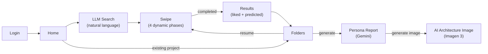
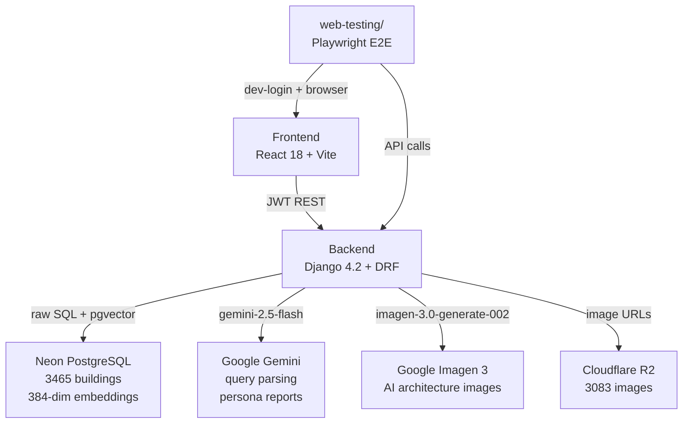
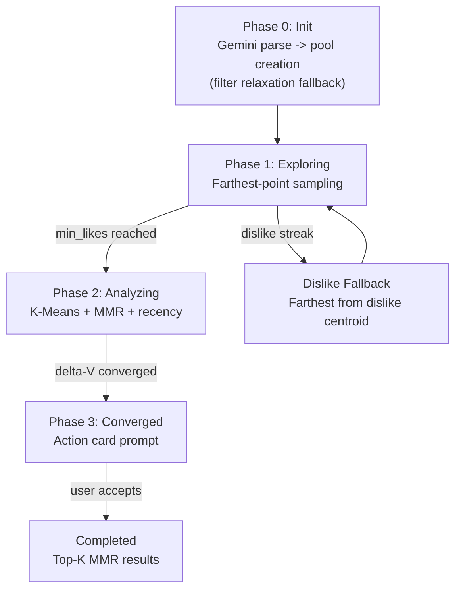
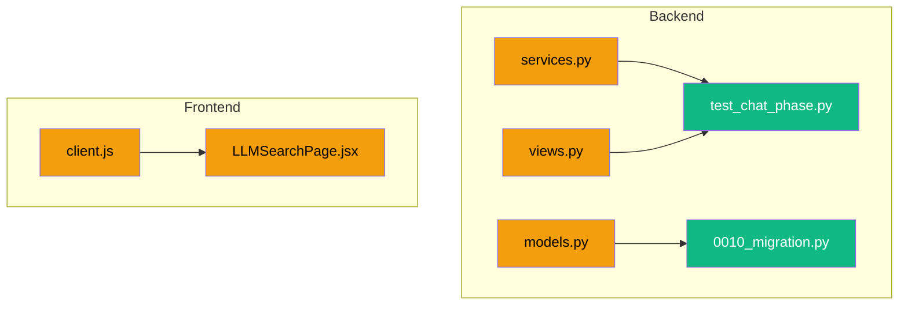

# System Report

> How the code works right now. Auto-updated by reporter after every commit.
> For what we're building: see Goal.md. For task status: see Task.md.

---

## User Flow

## System Architecture

## Algorithm Pipeline

## Backend Structure
| File | Responsibility |
|------|---------------|
| `models.py` | Django ORM models: Project (liked_ids, disliked_ids, saved_ids, report, report_image, session_id), AnalysisSession (phase, pool_ids, exposed_ids, pref_vector, convergence_history, etc.), SwipeEvent (unique_together session+idempotency_key); **schema A3:** Project.liked_ids shape now list[{id, intensity}] (was list[str]); Project.saved_ids NEW (list[{id, saved_at}]) for top-K bookmark / primary-metric source; Project.disliked_ids unchanged; **A4 (§5.6/§6):** AnalysisSession gains 4 new fields (original_filters, original_filter_priority, original_seed_ids, current_pool_tier) for pool relaxation state across re-relaxation events; **A5 (§6):** new SessionEvent model (13 event types in choices, JSON payload, indexes on (session, created_at) + (event_type, created_at), user FK SET_NULL + session FK CASCADE both nullable for pre-session/pre-auth events); **Sprint 1:** SessionEvent.EVENT_TYPE_CHOICES gains 'parse_query_timing' (migration 0010 AlterField) |
| `event_log.py` | **A5:** session event log emit helpers; emit_event(event_type, session=None, user=None, **payload) never raises (failure → logger.warning + None); emit_swipe_event() convenience wrapper; per-session sequence_no for tie-break; created_at microsecond is primary order signal |
| `engine.py` | Recommendation algorithm: pool creation, farthest-point, K-Means+MMR, convergence, top-K; centroid cache key uses spread dimensions (0, 191, -1) for collision resistance; **pool-score normalization (Topic 12):** _build_score_cases returns 3-tuple with total_weight; create_bounded_pool divides score by total_weight via ::float cast -> [0,1] range; seed boost 1.1; **IMP-1 (Spec v1.1 §11.1):** farthest_point_from_pool max-max → max-min correctness fix (Gonzalez sampling) + NumPy batch matmul (C @ E.T) vectorization, ~22ms → ~1ms per call (20-50× speedup); signature preserved across all 12 production callers; **A4:** create_pool_with_relaxation() helper factors out 3-tier logic (full → drop geo/numeric → random) for reuse; refresh_pool_if_low() runs from SwipeView when remaining pool < 5, escalates to next tier and merges new candidates with exclude_ids = pool_ids + exposed_ids |
| `services.py` | Gemini LLM: query parsing (gemini-2.5-flash), persona report generation; Imagen 3: AI architecture image generation; retry wrapper with 1-retry + logging; **A5:** failure events emitted in parse_query + generate_persona_report exception handlers (4 call sites; error_message truncated to 200 chars to prevent traceback leakage); **Sprint 1 §3:** _CHAT_PHASE_SYSTEM_PROMPT replaces _PARSE_QUERY_PROMPT (Investigation 06 full system prompt + 9 few-shot examples); parse_query(conversation_history) multi-turn signature with backward-compat shim for legacy string; thinking_budget=0 on parse_query AND generate_persona_report (Spec v1.3 §11.1 IMP-4 push-gate-blocker fix); parse_query_timing event emitted after each Gemini call |
| `views.py` | All REST endpoints -- session CRUD, swipes, projects, images, auth, report image generation; `select_for_update()` on session query + `session.save()` before prefetch to prevent concurrent exposed_ids staleness; persona report returns structured errors (502 with error_type); building_id validation returns 400; prefetch computed outside transaction.atomic(); pool_embeddings cached across transaction boundary (no redundant fetch for prefetch); dislike embeddings batch-fetched via get_pool_embeddings; **convergence signal integrity (Topic 10 Option A):** exploring -> analyzing transition clears `convergence_history` + `previous_pref_vector` (prevents cross-metric centroid-vs-pref_vector Delta-V); analyzing-phase Delta-V appended on every swipe (not gated by action == like) so `convergence_window` counts rounds, not likes; **A3:** _liked_id_only(liked_ids) helper handles legacy and new shape; swipe like-write appends {id, intensity} dict with optional intensity from request body (clamped [0,2], default 1.0); persona report path extracts plain IDs via helper; **A4:** SessionCreateView inline 3-tier replaced with engine.create_pool_with_relaxation() call (identical behavior); SwipeView calls refresh_pool_if_low() in normal swipe path AND action-card "Reset and keep going" branch (§5.6 "더 swipe" exhaustion most likely there); update_fields extended with pool_ids, pool_scores, current_pool_tier; **A5:** session_start + pool_creation events emitted in SessionCreateView; swipe event with timing_breakdown (lock_ms / embed_ms / select_ms / prefetch_ms / total_ms via _mark closure) emitted in SwipeView normal path; session_end emitted on action-card accept (end_reason='user_confirm'); **Sprint 1:** ParseQueryView accepts conversation_history list OR legacy query string; defensive input validation (history > 10 → 400, text > 2000 → 400, non-dict items → 400, role ∉ {user,model} → 400) |
| `config/settings.py` | RECOMMENDATION dict (12 hyperparameters, `max_consecutive_dislikes=5`), JWT config, DB config (CONN_MAX_AGE=600), CORS; uses STORAGES dict (Django 4.2+ format) for WhiteNoise static files |
| `apps/accounts/views.py` | Google/Kakao/Naver OAuth, dev-login, JWT token management; all login views use `authentication_classes = []` |
| `tests/conftest.py` | pytest fixtures: SQLite in-memory DB override, user_profile, auth_client, api_client |
| `tests/test_auth.py` | 7 auth integration tests (Google login mock, token refresh, logout, dev-login) |
| `tests/test_sessions.py` | 18+ session lifecycle tests (creation, swipes, idempotency, phase transitions, client-buffer merge, state resume, convergence signal integrity, pool-score normalization, project schema A3) with mocked engine.py; includes `TestConvergenceSignalIntegrity` for Topic 10 Option A fixes, `TestPoolScoreNormalization` for Topic 12 normalization, `TestProjectSchemaA3` (6 tests: like intensity dict, explicit intensity, clamp, legacy/new shape helper, saved_ids default, saved_ids serialized), `TestFarthestPointFromPool` (5 tests: max-min regression counterexample, none on no candidates, random on no exposed, skip missing embeddings, random when all exposed missing), `TestPoolExhaustionGuard` (5 tests: no-op above threshold, tier 1→2 escalate, tier 3 no-op, exclude exposed, fall-through to tier 3), and `TestSessionEventLogging` (5 tests: create + never-raise + sequence_no per session + integration session_create + integration swipe with timing); 54 total tests pass |
| `tests/test_projects.py` | 8 project + batch tests (CRUD, pagination, auth, building batch) |
| `tests/test_chat_phase.py` | **Sprint 1 NEW (10 tests):** TestChatPhaseParseQuery (5 tests: terminal 4-field, probe shape, multi-turn history, legacy string compat, Gemini failure + failure event); TestPreDeployStyleLabelGate (1 test: corpus label verification, skips on SQLite); TestGeneratePersonaReportThinkingBudget (1 test: thinking_budget=0); TestParseQueryTimingEvent (1 test: event emitted with usage_metadata); TestParseQueryInputValidation (2 tests: long history + invalid role 400) |

## Frontend Structure
| File | Responsibility |
|------|---------------|
| `api/client.js` | API client with 10s fetch timeout, network retry (2x backoff), `normalizeCard()` field mapping, `callApi()` with JWT refresh, `socialLogin` clears stale tokens, `generateReportImage()`; **Sprint 1:** parseQuery(input) accepts string OR conversation_history list; dispatches { query } or { conversation_history } body shape |
| `App.jsx` | Router, auth state, session management, project sync on login (incl. `reportImage` mapping), `initSession` with try-catch-finally (setIsSwipeLoading in finally block prevents infinite spinner), explicit prefetch null reset, swipe error handling, `handleImageGenerated` propagates image state, `handleGenerateReport` propagates errors to caller, `preloadImage` with 1.5s timeout (does not block UI on slow CDN); **A3:** extractLikedIds(rawLikedIds) helper handles legacy list[str] and new list[{id, intensity}] shapes (3 sites in handleLogin) |
| `SwipePage.jsx` | Card deck, swipe gestures, PC keyboard swiping, 3D flip, gallery, phase progress bar, "View Results" (converged/completed only), TutorialPopup, image error retry + fallback; safe-area height; 2-line title clamp; currentCard renders over loading state (overlay spinner) without bulky buttons |
| `TutorialPopup.jsx` | First-time user guide with responsive semi-transparent overlay (swipe vs arrow key hints), tap-to-dismiss (localStorage) |
| `FavoritesPage.jsx` | Project folders, persona report display with AI image generation button, "Generate Persona Report" button with error display; safe-area height; 44px back button |
| `LLMSearchPage.jsx` | AI search input, Gemini integration; safe-area-adjusted fixed elements, constrained horizontal scroll; **Sprint 1:** conversationHistory state alongside messages; probe path renders probe_question as AI bubble + accumulates history (turn 1+2); terminal path preserves existing flow; backward-compat: undefined probe_needed falls through to terminal |
| `LoginPage.jsx` | Google auth-code flow login, `onNonOAuthError` popup handling |
| `TabBar.jsx` | Bottom navigation with safe-area-inset-bottom padding (content-box) |
| `ProjectSetupPage.jsx` | New project setup with folder name and area range; safe-area-adjusted layout |

## Web Testing Structure
| File | Responsibility |
|------|---------------|
| `web-testing/research/persona.py` | PersonaProfile dataclass; template mode (random from pools) + LLM mode (Gemini); serializable to dict/JSON |
| `web-testing/research/scenarios.py` | TestScenario dataclass; keyword-overlap scoring for swipe decisions (program 3x, style 2x, atmosphere 2x, material 1x; threshold 0.35) |
| `web-testing/runner/runner.py` | Playwright E2E orchestration: dev-login -> home -> LLM search -> swipe loop -> results -> persona report; iPhone 14 Pro viewport; headless Chromium; 3-strategy swipe (locator -> viewport-center -> keyboard); screenshots on all steps; card visibility assertion; gesture/api/card/image timing breakdown |
| `web-testing/runner/collector.py` | StepRecord, ApiCallRecord, ErrorRecord dataclasses; Collector class with response/console/exception listeners; screenshot capture per step |
| `web-testing/runner/reporter.py` | Generates report.json with summary stats, bottleneck classification (image_loading, api_call, algorithm_computation, llm_api, database_query, rendering) |
| `web-testing/runner/feedback.py` | Generates feedback.json mapping API endpoints to source files; performance cause hints; pass/warn/fail status; suggestion string |
| `web-testing/run.py` | CLI entry point: --personas N, --mode template/llm, --auto-fix, --loop N, --dashboard-only; symlinks latest report to dashboard/data/latest/ |
| `web-testing/dashboard/` | Static HTML/JS/CSS SPA: persona sidebar, step timeline viewer with timing breakdown, error panel, sortable performance table with gesture/api/card/image columns; timing-aware bottleneck classification; dark theme; CSS Grid layout |

## API Surface
| Method | Endpoint | Description |
|--------|----------|-------------|
| POST | `/api/v1/auth/social/google/` | Google login (accepts `access_token` or `code`) -> JWT |
| POST | `/api/v1/auth/token/refresh/` | Refresh access token |
| POST | `/api/v1/auth/logout/` | Blacklist refresh token |
| GET | `/api/v1/projects/` | List user's projects |
| POST | `/api/v1/projects/` | Create project |
| DELETE | `/api/v1/projects/{id}/` | Delete project |
| POST | `/api/v1/projects/{id}/report/generate/` | Generate persona report (502 on Gemini failure with error_type) |
| POST | `/api/v1/projects/{id}/report/generate-image/` | Generate AI architecture image from persona report |
| POST | `/api/v1/analysis/sessions/` | Start swipe session (filter relaxation fallback, returns `filter_relaxed`) |
| POST | `/api/v1/analysis/sessions/{id}/swipes/` | Record swipe (idempotency scoped to session, dislike fallback tracks exposed_ids, 400 on missing building_id); request body accepts optional `intensity` float for like action (defaults 1.0, clamped to [0, 2]) |
| GET | `/api/v1/analysis/sessions/{id}/result/` | Get results |
| GET | `/api/v1/images/diverse-random/` | Get 10 diverse buildings |
| POST | `/api/v1/images/batch/` | Batch-fetch buildings by ID |
| POST | `/api/v1/parse-query/` | LLM query parsing -- accepts legacy `{ query: string }` OR new `{ conversation_history: [...] }` (list of {role, text} dicts, max 10 items, text max 2000 chars, role ∈ {user,model}; invalid → 400); response: terminal path returns `{ filters, filter_priority, raw_query, visual_description, reply }`, probe path returns `{ probe_needed: true, probe_question, reply }` |
| POST | `/api/v1/auth/dev-login/` | Dev login (DEBUG-only, returns 404 without DEV_LOGIN_SECRET, rate-limited 5/min) |

## Feature Status (from checklist)

### Complete
- Google OAuth login (auth-code flow for mobile compatibility) + JWT (access 1hr, refresh 30d, blacklist)
- **Stale token defense:** frontend clears tokens before social login; backend login views skip JWT authentication
- 4-phase recommendation pipeline (exploring -> analyzing -> converged -> completed)
- Weighted scoring pool creation (CASE WHEN SQL, OR-based, filter_priority weights)
- **Filter relaxation fallback** in session creation (drop geo/numeric -> random pool)
- Gemini filter_priority end-to-end (parse-query -> session create -> pool scoring)
- LLM search seed IDs force-included in pool
- K-Means + MMR card selection with recency weighting
- **Recency weight math protection** -- `max(0, ...)` guard prevents amplification when `round_num < entry_round`
- Convergence detection via delta-V moving average
- Action card for graceful session exit with **improved messaging** (title + subtitle, clear swipe direction hints)
- **"View Results" button only shows on converged/completed phase** (not during analyzing)
- **Dislike fallback cards tracked in exposed_ids** (no card repetition)
- MMR-diversified top-k results
- Preference vector updates (like +0.5, dislike -1.0, L2-normalize)
- Natural language query parsing + persona report generation (Gemini)
- **Gemini retry logic** -- 1 retry with 1s delay, specific error logging per attempt
- **Structured Gemini errors** -- persona report returns error_type + detail on failure, frontend shows error text
- **AI architecture image generation** (Imagen 3 via google-genai SDK, base64 stored in project model)
- Project CRUD + sync from backend on login + batch-fetch building cards
- Images served from Cloudflare R2
- SwipePage (swipe gestures, 3D flip, gallery), FavoritesPage (folders, persona report + AI image)
- Dark/light theme, loading skeletons, image preloading, fullscreen gallery overlay
- Phase-aware progress bar, action card early exit, multi-step project setup
- Dev-login endpoint + debug overlay (automated testing)
- Vercel + Railway deployment configs, WhiteNoise, CORS (both :5173 and :5174)
- **Detailed error logging** for Google login failures (backend + frontend)
- **onNonOAuthError** handling for popup-blocked scenarios
- **Swipe error handling:** try-catch + 1 network retry + card revert + auto-dismissing error toast
- **API client resilience:** 10s fetch timeout (AbortController), 2x network retry with exponential backoff (300ms, 900ms)
- **Pool embedding caching:** frozenset key per pool, max 50 entries; eliminates repeated DB queries within a session
- **KMeans centroid caching:** like-vector fingerprint + round_num key, max 20 entries; skips recomputation on dislikes; n_init reduced 10->3
- **Double prefetch (2-card buffer):** backend returns `prefetch_image_2`; frontend shifts prefetch queue on each instant swap
- **Gemini UI/UX Polish:** Chat overlay width constrained to fix horizontal scroll bug, responsive semi-transparent overlay for tutorials, PC keyboard left/right swiping functionality, and removal of intrusive UI buttons on SwipePage.
- **Tutorial popup:** first-time SwipePage visually upgraded guide, tap-to-dismiss (localStorage `archithon_tutorial_dismissed`)
- **Image error handling:** retry once with `?retry=1` cache bust; fallback placeholder on permanent failure (no more infinite skeleton)
- **Swipe race condition guard (B5):** `swipeLock` useRef in `handleSwipeCard` + `onCardLeftScreen`; concurrent swipe requests blocked
- **Card overwrite fix (B6):** canInstantSwap path no longer overwrites `currentCard` when backend response diverges; prefetch queue updated only
- **Concurrent exposed_ids fix (B2v2):** `session.save()` called before prefetch calculation; `select_for_update()` on session query prevents stale reads
- **Mobile optimization (F3):** viewport-fit=cover, safe-area-inset-bottom on all pages/TabBar/fixed elements, 44px touch targets, text overflow clamp, reduced SwipePage padding
- **Backend integration tests (INFRA1):** 23 pytest tests (7 auth + 8 session lifecycle + 8 project/batch) with SQLite in-memory DB and mocked engine.py
- **Idempotency scoped to session (INFRA2):** SwipeEvent unique_together (session, idempotency_key) instead of global unique
- **total_rounds removed (INFRA3):** field removed from AnalysisSession model, migration 0006
- **console.error cleanup (INFRA4):** removed from 8 UI locations, kept in api/client.js graceful catch blocks
- **initSession infinite spinner fix:** try-catch-finally in App.jsx ensures `setIsSwipeLoading(false)` runs even when `api.startSession()` throws; catch resets card state and shows error toast; prefetch explicitly set to null when absent
- **Centroid cache key collision fix:** `compute_taste_centroids()` cache key changed from first-3-dimensions to spread dimensions (0, 191, -1) with `round(..., 6)` for float stability across 384-dim vectors
- **building_id validation in SwipeView:** returns 400 Bad Request if `building_id` is missing or empty, preventing corrupted swipe state
- **Narrow transaction scope in SwipeView:** prefetch computation moved outside `transaction.atomic()`; session data copied to locals before lock release; improved response times under concurrent load
- **SwipePage loading priority:** `currentCard` always renders when present (overlay spinner), full skeleton `LoadingCard` only when `currentCard` is null
- **Codebase audit cleanup (AUDIT1):** removed unused deps (@react-spring/web, react-masonry-css, @playwright/test), dead CSS (.masonry-grid, .swipe-card), dead env var (VITE_GEMINI_API_KEY), dead fallback (predicted_like_images); consolidated tests to backend/tests/; STORAGES dict replaces deprecated STATICFILES_STORAGE; optuna moved to requirements-dev.txt; .gitignore gaps fixed
- **E2E visual test runner (TEST1):** Playwright-based `web-testing/` module with persona-driven scenarios, screenshot capture, report/feedback JSON, and static dashboard SPA
- **E2E runner fixes (TEST3):** Screenshots on all swipe steps (was 10/30), card image visibility check after screenshot, gesture/api/card/image timing breakdown in step metadata; 3-strategy swipe gesture (locator -> viewport-center -> keyboard); dashboard timing display in step cards and performance table; validated across 57 personas (20 loops x 3)
- **Swipe API latency optimizations (PERF1):** pool_embeddings cached across transaction boundary (eliminates redundant get_pool_embeddings call in prefetch section); dislike embeddings batch-fetched via single get_pool_embeddings call (was N individual get_building_embedding calls); CONN_MAX_AGE=600 for DB connection reuse; preloadImage 1.5s timeout prevents UI blocking on slow CDN
- **Convergence detection signal integrity (Topic 10 Option A, Sprint 0 Tier A Critical):** two unconditional structural fixes in SwipeView. Bug 1 -- exploring -> analyzing transition now clears `convergence_history` and `previous_pref_vector` so the first analyzing Delta-V is not a cross-metric `||centroid - pref_vector||`. Bug 2 -- analyzing-phase Delta-V append is no longer gated by `action == 'like'`, so `convergence_window=3` correctly counts rounds rather than likes. Known accepted side effect per spec: dislike Delta-V < like Delta-V biases the moving average downward on dislike-heavy sequences.
- **Pre-push review workflow (`/review`):** unified review-terminal slash command at `.claude/commands/review.md`; invoked via `/review` OR natural language ("리뷰해줘", "review please", "검토해줘") per CLAUDE.md "Natural language review trigger"; **push-gate scope** via `origin/main..HEAD` (unpushed commits only) with optional user-supplied range; `git fetch origin main` refresh before scope computation; runs Part A (7-axis static review writes `.claude/reviews/{sha_short}.md` + `latest.md`), conditional Part B (strict browser verification — 3 personas × ≥25 swipes, spec-aligned latency budgets, zero-tolerance error gates, edge cases — runs only when UI-affecting paths in scope), and Part C (HEAD/origin/main drift checks). Emits unified REVIEW-PASSED/REVIEW-ABORTED/REVIEW-FAIL to Task.md Handoffs. Complementary to fast inner-loop `reviewer`/`security-manager`/`web-tester`, not a replacement
- **Pool score normalization (Topic 12, Sprint 0 A1):** _build_score_cases() returns total_weight alongside cases and params; create_bounded_pool SQL output is normalized via ((sum)::float / total_weight), producing scores in [0,1] regardless of active-filter count. Seed boost is clean 1.1. Fixes weight-scale drift across queries with different filter counts (3-filter max 6 vs 8-filter max 36). Tier-grouping at views.py:188 unchanged behaviorally since defaultdict sorts int or float keys identically.
- **Max consecutive dislikes 10 → 5 (Sprint 0 A2, Section 5.1):** silent dislike fallback (engine.get_dislike_fallback) now fires after 5 consecutive dislikes rather than 10. settings.py canonical value + views.py RC.get() fallbacks + tools/algorithm_tester.py PRODUCTION_PARAMS baseline all aligned. Faster cadence lowers dead-time before the engine pivots away from mismatched neighborhoods. Per spec this is silent normal-flow auto-correction (no user notice).
- **Project schema migration (Sprint 0 A3, spec Section 7):** Project.liked_ids shape now list[{id, intensity}] with backfill default 1.0 (migration 0007). NEW Project.saved_ids field (list[{id, saved_at}]) plumbed as primary-metric source for top-K bookmark (Section 8). disliked_ids unchanged. Backend _liked_id_only and frontend extractLikedIds helpers handle both legacy and new shapes for backward compat. Sets up Sprint 3 A-1 (Love intensity 1.8) and Sprint 4 result-page bookmark UI. No bookmark endpoint yet -- saved_ids is read-only on serializer.
- **Farthest-point correctness + vectorization (Spec v1.1 §11.1 IMP-1):** engine.py farthest_point_from_pool was max-max (picked near-duplicates of exposed items) due to inverted accumulator; fixed to max-min per Gonzalez 2-approximation. Bundled with NumPy batch matmul vectorization (replaces ~7500 individual np.dot calls with single BLAS call) for 20-50× speedup. Bug was invisible to integration tests because test_sessions.py:54 mocks the function; new TestFarthestPointFromPool unit tests catch the regression directly. All 12 production callers (views.py × 10, algorithm_tester.py × 2) unaffected — signature + return contract preserved. Topic 11's "Gonzalez bound" and Section 4 C-3 Better layer 3 ("first 3-5 diverse seed cards") now actually deliver diverse selection.
- **Pool exhaustion guard (Sprint 0 A4, §5.6 + §6):** when remaining pool drops below 5 buildings during swiping, auto-escalate to next filter relaxation tier (Tier 1 full → Tier 2 drop geo/numeric → Tier 3 random) and merge new candidates with exclude_ids = pool_ids + exposed_ids. Migration 0008 adds 4 internal session fields for relaxation state. Backward-compat: legacy sessions (pre-0008) get default tier 1 + empty filters; if they exhaust mid-swipe, fall through to tier 3 random — graceful degradation. SessionCreateView's inline 3-tier logic refactored out into reusable engine.create_pool_with_relaxation() helper.
- **§6 Session logging infrastructure (Sprint 0 A5):** SessionEvent model + emit_event helper; 13 event types (10 v1.0 + 3 v1.1: pool_creation, cohort_assignment, probe_turn). Wired NOW in existing endpoints — session_start + pool_creation (SessionCreateView), swipe with timing_breakdown (SwipeView), session_end (action-card accept), failure (services.py exception handlers). Wired LATER as features ship — tag_answer/confidence_update (Sprint 3), bookmark/detail_view/external_url_click/session_extend (Sprint 4 result page), probe_turn (Sprint 1 chat), cohort_assignment (A/B). emit_event never raises so logging cannot crash a request. Foundation for V_initial bit hypothesis measurement (Topic 03), latency budget validation (Investigation 01 O1), bandit/CF training data accumulation (Topic 05/07), Topic 09 ANN trigger detection. Migration 0009 pure CreateModel.
- **Chat phase rewrite + IMP-4 push-gate fix (Sprint 1, Spec v1.3 §3 + §11.1 IMP-4):** parse_query rewritten per Investigation 06 — multi-turn 0-2 probe architecture (one Gemini call per user turn, conversation_history as Content list), 4-field terminal output (filters, filter_priority, raw_query, visual_description) + reply, probe variant for ambiguous input. 9 few-shot examples (skip/1-turn/2-turn × Korean/English/mixed). Backward-compat: legacy single-string still works; LLMSearchPage handles probe_needed=true. IMP-4: thinking_config=ThinkingConfig(thinking_budget=0) on parse_query + generate_persona_report; expected ~1000-1500ms p50 (vs prior 5496ms FAIL). parse_query_timing event (mandatory IMP-4 companion) + migration 0010. ParseQueryView input validation (history len/text len/role whitelist 400 reject). Resolves §10 #5 (bare query Example 7), §10 #7 (Korean bilingual), and v1.1 SPEC-UPDATED probe_turn event (probe_needed branch in payload). conversation history persistence: frontend-ephemeral per Investigation 06 default.

### Pending
- Kakao + Naver OAuth

## Last Updated (Claude)
- **Date:** 2026-04-25
- **Commits:** e290287 -- feat: chat phase 0-2 turn probe + Spec v1.3 IMP-4 push-gate-blocker fix (Sprint 1)
- **Phase:** Sprint 1 -- Chat phase rewrite (§3) + Spec v1.3 §11.1 IMP-4 push-gate-blocker
- **Changes:**
  - `backend/apps/recommendation/migrations/0010_alter_sessionevent_event_type.py` -- NEW: AlterField migration adding 'parse_query_timing' to SessionEvent.EVENT_TYPE_CHOICES.
  - `backend/apps/recommendation/models.py` -- SessionEvent.EVENT_TYPE_CHOICES gains 'parse_query_timing'.
  - `backend/apps/recommendation/services.py` -- _CHAT_PHASE_SYSTEM_PROMPT replaces _PARSE_QUERY_PROMPT (Investigation 06 full system prompt + 9 few-shot examples); parse_query(conversation_history) multi-turn signature with backward-compat shim for legacy string; thinking_budget=0 on parse_query AND generate_persona_report (IMP-4 push-gate-blocker fix); parse_query_timing event emitted after each Gemini call.
  - `backend/apps/recommendation/views.py` -- ParseQueryView accepts conversation_history list OR legacy query string; defensive input validation (history > 10 → 400, text > 2000 → 400, non-dict items → 400, role ∉ {user,model} → 400).
  - `backend/tests/test_chat_phase.py` -- NEW: 10 tests across 5 classes (TestChatPhaseParseQuery, TestPreDeployStyleLabelGate, TestGeneratePersonaReportThinkingBudget, TestParseQueryTimingEvent, TestParseQueryInputValidation). 63 total tests pass + 1 skipped.
  - `frontend/src/api/client.js` -- parseQuery(input) accepts string OR conversation_history list; dispatches { query } or { conversation_history } body shape.
  - `frontend/src/pages/LLMSearchPage.jsx` -- conversationHistory state alongside messages; probe path renders probe_question as AI bubble + accumulates history (turn 1+2); terminal path preserves existing flow; backward-compat: undefined probe_needed falls through to terminal.
- **Verification:** 63 backend tests pass + 1 skipped (54 prior + 10 new - 1 SQLite skip). Reviewer: PASS. Security: PASS.
- **Change diagram:**

## Last Updated (Gemini)
- **Date:** 2026-04-06
- **Phase:** Gemini UI/UX Polish
- **Changes:**
  - `frontend/src/pages/LLMSearchPage.jsx` -- Fixed horizontal overflow scrolling for the AI chat output.
  - `frontend/src/pages/SwipePage.jsx` -- Configured keyboard shortcut (ArrowLeft/ArrowRight) for PC user swiping and removed action buttons.
  - `frontend/src/components/TutorialPopup.jsx` -- Created transparent responsive overlay avoiding rigid modals.
- **Verification:** Visually verified by Antigravity Browser Subagent on localhost.
