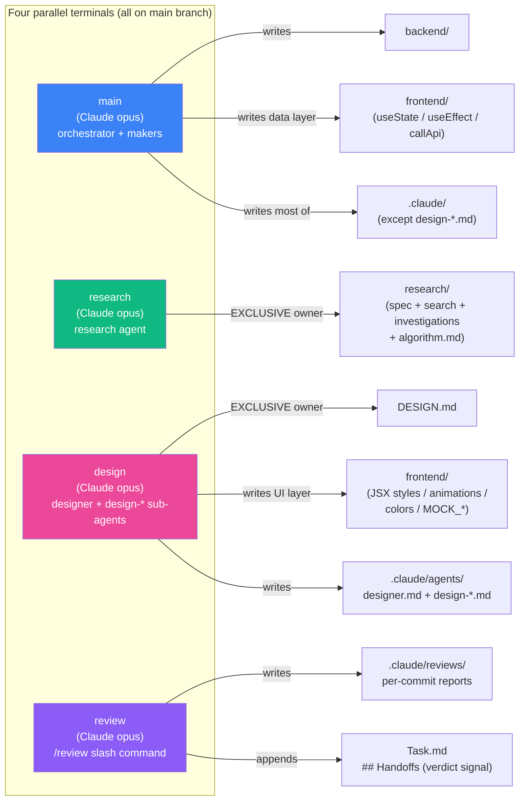
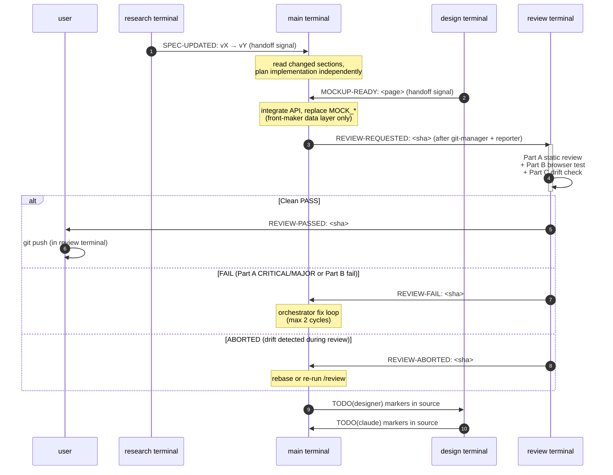
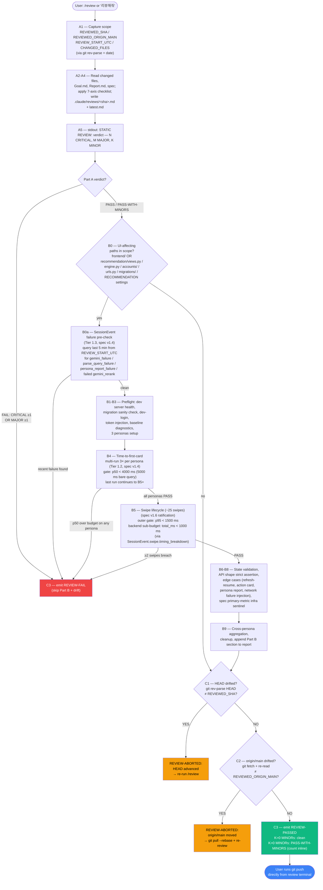
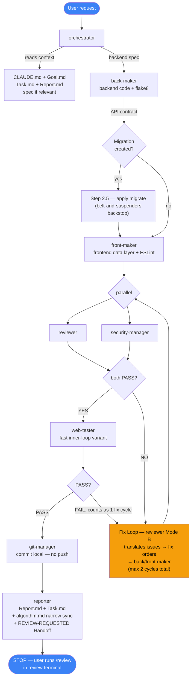
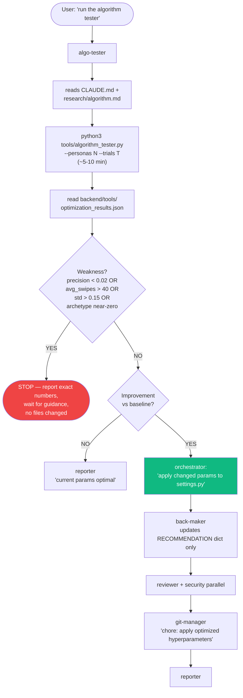
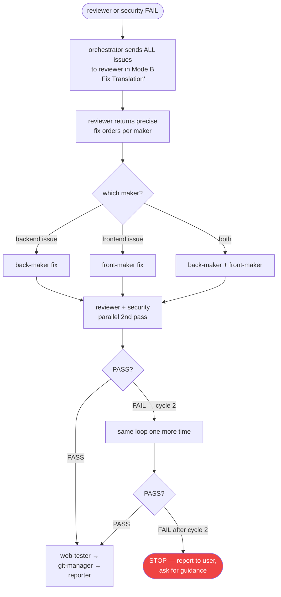

# ArchiTinder -- Agent Workflow

> **Read this when:** You want to understand how agents work, what triggers what, and when you
> will be flagged for manual review. All 7 workflow cases are covered here.
> For feature status: see `Report.md`. For task status: see `Task.md`. For vision: see `Goal.md`.

---

## At-a-Glance — Four-Terminal Architecture

The project runs across **four parallel terminals** on the same `main` Git branch. Coordination is by **file/layer ownership** + **handoff signals in `Task.md`**, not branches. Each terminal has an isolated context window and a focused role.



**Narrow exception** to ownership: `reporter` (main pipeline) may UPDATE only `research/algorithm.md` to keep it in sync with implementation (see CLAUDE.md `## Rules`).

---

## Cross-Terminal Signals

Terminals don't call each other directly — they leave append-only signals in `.claude/Task.md`'s `## Handoffs` and `## Research Ready` sections. Other terminals pick them up at session start.



**Signal types** (full vocabulary in `.claude/Task.md` `## Handoffs` header):

| Signal | Direction | Meaning |
|--------|-----------|---------|
| `SPEC-UPDATED: vX → vY` | research → main | Spec bumped; main reads only affected sections |
| `[SPEC-READY]` | research → main (in `## Research Ready`) | Persistent pointer to current spec |
| `MOCKUP-READY: <page>` | design → main | New mockup awaiting API integration |
| `REVIEW-REQUESTED: <sha>` | reporter (main) → review | Run `/review` next (or "리뷰해줘") |
| `REVIEW-PASSED: <sha>` | review → user | Drift-verified; user runs `git push` from review terminal |
| `REVIEW-FAIL: <sha>` | review → main | Re-enter orchestrator fix loop |
| `REVIEW-ABORTED: <sha>` | review → main | PASS verdict but drift detected; re-run after rebase |

---

## Agent Roster

| Agent | Model | Role | Touches |
|-------|-------|------|---------|
| **orchestrator** | opus | Main pipeline supervisor -- plans, delegates, manages fix loops | nothing directly |
| **back-maker** | sonnet | Django/DRF backend code | `backend/` only |
| **front-maker** | sonnet | React/Vite frontend **data layer** (useState, useEffect, callApi, hooks, error handling) | `frontend/` data layer only — UI layer is owned by `designer` |
| **reviewer** | sonnet | API contracts, logic bugs, error handling | read-only |
| **security-manager** | sonnet | SQL injection, auth bypass, XSS, token leaks | read-only |
| **web-tester** | sonnet | Live Playwright browser tests (fast inner-loop variant) | read-only |
| **git-manager** | haiku | Single commit per task | git only |
| **reporter** | sonnet | Updates Report.md + Task.md, emits REVIEW-REQUESTED handoff | `.claude/` only (+ narrow `research/algorithm.md` sync exception) |
| **algo-tester** | sonnet | Runs optimizer script, interprets results, triggers orchestrator | runs script + calls orchestrator |
| **research** | opus | Explores complex problems, writes to research/ | `research/` only |
| **designer** | opus | **Design pipeline supervisor** — owns DESIGN.md + frontend UI layer + design-* sub-agents (parallel of `orchestrator` for the design terminal). Spawns `design-<role>` sub-agents on demand. | `DESIGN.md`, `frontend/` UI layer (JSX styles, animations, colors, layout, MOCK_*), `.claude/agents/design-*.md`, `.claude/Task.md` Handoffs (MOCKUP-READY append-only) |
| **design-ui-maker** | sonnet | UI-layer JSX/inline-style refactors per a DESIGN.md directive (spawned by designer) | `frontend/` UI layer only |
| **design-mockup-maker** | sonnet | New mockup pages with `MOCK_*` constants matching designer.md API Contract Shapes (spawned by designer) | `frontend/` UI layer only |
| **`/review`** (slash command, no subagent) | opus (review terminal) | **Unified pre-push gate.** Part A: 7-axis static review. Part B: conditional strict browser verification. Part C: HEAD + origin/main drift checks. Emits one of REVIEW-PASSED / REVIEW-ABORTED / REVIEW-FAIL to Task.md Handoffs. Invoked via `/review` or natural language ("리뷰해줘", "review", "검토해줘"). | read-only on source; writes `.claude/reviews/` + Task.md Handoffs line + transient `test-artifacts/review/` (Part B, cleaned after run) |

---

## Multi-Terminal Coordination

### Terminal Roster

| Terminal | Model | Role | Owns / Touches | Typical signals |
|----------|-------|------|----------------|-----------------|
| **main** | Claude Code (orchestrator: opus) | Full pipeline — backend, frontend integration, E2E tests, commit | `backend/`, `frontend/` (data layer), `.claude/` (excluding anything inside `research/`, and excluding `.claude/agents/designer.md` + `.claude/agents/design-*.md`) | reporter emits `REVIEW-REQUESTED` to Handoffs; consumes `MOCKUP-READY`, `REVIEW-FAIL`, `REVIEW-ABORTED`, `SPEC-UPDATED` from Handoffs; `[SPEC-READY]` from Research Ready section. **READ-ONLY on `research/` and on design-owned paths.** |
| **research** | Claude Code (research agent: opus) | Ongoing algorithm / UX research dialog with user; consolidates findings into `research/spec/requirements.md` (living spec). `research/search/**` deep-dive reports are reasoning archive — accessed directly via filesystem, not via Task.md pointers. | **EXCLUSIVE owner of `research/`** (all subdirectories: `spec/`, `search/`, `investigations/`, `algorithm.md`). Also appends `[SPEC-READY]` to Task.md `## Research Ready` + `SPEC-UPDATED` to `## Handoffs` on version bump. Commits its own research/ changes from its own session. | emits `[SPEC-READY]`, `SPEC-UPDATED` |
| **review** | Claude Code (`/review` slash command: opus) | Unified pre-push gate. Single workflow at `.claude/commands/review.md` invoked via `/review` OR natural language ("리뷰해줘", "review please", "검토해줘"). Runs Part A (static 7-axis review) → Part B (conditional strict browser verification when UI-affecting paths in scope) → Part C (HEAD/`origin/main` drift checks) → emits one unified handoff signal. PASS → user runs `git push` from this terminal. | read-only on source; writes `.claude/reviews/*.md`, the handoff line in Task.md `## Handoffs`, and transient `test-artifacts/review/` during Part B. **READ-ONLY on `research/` and on design-owned paths** (same rule as main). | emits `REVIEW-PASSED` (clean Part A + Part B + drift-verified), `REVIEW-ABORTED` (clean review but drift detected), or `REVIEW-FAIL` (Part A had CRITICAL/MAJOR OR Part B browser test failed) to Handoffs. |
| **design** | Claude Code (designer: opus; spawns `design-*` sub-agents on demand) | Frontend UI/UX iteration — DESIGN.md DNA updates, new mockups, post-integration polish, design-system propagation. Replaces the prior antigravity (Gemini) terminal. | **EXCLUSIVE owner of `DESIGN.md`** + `.claude/agents/designer.md` + `.claude/agents/design-*.md`. Shared owner of `frontend/` on a **per-line layer split** (UI layer = design; data layer = main's front-maker). **READ-ONLY on `research/` and on `backend/`.** Commits its own work directly from this terminal (research analog). | emits `MOCKUP-READY` to Handoffs; drops inline `TODO(claude): ...` markers in source for main pipeline. Consumes reciprocal `TODO(designer): ...` markers from main pipeline. |

> **⚠️ `research/` ownership is absolute, with one narrow exception.** The research terminal is the broad owner of `research/` (`research/spec/`, `research/search/`, `research/investigations/`, and any future subdirectory). Main, review, design, and all their spawned subagents/commands (orchestrator, back-maker, front-maker, reviewer, security-manager, git-manager, algo-tester, web-tester, designer, design-* sub-agents, and the `/review` slash command) are strictly READ-ONLY on `research/`. This is also the user's active study workspace — do not touch.
>
> **Narrow exception**: the `reporter` agent (and only the reporter) may UPDATE `research/algorithm.md` to keep it in sync with implementation — see `reporter.md` Step 6 for the exact scope (Production Value column sync + inline annotations + Last Synced line; no rewriting of theory, no other files). Bookkeeping commits explicitly stage `research/algorithm.md` for this purpose; `git-manager`'s default exclude still applies to all other `research/` paths. See CLAUDE.md `## Rules` for the authoritative statement.
>
> **⚠️ `DESIGN.md` + `.claude/agents/design-*.md` ownership is absolute.** The design terminal (`designer` agent + any `design-<role>` sub-agents it creates) is the exclusive writer of `DESIGN.md` and any `.claude/agents/design-*.md` file. Main, review, and research terminals — and ALL their subagents — are strictly READ-ONLY on those paths. The frontend `UI` layer (JSX styles, animations, colors, layout, `MOCK_*` constants) is design-owned per the layer-split rule below; the frontend `data` layer (useState, useEffect, callApi, custom hooks, error handling, data transformations) remains main pipeline's. See `.claude/agents/designer.md` for the full rules and the reciprocal `TODO(claude):` / `TODO(designer):` handoff markers.

> **Note on Task.md sections:**
> - `## Handoffs` (near top) = short-lived review/mockup signals, rolling window.
> - `## Research Ready` (further down) = research terminal's append-only queue. Do not mix the two.

### Codex Integration (BACK / FRONT panes — stateless dispatch)

The cmux setup includes `workspace:2 BACK` and `workspace:3 FRONT` panes for **stateless Codex CLI dispatch** of mechanical code work. Pattern: Claude main writes a precise plan, dispatches via `cmux send`, Codex `exec` runs fresh per task, sentinel signals completion, Claude validates output via reviewer + security agents.

**Empirically validated 2026-05-06** across 3 PASS commits (`27fee9b` validators, `042bed4` reactors endpoint, `59d2af4` frontend hook). Quality 4/5 ("slightly better than back-maker" on bounded tasks); Plan-handoff fidelity tax low when plan is fully specified.

**When to dispatch to Codex** (vs back-maker):

| Use Codex when... | Use back-maker when... |
|---|---|
| Mechanical, well-bounded task (single feature, clear spec) | Open-ended exploration, refactoring across 5+ files |
| Plan can include verbatim code blocks for new functions | Bug fix where root cause needs diagnosis |
| Acceptance is `pytest -v` exit 0 + lint clean | Output evaluation is subjective (algorithm tuning) |
| Designer territory clearly excluded | Design pipeline already involved |

**Dispatch flow** (stateless, single task):

```
[Plan written by Claude main]                    .claude/codex-tasks/<NNN>-<slug>.md
            │
            ▼
[cmux send to BACK or FRONT pane]
  codex exec --sandbox workspace-write
    -C <repo> < plan.md
    && echo "WRAP<NNN>FINISHED"
    || echo "WRAP<NNN>NONZERO"
            │
            ▼
[Codex executes — autonomous test loop until green]
            │
            ▼
[Wrapper sentinel WRAP<NNN>FINISHED on its own line]
            │
            ▼
[Claude main: git diff verify deliverable exists]
            │
            ▼
[Reviewer + security agents in parallel — same bar as back-maker]
            │
            ▼
[git-manager commit (Co-Authored-By Codex CLI)]
```

**Key invariants** (full protocol at `.claude/codex-tasks/PROTOCOL.md`):

- Verify pane state with `cmux read-screen` BEFORE dispatch — must be a clean shell prompt, not an interactive process.
- Sentinel is shell-emitted (`echo WRAP<NNN>...`), never relies on Codex output.
- Sentinel match must be anchored at start-of-line (`grep -q "^WRAP..."`) to avoid matching the dispatch command echoed in the prompt.
- After sentinel fires, ALWAYS verify with `git diff --stat` that files actually changed. Zero diff = false-positive sentinel; investigate.
- 2 failed iterations on the same task → fall back to Claude back-maker.

**Relationship to other terminals**: Codex panes are *invocation surfaces*, not full terminals. They share Claude main's signal flow — REVIEW-REQUESTED is still emitted by main's reporter, /review still runs in workspace:4, design pipeline is unchanged. The Codex pattern is an **alternative to back-maker for the inner loop only**.

### Frontend Layer Ownership (designer vs main)

Both the design terminal (`designer`) and main (`front-maker`) edit files under
`frontend/`, so ownership is split **by layer within the same file**:

| Layer | Owner | Allowed edits |
|-------|-------|---------------|
| **UI** | designer | JSX return, `styles` objects, animations, transitions, colors, spacing, `MOCK_*` constants (pre-integration only) |
| **Data / Logic** | main (`front-maker`) | `useState`, `useEffect`, `callApi()`, error handling, data transformations, custom hooks |

Post-integration rules for designer returning to a polished page (full table in `.claude/agents/designer.md`):
- Allowed: JSX structure, styles, animations, colors
- Forbidden: re-inserting `MOCK_*`, editing `useState/useEffect/callApi`, removing `profile?.xxx` optional chaining

**Reciprocal TODO markers** (drop the marker, move on — no cross-terminal sync overhead):

When designer needs behavior that requires API/backend work, it drops `TODO(claude):`:

```jsx
<button onClick={() => { /* TODO(claude): DELETE /api/v1/boards/${board_id}/ */ }}>
  Delete
</button>
```

Main's orchestrator batches these via `grep -r "TODO(claude)" frontend/` during the next
integration session.

When `front-maker` (main) needs a UI change but is data-layer-bound, it drops
`TODO(designer):`:

```jsx
{/* TODO(designer): swap the spinner for a skeleton card here */}
```

Designer batches these via `grep -r "TODO(designer)" frontend/` at the start of each
session.

### Git Discipline

- **All four terminals work on `main` branch.** No feature branches.
- **Always `git pull` before starting a session.**
- **Commit early, commit small** — avoid saving up many changes for one large commit.
  Git's 3-way merge handles most cases when two terminals touched the same file in
  different sections (e.g., designer edited JSX, main edited `useEffect`).
- Only `git-manager` commits from the orchestrator pipeline (one commit per task).
  The **design terminal** commits directly from its own terminal (research analog).
- **Research terminal commits its own `research/` changes** from its own session
  (the research terminal is the ONLY writer of `research/`; main cannot stage them per
  the ownership rule above). If `git status` in the main terminal shows uncommitted
  modifications under `research/`, those belong to the research terminal — leave them
  untouched and unstaged. `git-manager` actively excludes `research/` from staging.
- **Design terminal commits its own `DESIGN.md` and `.claude/agents/design-*.md`
  changes** from its own session. Main's `git-manager` excludes `DESIGN.md` and
  `.claude/agents/design-*.md` from default staging — those belong to the design
  terminal's own commit flow. Frontend `.jsx` files touched on the UI layer by
  designer typically land in design-terminal commits; main's `front-maker`
  data-layer edits to the same files land in main commits. Git's 3-way merge handles
  the per-line split.

### Research ↔ Main: Spec-based Coordination

Research terminal does not ship code or implementation plans to main directly. Instead,
research consolidates findings into a **living spec** at `research/spec/requirements.md`,
versioned via `**Version**: X.Y` in its header.

**Handoff protocol**:
- `[SPEC-READY]` in `## Research Ready` — the primary entry point. Main terminal reads
  `research/spec/requirements.md` when it sees this marker. No per-topic markers are
  published to Task.md; the topic deep-dives at `research/search/**` and
  `research/investigations/**` are reasoning archive, accessed directly by filesystem
  only when main needs deep justification behind a Section 11 directive.
- `SPEC-UPDATED: vX.Y → vX.Z — <sections> — <summary>` in `## Handoffs` on every
  non-trivial spec revision. Main terminal reads this at session start to discover
  changes since its last pickup.

**Main's re-read policy** (incremental, not full):
- On session start: scan Handoffs for new `SPEC-UPDATED` entries since last known version.
- If new entries: read only the affected sections in the spec (not the whole document).
- Full re-read is NOT required per task — only when the version bump touches work
  currently in progress.

**When a SPEC-UPDATED invalidates in-progress work**: orchestrator stops, flags the
conflict to the user, does NOT silently continue with the old spec. User decides
whether to finish the current task on the old spec or restart on the new.

**Concurrency (two terminals editing `.claude/Task.md`)**:
- Research appends to `## Research Ready` (or `## Handoffs` for SPEC-UPDATED).
- Main's reporter removes resolved markers from `## Research Ready` as each topic lands.
- Appends to different sections never conflict. Appends to the same section usually
  merge cleanly via git 3-way.
- On merge conflict: one terminal pulls + re-appends. No data loss because both
  terminals work append-only or remove-only.

**What research NEVER does**:
- Does not prescribe task breakdown, sprint ordering, or implementation pacing — those
  are entirely main's judgment. Research documents (like
  `research/spec/research-priority-rebaselined.md`) carry proposed groupings but are
  explicitly non-binding (see its "Authority Boundary" section).
- Does not modify `backend/`, `frontend/`, `web-testing/`, or any `.claude/` file
  outside Task.md's research sections and this WORKFLOW.md's research rows.
- Does not commit or push.

**What research DOES continuously**:
- Ongoing user ↔ research dialog: elicitation, clarification, gap hunting, algorithm
  audit, optimization ideas.
- Updates `research/spec/requirements.md` in place (version bump + changelog entry).
- Appends `SPEC-UPDATED` handoff signal so main picks up changes efficiently.
- Keeps `research/search/**` + `research/investigations/**` as reasoning archive —
  expanded when a new question requires fresh exploration.

### Pre-Push Review Gate

The orchestrator pipeline **commits but does not push**. `/review` is the unified
pre-push gate that combines static review + (conditional) browser verification + drift
checks into a single workflow. The diagram below shows the up-to-date Part B steps
including Step B0a SessionEvent failure pre-check (Tier 1.3, spec v1.4-era), Step B4
multi-run aggregation with p50 gate (Tier 1.2), and Step B5 swipe-loop budget per
spec v1.6 (outer <1500 ms, backend sub-budget <1000 ms).



This means:
1. **One unified command, one verdict.** `/review` runs Part A (static review),
   conditionally Part B (browser verification when UI-affecting paths in scope), and
   Part C (drift checks), then emits one combined signal. Natural language
   ("리뷰해줘", "review please", "검토해줘") triggers the same workflow per CLAUDE.md
   "Natural language review trigger".
2. `git push` happens from the review terminal, not the main terminal — after the review
   verified that the range is clean (Part A), the UX is intact (Part B if applicable),
   AND HEAD/origin/main still match what was reviewed (Part C). No context-switch, no
   "review one range, push another" race.
3. **Part B uses multi-run aggregation for non-deterministic upstream services.** Step B4
   (parse-query → first card) runs 3× per persona and gates on the p50 (median) — this
   absorbs Gemini API ~5% variance that previously caused same-cause Part B FAILs across
   consecutive cycles. The "no retries on flaky steps" rule still applies to GESTURE
   flakiness (button-click misses, image-load timeouts) — multi-run is reserved for
   external-API latency variance.
4. **Step B0a SessionEvent failure pre-check** fast-fails the run if a recent
   `gemini_failure` / `parse_query_failure` / `persona_report_failure` event is found
   within `REVIEW_START_UTC − 5 min`. Saves 60–120 s per upstream-outage scenario.
5. **Step B5 budget mirrors v1.6 spec ratification** — outer p95 <1500 ms (frontend RTT)
   and backend sub-budget <1000 ms (per `SessionEvent.swipe.timing_breakdown.total_ms`).
   Aspirational <500 ms preserved as goal, not gate. Re-tightening pathway:
   IMP-7 (per-building-id cache) → IMP-8 (background prefetch) → INFRA-1
   (same-region deploy, multiplicative).
6. The review terminal still never edits source code and never runs `git push` itself —
   the push is always user-initiated by explicit `git push` in the review terminal.
7. `git-manager`'s "never pushes unless explicitly told to" default (see Key Rules
   below) is what keeps the orchestrator side clean; no existing agent code changes.

---

## Case 1: Normal feature or bug fix (orchestrator pipeline)



**Fix-cycle accounting**: max 2 cycles total across reviewer/security/web-tester FAIL paths. After 2 failed cycles → STOP, report to user, ask for guidance.

---

## Case 2: Question or explanation

```
User question
  -> Claude answers directly
       No agents spawned. No code changed.
```

---

## Case 3: Algorithm optimizer run



---

## Case 4: Fix loop detail



Web test FAIL counts as 1 fix cycle. Max 2 cycles total across all loops.

---

## Case 5: Web tester flow (fast inner-loop variant)

The orchestrator's inner-loop `web-tester` is the fast Playwright runner that catches obvious regressions during the pipeline. The strict pre-push variant lives in `/review` Part B (separate, slower, multi-run).

```
web-tester starts
  |
  |- Step 0: dev-login
  |   -> POST /api/v1/auth/dev-login/  ->  inject JWT to browser localStorage
  |       if 404 (DEV_LOGIN_SECRET not set): test page-load only
  |
  |- Step 1: Playwright Bash script
  |   -> captures: network requests, console errors, page errors
  |
  |- Step 2: MCP visual tests
  |   |- page load + screenshot
  |   |- UI structure (TabBar, theme toggle, search input)
  |   |- AI search -> submit -> wait for Gemini response
  |   |- start swiping -> 5-10 swipes -> verify next_image on every swipe
  |   -> check phase transitions (exploring -> analyzing)
  |
  -> returns: WEB TEST: PASS or FAIL
      FAIL includes: exact error, failing URL, console log excerpt
```

**Difference from `/review` Part B**: inner-loop web-tester is 1 persona × ≥10 swipes, no latency assertion, retries on flake (1×), console errors reported but not failed. Part B is 3 personas × ≥25 swipes, spec-aligned latency budgets, multi-run aggregation, zero-tolerance error gates.

---

## Case 6: Research flow (separate terminal, ongoing)

Research runs in its **own dedicated terminal** (see "Multi-Terminal Coordination" →
Terminal Roster above). It is **not orchestrator-triggered** — it is a long-running,
user-driven dialog.

```
User starts/resumes research terminal
  |
  |- [ongoing dialog: user ↔ research terminal]
  |    elicitation, clarification, gap-hunting, algorithm audit, optimization ideas
  |
  |- research terminal writes / updates:
  |    research/spec/requirements.md   (living spec, versioned X.Y)
  |    research/spec/research-priority-rebaselined.md   (research recommendation, non-binding)
  |    research/search/NN-*.md   (reasoning archive, original 12 topic deep-dives)
  |    research/investigations/NN-*.md   (post-spec deep dives, cross-referenced from spec §11.1)
  |
  |- On spec revision:
  |    1. bumps **Version**: X.Y in requirements.md header
  |    2. appends Changelog entry at bottom of requirements.md
  |    3. appends `SPEC-UPDATED: vX.Y → vX.Z — <sections> — <summary>` to
  |        .claude/Task.md ## Handoffs
  |    4. if first publication: appends `[SPEC-READY]` to ## Research Ready
  |
  -> main terminal (separate, in its own session):
       |- at session start, reads ## Handoffs for new SPEC-UPDATED
       |- if new version: reads only affected sections in requirements.md
       |- plans task breakdown + sequencing INDEPENDENTLY
       |    (research/spec/research-priority-rebaselined.md is reference, not mandate)
       |- runs its orchestrator pipeline (Case 1) to implement
```

**Research terminal writes only**: `research/**` (full), `.claude/Task.md` (append-only
research sections), `.claude/WORKFLOW.md` (research rows only, by explicit user grant).
Never `backend/`, `frontend/`, agent definitions, `Report.md`, or git commits from main's pipeline.

**Main terminal reads** (in order): spec → plans → code. Main does NOT read
`research/search/**` or `research/investigations/**` under normal flow — Section 11
of `requirements.md` absorbs all actionable directives. Main may consult deep-dive
files for justification only when debugging a spec decision or exploring a variant.

The **old orchestrator-triggered research pattern** (main's orchestrator invoking the
research agent mid-pipeline for a complex sub-question) is still available in
principle, but in practice all substantial research now lives in the dedicated
research terminal.

---

## Case 6.5: Design flow (separate terminal, ongoing)

The design pipeline runs in its **own dedicated terminal** (see "Multi-Terminal
Coordination" → Terminal Roster above). It is the parallel of `orchestrator` for
UI/UX work, supervised by the `designer` agent. Like research, it is not
orchestrator-triggered — it is a long-running, user-driven design dialog.

```
User starts/resumes design terminal
  |
  |- [ongoing dialog: user ↔ designer]
  |    DESIGN.md DNA refinement, mockup planning, post-integration polish, sub-agent
  |    creation when delegation is needed
  |
  |- designer reads at session start:
  |    DESIGN.md (visual system bible)
  |    CLAUDE.md (project conventions, design pipeline ownership rule)
  |    relevant frontend/ files
  |    grep -r "TODO(designer)" frontend/   (reciprocal markers from main)
  |
  |- designer writes / updates:
  |    DESIGN.md   (design DNA)
  |    frontend/  (UI layer only — JSX styles, animations, colors, layout, MOCK_*)
  |    .claude/agents/designer.md    (this file, on convention drift)
  |    .claude/agents/design-*.md    (creates new sub-agents on demand)
  |
  |- designer may spawn `design-<role>` sub-agents via the Agent tool when delegation
  |   is needed (e.g., multi-file refactor, full mockup page, visual QA pass).
  |   Currently spawned on demand: design-ui-maker (sonnet), design-mockup-maker (sonnet).
  |
  |- On new mockup ready for API integration:
  |    appends `MOCKUP-READY: <page>` to .claude/Task.md ## Handoffs
  |
  |- On UI changes that need backend work:
  |    drops `// TODO(claude): <what>` markers in source for main pipeline pickup
  |
  -> design terminal commits its own work directly (research analog)
       (main's git-manager excludes DESIGN.md + .claude/agents/design-*.md by default)
```

**Design terminal writes only**: `DESIGN.md`, `frontend/` UI layer (JSX styles,
animations, colors, layout, `MOCK_*` constants), `.claude/agents/designer.md`,
`.claude/agents/design-*.md`, `.claude/Task.md` `## Handoffs` (`MOCKUP-READY`
append-only). Never `backend/`, `frontend/` data layer, `research/`, agent
definitions outside `design-*`, `CLAUDE.md`, `WORKFLOW.md`, `Goal.md`, or
`Report.md`.

**Main terminal reads** (in order): `DESIGN.md` (when front-maker integration
work touches surrounding JSX) → `MOCKUP-READY` Handoffs (to know which pages are
ready for API wiring) → `grep -r "TODO(claude)" frontend/` (to batch design's
backend requests).

---

## Case 7: Reporter (updates system docs + emits REVIEW-REQUESTED)

```
reporter runs after every git-manager commit
  |
  |- git log -1 --stat           (what changed)
  |- reads .claude/Report.md    (system documentation)
  |- reads .claude/Task.md      (task board)
  |
  |- updates Report.md:
  |   |- Last Updated section for Claude ONLY
  |   |   (Do NOT overwrite Last Updated (Designer) section — design terminal owns it)
  |   |- Structure tables (if new files created)
  |   |- API Surface (if new endpoints)
  |   |- Feature Status (if features completed)
  |   -> Mermaid diagrams (if architecture changed)
  |
  |- updates Task.md:
  |   -> moves completed tasks to Resolved with date
  |
  |- (narrow exception) updates research/algorithm.md ONLY when:
  |   - RECOMMENDATION dict in settings.py changed → sync Production Value column
  |   - phase/formula/edge-case section's implementation changed → append 1-line annotation
  |   - maintains Last Synced (Reporter): YYYY-MM-DD <sha_short> line near top
  |   See CLAUDE.md ## Rules for the authoritative scope.
  |
  -> appends REVIEW-REQUESTED to Task.md Handoffs:
       `- [YYYY-MM-DD] REVIEW-REQUESTED: <sha_short> — <one-line summary>`
       (uses Edit tool; does NOT touch the Research Ready section)
```

---

## Key rules

| Rule | Detail |
|------|--------|
| All changes go through orchestrator | Never implement directly from main conversation |
| Questions answered directly | No agents needed for explanations |
| Makers are sandboxed | back-maker: `backend/` only -- front-maker: `frontend/` data layer only -- design-* sub-agents: `frontend/` UI layer only |
| orchestrator never writes code | Always delegates to makers |
| git-manager never pushes | Unless explicitly told to push |
| Reporter updates, never appends | Report.md is live state (but preserve `Last Updated (Designer)` section — design terminal owns it); Task.md Resolved is historical |
| Algorithm weakness = manual review | orchestrator stops and flags; does not auto-fix |
| Fix cycle limit = 2 | After 2 failed cycles, stop and report to user |
| Research before complex coding | Algorithm/UX tasks without precedent trigger research first |
| WORKFLOW.md stays in sync | When workflow / agent / terminal / pre-push gate / signal vocab changes, update this file (text + Mermaid) in the same commit |

---

## File locations

| File | Purpose |
|------|---------|
| `.claude/agents/*.md` | Agent definitions (this system) |
| `.claude/commands/*.md` | Slash command definitions (`/review`, etc.) |
| `.claude/Goal.md` | Vision + acceptance criteria (north star) |
| `.claude/Task.md` | Problem board -- open/in-progress/resolved by category, Handoffs + Research Ready signals |
| `.claude/Report.md` | Live system documentation -- architecture, API, diagrams |
| `.claude/WORKFLOW.md` | This file -- agent workflow documentation |
| `.claude/reviews/*.md` | Per-commit `/review` reports (latest.md is symlink-equivalent) |
| `research/spec/requirements.md` | Living spec (research terminal exclusive) |
| `research/algorithm.md` | Algorithm reference (read-only except reporter narrow sync) |
| `research/search/`, `research/investigations/` | Research reasoning archive |
| `backend/tools/algorithm_tester.py` | Hyperparameter optimizer script |
| `backend/tools/optimization_results.json` | Latest tester output |
| `CLAUDE.md` | Project conventions (read by all agents) |
| `DESIGN.md` | Design DNA (design terminal exclusive) |
