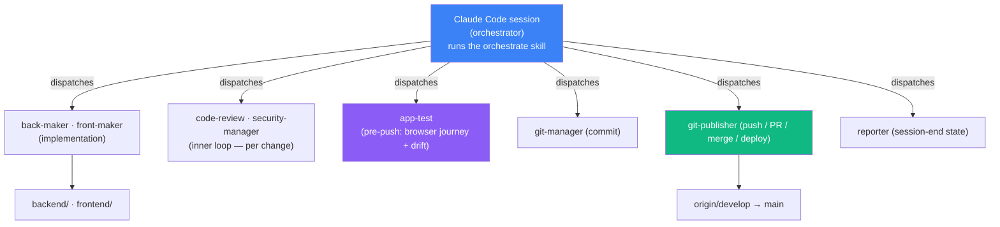
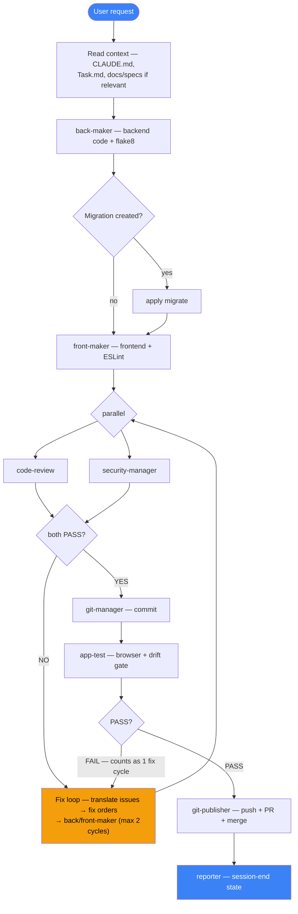

# ArchiTinder — Workflow

> **Read this when:** you want to understand how the project is built — the
> single Claude Code session, its sub-agents, the `orchestrate` skill, the
> session model, the pre-push gate, and the token-saving rules.
> Branch model + PR rules + file ownership live in `CONTRIBUTING.md`.

---

## 1. Architecture — one session, many sub-agents

ArchiTinder Make Web is built from **one Claude Code session** (the
orchestrator). It owns architecture, schema, auth, product + release decisions,
and review. It does not write feature code itself — it **dispatches sub-agents**
and runs the `orchestrate` skill.


```mermaid
flowchart TD
    Main["Claude Code session<br/>(orchestrator)<br/>runs the orchestrate skill"]
    Main -->|dispatches| Impl["back-maker · front-maker<br/>(implementation)"]
    Main -->|dispatches| Rev["code-review · security-manager<br/>(inner loop — per change)"]
    Main -->|dispatches| Gate["app-test<br/>(pre-push: browser journey + drift)"]
    Main -->|dispatches| Commit["git-manager (commit)"]
    Main -->|dispatches| Pub["git-publisher (push / PR / merge / deploy)"]
    Main -->|dispatches| Rep["reporter (session-end state)"]
    Impl --> Code["backend/ · frontend/"]
    Pub --> Remote["origin/develop → main"]

    style Main fill:#3b82f6,color:#fff
    style Gate fill:#8b5cf6,color:#fff
    style Pub fill:#10b981,color:#fff
```

No Codex, no cmux terminals, no cross-session handoff signals — every worker is
a sub-agent that returns its result directly to the session that dispatched it.

## 2. Agent roster

| Agent | Role | Touches |
|-------|------|---------|
| **back-maker** | Django/DRF backend code | `backend/` only |
| **front-maker** | React/Vite frontend code (consults `DESIGN.md`) | `frontend/` only |
| **code-review** | Static code review — API contracts, logic bugs, error handling, integration correctness | read-only |
| **security-manager** | Security scan — SQL injection, auth bypass, XSS, secret/token leakage | read-only |
| **app-test** | Pre-push gate — live browser user-journey test + HEAD/origin drift check; FULL / FEATURE-SCOPED modes | read-only |
| **git-manager** | Single commit only — never pushes | `git commit` |
| **git-publisher** | Push / PR open / PR poll / squash merge / external PR triage / develop→main deploy | `git push`, `gh pr *` |
| **reporter** | Session-end — updates `.claude/Task.md` + the `project/` dashboard state | `.claude/`, `project/` |

Plus the **`orchestrate` skill** — the feature playbook the session runs itself
(a skill, not an agent, because only the main session can dispatch sub-agents).

**Agent vs skill rule:** isolated work that returns a result → an **agent**
(`.claude/agents/*.md`). A procedure the main session runs itself, including
anything that dispatches agents → a **skill** (`.claude/skills/*/SKILL.md`).
There are no slash commands.

## 3. The orchestrate skill — feature pipeline

For any feature or bug fix, the session runs the `orchestrate` skill:


```mermaid
flowchart TD
    Start([User request]) --> Ctx[Read context — CLAUDE.md,<br/>Task.md, docs/specs if relevant]
    Ctx --> BM[back-maker — backend code + flake8]
    BM --> Mig{Migration created?}
    Mig -->|yes| Migrate[apply migrate]
    Mig -->|no| FM
    Migrate --> FM[front-maker — frontend + ESLint]
    FM --> Par{parallel}
    Par --> RV[code-review]
    Par --> SC[security-manager]
    RV --> Dec{both PASS?}
    SC --> Dec
    Dec -->|NO| FL["Fix loop — translate issues → fix orders<br/>→ back/front-maker (max 2 cycles)"]
    FL --> Par
    Dec -->|YES| GM[git-manager — commit]
    GM --> AT[app-test — browser + drift gate]
    AT --> ATv{PASS?}
    ATv -->|FAIL — counts as 1 fix cycle| FL
    ATv -->|PASS| Pub[git-publisher — push + PR + merge]
    Pub --> RP[reporter — session-end state]

    style Start fill:#3b82f6,color:#fff
    style FL fill:#f59e0b,color:#000
    style RP fill:#3b82f6,color:#fff
```

**Fix-cycle accounting:** max 2 cycles total across code-review / security /
app-test FAIL paths. After 2 failed cycles → stop, report to user, ask for
guidance.

**Inner loop vs pre-push gate:** `code-review` + `security-manager` check the
*code* (static, per change, pre-commit). `app-test` checks the *running app*
(browser journey + drift, pre-push). Different activities, no overlap.

A plain question or explanation spawns no agents — answer directly.

## 4. Session model

A **session** is one push-worthy unit of work (typically 1 PR). Multiple commits
accumulate locally on a `feature/*` branch; one push sweeps them as a PR.

**Session start:**
1. `git status && git branch --show-current`. If on `main`/`develop`, do not
   edit — create a `feature/*` branch first (HARD RULE, `CONTRIBUTING.md`).
2. `git fetch origin develop --quiet`; if the branch is behind, ask before
   rebasing.
3. Scan `.claude/Task.md` for any `SESSION-START-TODO` pending action; surface
   it to the user before starting their request.

**Session end** (after the PR merges):
1. `reporter` pass — update `.claude/Task.md` + regenerate the `project/`
   dashboard state. Once per session, not per commit.
2. Append a `SESSION-START-TODO` line to `Task.md` if something must fire on
   the next session's start.

## 5. Planning — before substantive work

Before any `Edit` / `Write` / multi-step `Bash`, present a plan. Korean
narrative + English code identifiers. For non-trivial work, a short table:

```markdown
## 작업: <한 줄 한글 요약>
| Step | 에이전트 / 도구 | 동작 | 토큰 추정 |
|------|----------------|------|----------|
| 1 | ... | ... | ~XK |
**Risk**: low / medium / high — 이유
```

Decisions needing user input → `AskUserQuestion`, **one question per turn**,
3-4 multiple-choice options, wait for the answer before the next. Never batch.

Skip the plan table only for genuinely trivial single-action requests
("how do I…", "show me file X") — anything that results in an edit gets a plan.

For multi-step implementation, enter plan mode: data gathering → short Korean
summary → user review → sequential multiple-choice decisions → plan file →
`ExitPlanMode`.

## 6. Pre-push gate — app-test

The pipeline commits but the `app-test` agent gates the push. It runs the live
browser user-journey (dev-login → search → swipe lifecycle → results → error
recovery, with card-data validation, phase-transition checks, latency budgets)
and the HEAD/`origin/develop` drift check. It returns one verdict — PASS /
PASS-WITH-MINORS / FAIL / ABORTED (drift) — and persists nothing. It runs in one
of two modes — **FULL** (the 3-persona swipe journey, for changes touching the
recommendation/swipe path) or **FEATURE-SCOPED** (preflight + a caller-supplied
feature checklist + a light regression smoke, for changes that don't); the caller
picks, default FULL — see `.claude/agents/app-test.md` § Modes. On FAIL the
orchestrate fix loop re-enters (counts as 1 cycle). On ABORTED, rebase and
re-run. `app-test` is auto-skipped for pure docs/config changes (no UI/runtime
surface).

## 7. Token-saving rules

1. **Defer reporter to session end** — accumulate `Task.md` / dashboard changes,
   run `reporter` once per session. Override: "지금 reporter 돌려".
2. **Skip code-review + security-manager on trivial commits** — a commit is
   trivial when ALL of: `<50 LOC` or pure docs/policy/agent-file (zero source
   code); no migration; no production code; no auth/network/model-layer change.
   Trivial commits go straight to `git-manager`. Override: "리뷰 돌려".
3. **Bundle trivial commits; push only on push-worthy** — don't gate+push after
   every commit. Push-worthy = milestone / production code / migration /
   risky-zone (auth, token, external API, cross-cutting refactor) / explicit
   "지금 push" / session end. Bundle-worthy = pure docs/policy, tooling,
   sub-MINOR follow-ups. Each push still runs `app-test`'s drift check over the
   whole range, so bundling loses no protection.
   **Enforcement (codified post-PR #105 incident 2026-05-25)**:
   `.claude/skills/orchestrate/SKILL.md` Step 8 Publish gate (default-STOP after
   commit; opens only on explicit user trigger or active-plan `## PR Plan`
   reference). `.claude/agents/git-publisher.md` hard guardrails 7 + 8
   (refuse-without-trigger + base=main precondition requiring deploy keyword).
   `.claude/agents/reporter.md` Hard scope (writes files only; refuses any
   dispatch prompt that instructs git/gh state-mutating commands).

## 8. Known issues

| Issue | Severity | Workaround |
|---|---|---|
| `tools/git-new-feature.sh` refuses a dirty working tree without auto-stash | LOW | `git stash push <paths>` → `git-new-feature.sh` → `git stash pop` |
| Local `pytest` gives a false-pass signal — `backend/conftest.py`'s SQLite override is not load-bearing for tests that open direct DB connections; they pass locally (dev Postgres on :5432) but fail in CI without it | MEDIUM | CI is the validation gate — green CI, not local pytest, is the proof |

## 9. Key rules

| Rule | Detail |
|------|--------|
| Feature work runs through the `orchestrate` skill | The session never implements feature code directly from the main thread |
| Direct edit allowed for | meta/infra (`tools/`, `hooks/`, `.github/`), single-line fixes, sub-MINOR follow-ups, pure docs (`CLAUDE.md`, `.claude/*`, `docs/*`, `CONTRIBUTING.md`, `DESIGN.md`, `README.md`) |
| Makers are sandboxed | `back-maker`: `backend/` only · `front-maker`: `frontend/` only |
| `git-manager` only commits | Never pushes — push is `git-publisher`'s job |
| `git-publisher` only pushes / opens PRs / merges | Never commits source code |
| Fix-cycle limit = 2 | After 2 failed cycles, stop and report to the user |
| Keep this file in sync | When the workflow / agents / pre-push gate change, update `WORKFLOW.md` (text + Mermaid) in the same commit |

---

_History: pre-2026-05-22 the project ran across multiple cmux terminals with
Codex CLI workers. Collapsed to a single Claude Code session + sub-agents once
sub-agents provided the same context isolation; Codex dropped the same date._
