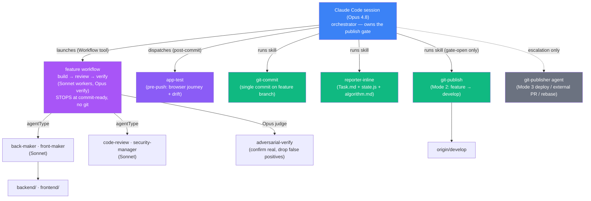
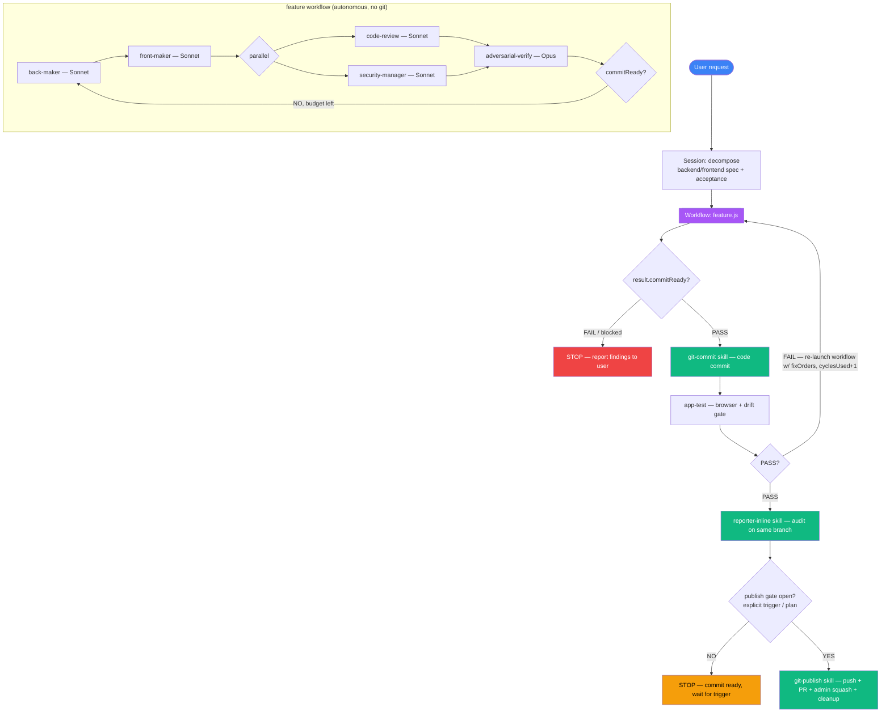

# ArchiTinder — Workflow

> **Read this when:** you want to understand how the project is built — the single
> Claude Code session, the `feature` Workflow it launches for build+review, its
> sub-agents, the skills it runs itself, the model tier map, the session model, the
> pre-push gate, and the token-saving rules.
> Branch model + PR rules + file ownership live in `CONTRIBUTING.md`.

---

## 0. Operating model — ultracode-main (Opus 4.8)

The main model is **Opus 4.8** (`claude-opus-4-8`, 1M context); Mythos/Fable are blocked,
so Opus 4.8 is both floor and ceiling for the orchestrator. The primary workflow is
**ultracode = the Workflow tool**: substantive build+review work runs as a deterministic
multi-agent Workflow script (`.claude/workflows/feature.js`), not an inline chain of
`Agent` dispatches. Trivial mechanical edits (typos, one-line fixes, pure docs) stay
**solo** — no workflow.

Cost is controlled by **model tiering inside the workflow**, not by avoiding fan-out.
(Anthropic's "~15× tokens" figure is for open-ended research fan-out; a bounded code
workflow with Sonnet/Haiku workers sits far below it. The lever is which tier each agent
runs on — see § 1.1.)

## 1. Architecture — one session, a workflow, agents + skills

The Claude side runs as **one Claude Code orchestrator session** (this tool, in a cmux
terminal). It owns architecture, schema, auth, product + release decisions, and review.
It does not write feature code itself — it **launches the `feature` Workflow** for the
build+review core, **dispatches sub-agents** for isolated post-workflow work (the pre-push
gate), and runs **skills** itself for the commit/audit/publish procedures.


```mermaid
flowchart TD
    Main["Claude Code session (Opus 4.8)<br/>orchestrator — owns the publish gate"]
    Main -->|"launches (Workflow tool)"| WF["feature workflow<br/>build → review → verify<br/>(Sonnet workers, Opus verify)<br/>STOPS at commit-ready, no git"]
    WF -->|"agentType"| Impl["back-maker · front-maker<br/>(Sonnet)"]
    WF -->|"agentType"| Rev["code-review · security-manager<br/>(Sonnet)"]
    WF -->|"Opus judge"| Ver["adversarial-verify<br/>(confirm real, drop false positives)"]
    Main -->|"dispatches (post-commit)"| Gate["app-test<br/>(pre-push: browser journey + drift)"]
    Main -->|runs skill| Cmt["git-commit<br/>(single commit on feature branch)"]
    Main -->|runs skill| RIn["reporter-inline<br/>(Task.md + state.js + algorithm.md)"]
    Main -->|"runs skill (gate-open only)"| Pub["git-publish<br/>(Mode 2: feature → develop)"]
    Main -.->|escalation only| PubA["git-publisher agent<br/>(Mode 3 deploy / external PR / rebase)"]
    Impl --> Code["backend/ · frontend/"]
    Pub --> Remote["origin/develop"]

    style Main fill:#3b82f6,color:#fff
    style WF fill:#a855f7,color:#fff
    style Gate fill:#8b5cf6,color:#fff
    style Pub fill:#10b981,color:#fff
    style RIn fill:#10b981,color:#fff
    style Cmt fill:#10b981,color:#fff
    style PubA fill:#6b7280,color:#fff
```

**The gate-stays-in-session invariant:** the `feature` workflow runs autonomously to
completion and performs **NO git operations**. It returns `{ commitReady, ... }`. The main
session then runs `git-commit` → `app-test` → `reporter-inline` and **STOPS at the publish
gate**. Push/PR/merge happens only on an explicit human trigger. Never add `git push`/`gh
pr`/`merge` inside a workflow script. (Incident-driven: PR #105 main-merge, Codex HEAD-move.)

**Codex** runs concurrently as a peer worker in its own clone (`make_web-codex/`, separate
`.git`) — not a sub-agent of this session, never sharing this working dir (`CONTRIBUTING.md`
§ Concurrent agents).

### 1.1 Model tier map (spend-posture: ultracode-main + cost-aware tiering)

| Tier | Runs | Why |
|------|------|-----|
| **Opus 4.8** | the session/orchestrator + the workflow's own logic; the **adversarial-verify / judge** pass | judgment, synthesis, decomposition |
| **Sonnet 4.6** | `back-maker`, `front-maker`, `code-review`, `security-manager`, `app-test` | implementation + review; documented production sweet spot |
| **Haiku 4.5** | pure exploration / file-discovery / search (built-in `Explore` already runs Haiku) | high-volume, low-judgment lookup |

**Pin `model` explicitly on every workflow `agent()` call.** `agentType` swaps the
system-prompt + tools but model still defaults to inherit-main-loop (= Opus). Leaving it
implicit silently runs every worker on Opus and defeats the cost decision. `feature.js`
pins Sonnet on workers and Opus on the verify pass.

## 2. Agent + skill roster

### Workflow (`.claude/workflows/`) — the session launches these via the Workflow tool

| Workflow | Role | Touches |
|----------|------|---------|
| **feature** | Build+review CORE: decompose → back/front-maker → code-review + security-manager → Opus adversarial-verify → 2-cycle fix loop. Returns `commitReady`; runs no git | spawns agents only |
| **review** | Heavy multi-dimensional adversarial review of the branch diff (correctness / security / performance / simplicity, Sonnet) → per-finding Opus verify via `pipeline()`. Read-only. Launch: `Workflow({name:'review', args:{range:'origin/develop...HEAD'}})` | read-only (spawns agents) |

### Skills (`.claude/skills/`) — main session runs these itself

| Skill | Role | Touches |
|-------|------|---------|
| **orchestrate** | Feature playbook — decomposes, launches the `feature` workflow, then owns commit/test/audit/publish-gate | — (orchestrates) |
| **reporter-inline** | Session-end audit — `Task.md` `## Done` + `project/state.js` + conditional `docs/algorithm.md`. Runs INLINE before squash | `Task.md`, `project/state.js`, narrow `docs/algorithm.md` |
| **git-commit** | Single commit on a feature branch — caveman conventional commit + secret guards. Never pushes | `git commit` |
| **git-publish** | Mode 2: feature → develop (push + PR + admin squash + cleanup). Publish gate at Step 0 | `git push`, `gh pr create/merge` |

### Sub-agents (`.claude/agents/`) — dispatched for isolated-context work

| Agent | Role | Model | Touches |
|-------|------|-------|---------|
| **back-maker** | Django/DRF backend code | sonnet | `backend/` only |
| **front-maker** | React/Vite frontend code (consults `DESIGN.md`) | sonnet | `frontend/` only |
| **code-review** | Static review — API contracts, logic bugs, error handling, integration | sonnet | read-only |
| **security-manager** | Security scan — SQL injection, auth bypass, XSS, secret/token leakage | sonnet | read-only |
| **app-test** | Pre-push gate — live browser user-journey + HEAD/origin drift; FULL / FEATURE-SCOPED | sonnet | read-only |
| **git-publisher** | Edge-case escalation: Mode 3 deploy, external PR triage, complex rebase | sonnet | `git push`, `gh pr *` |

These six are the workflow's `agentType` building blocks AND directly dispatchable by the
session (app-test, git-publisher). Frontmatter `model: sonnet` governs direct `Agent`-tool
dispatch; inside a workflow the `agent()` call pins the tier explicitly (§ 1.1).

**Agent vs skill vs workflow:** isolated work returning a result → **agent**. A procedure
the main session runs itself → **skill**. A deterministic multi-agent fan-out (loops,
parallel, verify) → **workflow**. There are no slash commands.

## 3. The feature pipeline

For any feature or bug fix, the session runs the `orchestrate` skill, which launches the
`feature` workflow and then gates around it:


```mermaid
flowchart TD
    Start(["User request"]) --> Dec["Session: decompose<br/>backend/frontend spec + acceptance"]
    Dec --> WF[["Workflow: feature.js"]]
    subgraph WF_INNER["feature workflow (autonomous, no git)"]
      BM["back-maker — Sonnet"] --> FM["front-maker — Sonnet"]
      FM --> Par{"parallel"}
      Par --> RV["code-review — Sonnet"]
      Par --> SC["security-manager — Sonnet"]
      RV --> VF["adversarial-verify — Opus"]
      SC --> VF
      VF --> Dv{"commitReady?"}
      Dv -->|"NO, budget left"| BM
    end
    WF --> Res{"result.commitReady?"}
    Res -->|"FAIL / blocked"| Stop1["STOP — report findings to user"]
    Res -->|"PASS"| GC["git-commit skill — code commit"]
    GC --> AT["app-test — browser + drift gate"]
    AT --> ATv{"PASS?"}
    ATv -->|"FAIL — re-launch workflow w/ fixOrders, cyclesUsed+1"| WF
    ATv -->|"PASS"| RIn["reporter-inline skill — audit on same branch"]
    RIn --> PGate{"publish gate open?<br/>explicit trigger / plan"}
    PGate -->|"NO"| Stop2["STOP — commit ready, wait for trigger"]
    PGate -->|"YES"| PG["git-publish skill — push + PR + admin squash + cleanup"]

    style Start fill:#3b82f6,color:#fff
    style WF fill:#a855f7,color:#fff
    style RIn fill:#10b981,color:#fff
    style GC fill:#10b981,color:#fff
    style PG fill:#10b981,color:#fff
    style Stop1 fill:#ef4444,color:#fff
    style Stop2 fill:#f59e0b,color:#000
```

**Fix-cycle accounting:** max 2 fix cycles total, a **shared budget** across the workflow's
internal loop AND session-side app-test FAIL re-launches. The session passes `cyclesUsed`
into the workflow `args` and reads it back from the result. After 2 failed cycles → STOP,
report, ask for guidance.

**Inner loop vs pre-push gate:** code-review + security-manager + adversarial-verify check
the *code* (static, inside the workflow, pre-commit). `app-test` checks the *running app*
(browser journey + drift, post-commit, pre-push). Different activities, no overlap.

**Reporter-inline placement:** runs BEFORE `git-publish` — the audit commits onto the
feature branch and ships in the same PR; keyed on the task ID, the GitHub PR# is optional.

A plain question or explanation spawns no workflow — answer directly.

## 4. Session model

A **session** is one push-worthy unit of work (typically 1 PR). Multiple commits accumulate
locally on a `feature/*` branch; one push sweeps them as a PR. The audit commit is one of
those bundled commits — same PR.

**Session start:**
1. `git status && git branch --show-current`. If on `main`/`develop`, do not edit — create a `feature/*` branch first (HARD RULE, `CONTRIBUTING.md`).
2. Confirm you are in the **main clone `make_web/`** on `develop` or a `feature/claude-*` branch. Wrong dir → switch clones, do NOT `git reset`.
3. `git fetch origin develop --quiet`; if behind, ask before rebasing.
4. Scan `Task.md` for any `SESSION-START-TODO`; surface it before starting the request.

**Session end** (before the PR squash merges):
1. `reporter-inline` skill — update `Task.md` + `project/state.js` (conditionally `docs/algorithm.md`). Once per push-worthy unit.
2. `git-commit` skill — audit commit on the same feature branch.
3. `git-publish` Step 4 — admin squash merge (gate-open only).
4. Append a `SESSION-START-TODO` to `Task.md` if something must fire next session.

## 5. Planning — before substantive work

Before any `Edit` / `Write` / multi-step `Bash`, present a plan. Korean narrative + English
code identifiers. For non-trivial work, a short table:

```markdown
## 작업: <한 줄 한글 요약>
| Step | 워크플로/에이전트/도구 | 동작 | 토큰 추정 |
|------|----------------------|------|----------|
| 1 | ... | ... | ~XK |
**Risk**: low / medium / high — 이유
```

Decisions needing user input → `AskUserQuestion`, **one question per turn**, 3-4
multiple-choice options, wait before the next. Never batch. Skip the plan table only for
genuinely trivial single-action requests.

For multi-step implementation, enter plan mode: data gathering → short Korean summary →
user review → sequential multiple-choice decisions → plan file → `ExitPlanMode`.

## 6. Pre-push gate — app-test

The workflow stops at commit; the **`app-test` agent** (dispatched by the session, outside
the workflow) gates the push. It runs the live browser user-journey (dev-login → search →
swipe lifecycle → results → error recovery, with card-data validation, phase-transition
checks, latency budgets) and the HEAD/`origin/develop` drift check. One verdict — PASS /
PASS-WITH-MINORS / FAIL / ABORTED (drift). Two modes — **FULL** (3-persona swipe journey,
for recommendation/swipe-path changes) or **FEATURE-SCOPED** (preflight + caller checklist
+ light regression smoke); default FULL.

On FAIL, the session **re-launches the `feature` workflow** with `fixOrders` + `cyclesUsed`
raised by 1 (the workflow already returned and cannot re-enter its own loop). On ABORTED,
rebase and re-run (not a cycle). `app-test` is auto-skipped for pure docs/config changes.

## 7. Token-saving rules

The system's DNA is token thrift (2026-04-29 quota crisis). Ultracode does NOT discard it —
the heavy lane is opt-in via the workflow, with cost controlled by model tiering (§ 1.1).

1. **Reporter inline** — `reporter-inline` runs in the same feature PR as the work. No separate reporter PR. Override: "지금 reporter 돌려".
2. **Trivial stays solo** — a commit is trivial when ALL of: `<50 LOC` or pure docs/policy/agent-file (zero source); no migration; no production code; no auth/network/model-layer change. Trivial commits skip the `feature` workflow AND code-review/security — straight to `git-commit`. Override: "리뷰 돌려".
3. **Model tiering controls workflow cost** — workers on Sonnet, exploration on Haiku, Opus confined to orchestration + verify. A worker silently inheriting Opus is the main cost regression — pin explicitly.
4. **Skill-first for git ops** — `git-commit`, `git-publish` run in-context; dispatch `git-publisher` agent only on the escalation matrix. Each agent dispatch costs 14-46k tokens + round-trip latency.
5. **Bundle trivial commits; push only on push-worthy** — push-worthy = milestone / production code / migration / risky-zone (auth, token, external API, ≥4-file refactor) / explicit "지금 push" / session end. Each push runs app-test's drift check over the whole range, so bundling loses no protection.
   **Publish gate enforcement (post-PR #105 / #116 / #117)**: `git-publish` Step 0 + `orchestrate` Step 7 + `git-publisher` guardrails 7-8 — after commit, default STOP. Push/PR/merge requires explicit keyword (`push`, `올려`, `PR`, `배포`, `merge`, `deploy`, `ship`) OR an active `.claude/plans/<slug>.md`.
   **Deterministic harness guard (Phase 2)**: `.claude/hooks/git-guard.py` — a `PreToolUse(Bash)` hook wired in project `.claude/settings.json` — blocks at the tool layer: direct/force push to `develop`/`main`, `git push --no-verify`, and `gh pr create --base main`. ALLOWS `feature/*` pushes + `gh pr merge --admin`. FAIL-OPEN (parse/exec error → allow; GitHub branch protection is the server-side backstop). Converts the CLAUDE.md git HARD RULEs from prose-the-model-must-remember into harness enforcement. Activates at session start; edit + re-test via `.claude/hooks/git-guard.py` standalone (stdin JSON `{"tool_input":{"command":"..."}}`, exit 2 = block).

## 8. Known issues

| Issue | Severity | Workaround |
|---|---|---|
| `tools/git-new-feature.sh` refuses a dirty working tree without auto-stash | LOW | `git stash push <paths>` → `git-new-feature.sh` → `git stash pop` |
| Local `pytest` gives a false-pass signal — `backend/conftest.py`'s SQLite override is not load-bearing for direct-DB tests | MEDIUM | CI is the validation gate — green CI, not local pytest |
| `reporter-inline`'s `meta.head` in `state.js` is the pre-squash develop SHA, lags one PR | LOW (by design) | Self-correcting next pass |
| Workflow `agent()` model defaults to inherit (Opus) — an unpinned worker silently runs Opus | MEDIUM | Pin `model` on every `agent()` call in `.claude/workflows/*.js` (§ 1.1) |
| Workflow `args` arrives as a JSON **string** across the background-task boundary, not a parsed object | MEDIUM | The script parses it (`feature.js` top); any new workflow reading `args` as an object must `JSON.parse` if `typeof args === 'string'`. Verified by dry-run 2026-06-13 |
| `Workflow({name:'X'})` snapshots the script by name and does not re-read mid-session edits | LOW | After editing a workflow in-session, relaunch via `Workflow({scriptPath:'<abs>/.claude/workflows/X.js'})`. Fresh sessions load the committed file |

## 9. Key rules

| Rule | Detail |
|------|--------|
| Feature work runs through the `orchestrate` skill → `feature` workflow | The session never implements feature code directly from the main thread |
| Workflows perform no git | `feature.js` stops at `commitReady`; the publish gate lives in the session |
| Pin model on every workflow `agent()` | `agentType` does not carry the tier; default is inherit-Opus |
| Direct edit allowed for | meta/infra (`tools/`, `hooks/`, `.github/`, `.claude/workflows/`), single-line fixes, sub-MINOR follow-ups, pure docs (`CLAUDE.md`, `.claude/*`, `docs/*`, `CONTRIBUTING.md`, `DESIGN.md`, `README.md`) — direct edit + `git-commit` skill |
| Makers are sandboxed | `back-maker`: `backend/` only · `front-maker`: `frontend/` only |
| Git operations use skills first | `git-commit`, `git-publish`; `git-publisher` agent only for Mode 3 / external PR / complex rebase |
| Audit uses `reporter-inline` skill | Runs INLINE before squash, same PR |
| Fix-cycle limit = 2, shared | Across the workflow loop AND session app-test re-launches |
| Keep this file in sync | When workflow / agents / skills / pre-push gate / tier map change, update `WORKFLOW.md` (text + Mermaid) in the same commit |

---

_History: pre-2026-05-22 the project ran across multiple cmux terminals with Codex CLI
workers; collapsed to a single Claude Code session + sub-agents once sub-agents provided
context isolation. 2026-05-26: routine reporter / git-manager / git-publisher Mode 2
absorbed into `reporter-inline` / `git-commit` / `git-publish` skills (~30-40k tokens,
~150-300s saved per PR cycle). 2026-05-31: Codex re-introduced as a CONCURRENT PEER in its
own clone. 2026-06-13: Opus 4.8 + ultracode refactor — the build+review core moved from
inline `Agent` dispatches into the `feature` Workflow (`.claude/workflows/feature.js`),
deterministic fan-out + Opus adversarial-verify, with the publish gate kept in the session
outside the autonomous workflow; model tier map codified (§ 1.1)._
