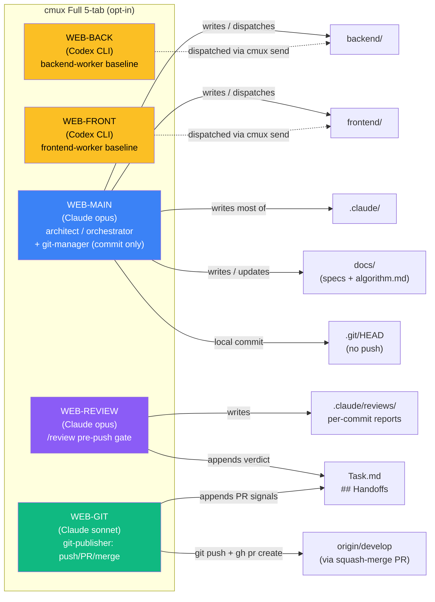
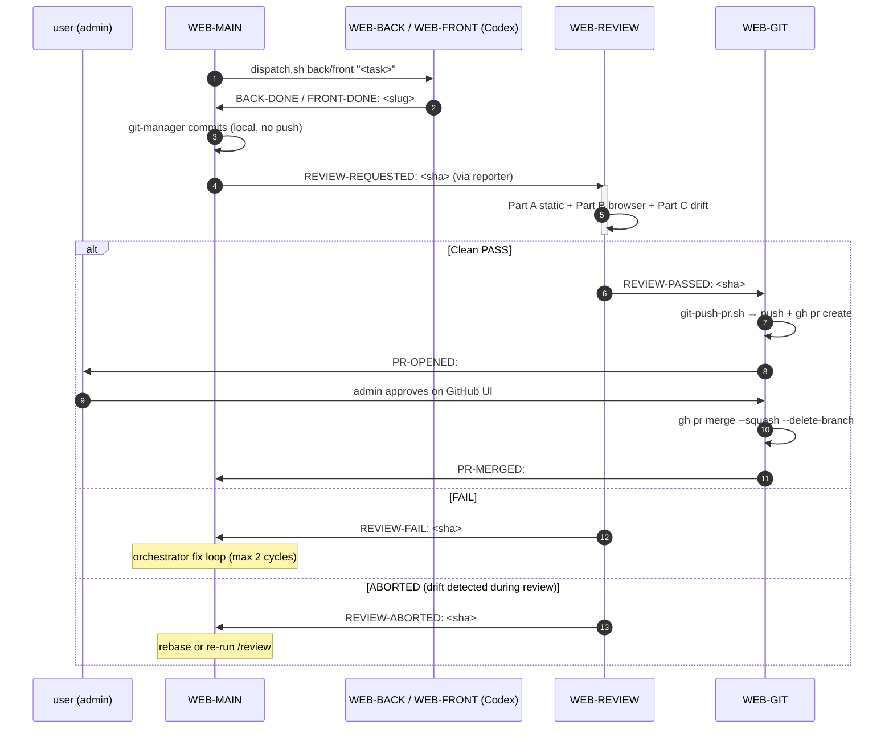
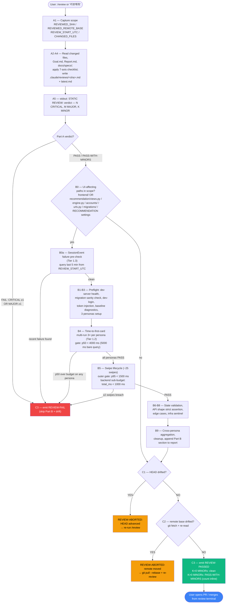
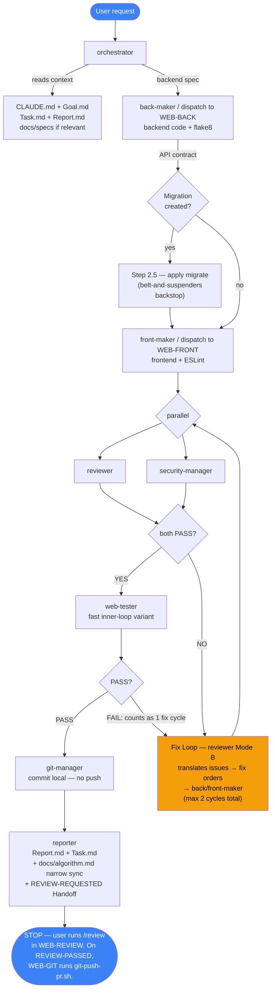
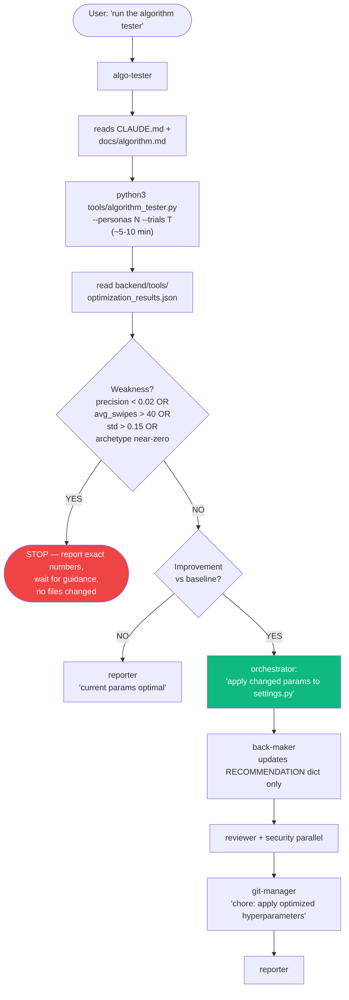
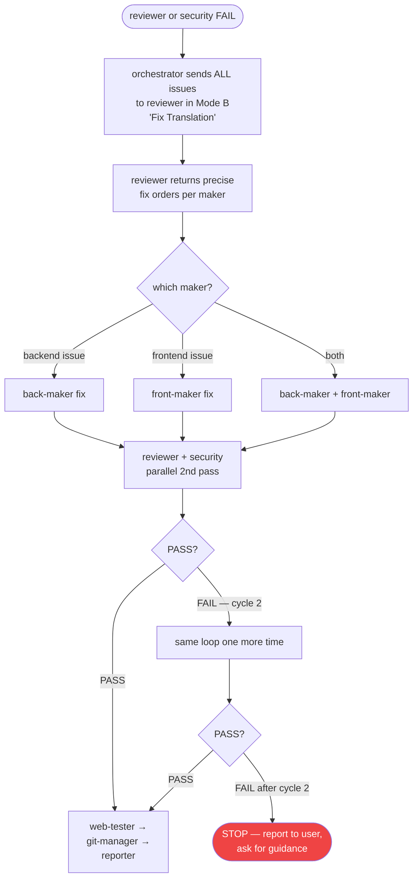

# ArchiTinder -- Agent Workflow

> **Read this when:** You want to understand how the orchestrator pipeline works, what triggers what, and how the pre-push review gate fits in. Branch model + PR workflow live in `CONTRIBUTING.md` (root).
> For feature status: see `Report.md`. For task status: see `Task.md`. For vision: see `Goal.md`.

---

## At-a-Glance — Multi-Terminal Architecture (Lean default, Full opt-in)

The project runs across **Claude Code terminals + Codex CLI workspaces** in a cmux layout. Coordination is by **handoff signals in `Task.md`** + ownership conventions documented in `CONTRIBUTING.md`. Two lane configurations exist:

### Lean 3-lane (default — most work)

WEB-MAIN + one Codex worker (back OR front) + WEB-REVIEW + WEB-GIT. Setup via `tools/cmux_lean_setup.sh <back|front|both>`.

```mermaid
flowchart LR
    subgraph T["cmux Lean 3-lane (default)"]
        Main["WEB-MAIN<br/>(Claude opus)<br/>architect / orchestrator<br/>+ git-manager (commit only)"]
        Worker["WEB-BACK or WEB-FRONT<br/>(Codex CLI)<br/>bounded implementer"]
        Rev["WEB-REVIEW<br/>(Claude opus)<br/>/review pre-push gate"]
        Git["WEB-GIT<br/>(Claude sonnet)<br/>git-publisher: push/PR/merge"]
    end

    Main -->|writes / dispatches| BE_FE["backend/ or frontend/"]
    Main -->|writes most of| CL[".claude/"]
    Main -->|writes / updates| DOCS["docs/<br/>(specs + algorithm.md)"]
    Main -->|local commit| GIT_LOCAL[".git/HEAD<br/>(no push)"]

    Worker -.bounded task file via dispatch-codex-task.sh.-> BE_FE

    Rev -->|writes| RVR[".claude/reviews/<br/>per-commit reports"]
    Rev -->|appends verdict| HO["Task.md<br/>## Handoffs"]

    Git -->|git push + gh pr create| REMOTE["origin/develop<br/>(via squash-merge PR)"]
    Git -->|appends PR signals| HO

    style Main fill:#3b82f6,color:#fff
    style Worker fill:#fbbf24,color:#000
    style Rev fill:#8b5cf6,color:#fff
    style Git fill:#10b981,color:#fff
```

### Full 5-tab (opt-in — both workers concurrently active)

WEB-MAIN + WEB-BACK + WEB-FRONT + WEB-REVIEW + WEB-GIT. Setup via `tools/cmux_setup.sh`. Used when a full-stack task wants backend and frontend workers running in parallel.


```mermaid
flowchart LR
    subgraph T5["cmux Full 5-tab (opt-in)"]
        Main5["WEB-MAIN<br/>(Claude opus)<br/>architect / orchestrator<br/>+ git-manager (commit only)"]
        Back5["WEB-BACK<br/>(Codex CLI)<br/>backend-worker baseline"]
        Front5["WEB-FRONT<br/>(Codex CLI)<br/>frontend-worker baseline"]
        Rev5["WEB-REVIEW<br/>(Claude opus)<br/>/review pre-push gate"]
        Git5["WEB-GIT<br/>(Claude sonnet)<br/>git-publisher: push/PR/merge"]
    end

    Main5 -->|writes / dispatches| BE5["backend/"]
    Main5 -->|writes / dispatches| FE5["frontend/"]
    Main5 -->|writes most of| CL5[".claude/"]
    Main5 -->|writes / updates| DOCS5["docs/<br/>(specs + algorithm.md)"]
    Main5 -->|local commit| GIT_LOCAL5[".git/HEAD<br/>(no push)"]

    Back5 -.dispatched via cmux send.-> BE5
    Front5 -.dispatched via cmux send.-> FE5

    Rev5 -->|writes| RVR5[".claude/reviews/<br/>per-commit reports"]
    Rev5 -->|appends verdict| HO5["Task.md<br/>## Handoffs"]

    Git5 -->|git push + gh pr create| REMOTE5["origin/develop<br/>(via squash-merge PR)"]
    Git5 -->|appends PR signals| HO5

    style Main5 fill:#3b82f6,color:#fff
    style Back5 fill:#fbbf24,color:#000
    style Front5 fill:#fbbf24,color:#000
    style Rev5 fill:#8b5cf6,color:#fff
    style Git5 fill:#10b981,color:#fff
```

---

## Cross-Terminal Signals

Terminals don't call each other directly — they leave append-only signals in `.claude/Task.md`'s `## Handoffs` section. Other terminals (and the human admin) pick them up at session start.


```mermaid
sequenceDiagram
    autonumber
    participant U as user (admin)
    participant M as WEB-MAIN
    participant T as WEB-BACK / WEB-FRONT (Codex)
    participant V as WEB-REVIEW
    participant G as WEB-GIT

    M->>T: dispatch.sh back/front "<task>"
    T->>M: BACK-DONE / FRONT-DONE: <slug>
    M->>M: git-manager commits (local, no push)
    M->>V: REVIEW-REQUESTED: <sha> (via reporter)
    activate V
    V->>V: Part A static + Part B browser + Part C drift
    deactivate V

    alt Clean PASS
        V->>G: REVIEW-PASSED: <sha>
        G->>G: git-push-pr.sh → push + gh pr create
        G->>U: PR-OPENED: #<N> + CI poll
        U->>G: admin approves on GitHub UI
        G->>G: gh pr merge --squash --delete-branch
        G->>M: PR-MERGED: #<N>
    else FAIL
        V->>M: REVIEW-FAIL: <sha>
        Note over M: orchestrator fix loop (max 2 cycles)
    else ABORTED (drift detected during review)
        V->>M: REVIEW-ABORTED: <sha>
        Note over M: rebase or re-run /review
    end
```

**External PR triage** (Role A / Role B collaborator submissions):

```mermaid
sequenceDiagram
    autonumber
    participant C as collaborator
    participant GH as GitHub PR
    participant G as WEB-GIT
    participant V as WEB-REVIEW
    participant U as admin

    C->>GH: gh pr create --base develop
    GH->>GH: GHA CI runs (.github/workflows/ci.yml)
    G->>GH: gh pr list --state open (poll OR admin pings)
    G->>G: gh pr checkout #<N>
    G->>U: PR-READY-FOR-REVIEW: #<N>
    U->>V: trigger /review manually (hybrid policy)
    activate V
    V->>V: /review against PR branch
    deactivate V
    alt PASS
        V->>G: REVIEW-PASSED: <sha>
        G->>GH: gh pr review --approve + gh pr merge --squash
        G->>U: PR-MERGED: #<N>
    else FAIL
        V->>G: REVIEW-FAIL: <sha>
        G->>GH: gh pr review --request-changes (summary + collapsible details)
        G->>U: PR-CHANGES-REQUESTED: #<N>
        Note over C,GH: collaborator pushes fix; admin re-triggers /review
    end
```

**Signal vocabulary** (full list in `.claude/Task.md` `## Handoffs` header):

| Signal | Direction | Meaning |
|--------|-----------|---------|
| `BACK-DONE: <slug>` / `FRONT-DONE: <slug>` | codex team → WEB-MAIN | Team finished dispatched task |
| `BACK-BLOCKED: <reason>` / `FRONT-BLOCKED: <reason>` | codex team → WEB-MAIN | Self-heal exhausted; escalate |
| `<TEAM>-NEEDS-CLARIFICATION: <q>` | codex team → WEB-MAIN | Scope ambiguous; team waits |
| `REVIEW-REQUESTED: <sha>` | reporter (WEB-MAIN) → WEB-REVIEW | Run `/review` next |
| `REVIEW-PASSED: <sha>` | WEB-REVIEW → WEB-GIT | Drift-verified; push + open PR |
| `REVIEW-FAIL: <sha>` | WEB-REVIEW → WEB-MAIN | Re-enter orchestrator fix loop |
| `REVIEW-ABORTED: <sha>` | WEB-REVIEW → WEB-MAIN | PASS verdict but drift detected; re-run after rebase |
| `READY-FOR-PUSH: <branch>` | WEB-MAIN → WEB-GIT | (alt to REVIEW-PASSED) trivial commit skipping `/review` |
| `BRANCH-CREATED: <branch>` | WEB-GIT → WEB-MAIN | New feature branch created from develop |
| `PR-OPENED: #<N>` | WEB-GIT → admin | `gh pr create` succeeded; CI running |
| `PR-CI-GREEN: #<N>` / `PR-CI-FAIL: #<N>` | WEB-GIT → admin | CI poll result |
| `PR-MERGED: #<N>` | WEB-GIT → WEB-MAIN | Squash-merged into develop, branch deleted, local synced |
| `PR-READY-FOR-REVIEW: #<N>` | WEB-GIT → admin | External PR checked out; admin triggers `/review` (hybrid policy) |
| `PR-CHANGES-REQUESTED: #<N>` | WEB-GIT → collaborator (PR comment) | External PR FAIL; verdict body posted |
| `PR-CONFLICT: #<N>` | WEB-GIT → admin | External PR conflicts with develop; author must rebase |
| `DEPLOY-PR-OPENED: #<N>` / `DEPLOY-MERGED: #<N>` | WEB-GIT → admin | develop→main deploy PR lifecycle |
| `GIT-PUBLISH-BLOCKED: <reason>` | WEB-GIT → admin | Refusal (wrong branch, ruleset violation) |
| `GIT-PUBLISH-RETRY: <branch>` | WEB-GIT → admin | Rebase performed, new sha; re-run `/review` |
| `GIT-PUBLISH-NOOP: <reason>` | WEB-GIT → admin | Nothing to do (e.g. develop = main) |

---

## Agent Roster

| Agent | Model | Role | Touches |
|-------|-------|------|---------|
| **orchestrator** | opus | Main pipeline supervisor — plans, delegates, manages fix loops | nothing directly (delegates) |
| **back-maker** | sonnet | Django/DRF backend code | `backend/` only |
| **front-maker** | sonnet | React/Vite frontend code (data + UI; consults DESIGN.md) | `frontend/` only |
| **reviewer** | sonnet | API contracts, logic bugs, error handling | read-only |
| **security-manager** | sonnet | SQL injection, auth bypass, XSS, token leaks | read-only |
| **web-tester** | sonnet | Live Playwright browser tests (fast inner-loop variant) | read-only |
| **git-manager** | haiku | **Single commit only — never pushes.** Lives in WEB-MAIN. | `git commit` |
| **git-publisher** | sonnet | **Push / PR open / PR poll / squash merge / external PR triage / develop→main deploy.** Lives in WEB-GIT (separate tab). | `git push`, `gh pr *` |
| **reporter** | sonnet | Updates Report.md + Task.md, emits REVIEW-REQUESTED handoff | `.claude/` only (+ narrow `docs/algorithm.md` sync exception) |
| **algo-tester** | sonnet | Runs optimizer script, interprets results, triggers orchestrator | runs script + calls orchestrator |
| **backend-worker / frontend-worker** | Codex CLI | Codex bounded implementers (running in WEB-BACK / WEB-FRONT cmux tabs). Baselines at `.claude/codex/<team>-worker.md`. | `backend/` / `frontend/` per role |
| **`/review`** (slash command) | opus (review terminal) | **Unified pre-push gate.** Part A 7-axis static + Part B (conditional) browser + Part C drift checks. Emits one of REVIEW-PASSED / REVIEW-ABORTED / REVIEW-FAIL. | read-only on source + docs; writes `.claude/reviews/*.md` + Task.md Handoffs line + transient `test-artifacts/review/` |

---

## Multi-Terminal Coordination

### Terminal Roster

| Terminal | Runs | Owns / Touches |
|----------|------|----------------|
| **WEB-MAIN** | Claude Code (architect / orchestrator: opus) | Full pipeline — backend, frontend, **local commits via git-manager** (never pushes). Reads `.claude/`, `docs/`, `CLAUDE.md`, `DESIGN.md`, `CONTRIBUTING.md`. Dispatches bounded tasks to codex workers via `tools/dispatch-codex-task.sh` (default) / `tools/dispatch.sh` (fallback). |
| **WEB-BACK** | Codex CLI (gpt-5.5 + `-c model_reasoning_effort=high`) | `backend/` (per `.claude/codex/backend-worker.md`). Self-reviews before BACK-DONE per hybrid policy. |
| **WEB-FRONT** | Codex CLI (same model config) | `frontend/` (per `.claude/codex/frontend-worker.md`). Consults `DESIGN.md` for visual system. |
| **WEB-REVIEW** | Claude Code (`/review` slash command: opus) | Pre-push gate. Read-only on source/docs; writes `.claude/reviews/*.md`, Task.md Handoffs line, transient `test-artifacts/review/`. |
| **WEB-GIT** | Claude Code (git-publisher: sonnet) | **Push / PR / merge / external PR triage / develop→main deploy.** Reads source for context; writes only `git`/`gh` actions + Task.md Handoffs line. Per `.claude/agents/git-publisher.md`. |

### Codex Multi-Workspace (WEB-BACK / WEB-FRONT — stateful)

Each Codex worker's session is **stateful** — it stays running, auto-loads `AGENTS.md` from cwd at startup, and is dispatched tasks via `cmux send`. Two dispatch wrappers exist; the default carries a bounded task file:

- `tools/dispatch-codex-task.sh <team> <slug> <task-file>` — **default**. Embeds the task file (per `tools/codex-task-template.md`) inside a bounded-implementer contract message. Use for any non-trivial task.
- `tools/dispatch.sh <team> "<msg>"` — **fallback**. Free-form message for quick pings, scope-clear follow-ups, or fix-loop dispatches.

**Setup** (idempotent — re-runs only create missing workspaces):

```bash
./tools/cmux_lean_setup.sh <back|front|both>   # default: 1 worker + WEB-REVIEW + WEB-GIT
./tools/cmux_setup.sh                          # opt-in: full 5-tab (both workers concurrently active)
```

**Architecture ground truth** (edit these files, not policy in this doc):
- `AGENTS.md` — Codex baseline (auto-loaded by codex CLI from cwd-walk)
- `.claude/codex/backend-worker.md`, `frontend-worker.md` — per-worker owned files,
  typical task shapes, DRF gotcha, fix loop, self-review checklists
- `tools/codex-task-template.md` — bounded task file template
- `tools/dispatch-codex-task.sh <team> <slug> <task-file>` — WEB-MAIN → worker (default, bounded task file)
- `tools/dispatch.sh <team> "<msg>"` — WEB-MAIN → worker / review / git (fallback, free-form)
- `tools/poll.sh <team> [lines]` — read worker's screen

**When to dispatch to a Codex worker (with bounded task file)** (vs in-session Claude sub-agent):

| Use Codex worker (bounded task file) when... | Use Claude back-maker / front-maker when... |
|---|---|
| Mechanical, well-bounded task (single feature, clear spec) | Open-ended exploration, refactoring across 5+ files |
| Plan can include explicit acceptance criteria | Bug fix where root cause needs diagnosis |
| Acceptance is `pytest -v` exit 0 + lint clean | Output evaluation is subjective (algorithm tuning) |

The free-form `dispatch.sh` is reserved for quick pings (e.g. "are you alive?", "re-read your worker file"), scope-clear fix-loop dispatches where the task file was already established, or non-implementation messages.

**Handoff signals** (`.claude/Task.md` § Handoffs):
- `BACK-DONE: <slug>` / `FRONT-DONE: <slug>` — worker finished
- `BACK-BLOCKED: <reason>` / `FRONT-BLOCKED: <reason>` — exhausted self-heal
- `<TEAM>-NEEDS-CLARIFICATION: <question>` — scope ambiguous, worker waits

**Key invariants**:
- Codex auto-loads `AGENTS.md` from cwd at startup.
- Stateful: a worker's session persists across tasks — WEB-MAIN doesn't re-init context every dispatch. Restart codex (`/quit` then `codex -c model_reasoning_effort=high`) only if `AGENTS.md` or the worker file changed.
- Reviewer/security verdict bar is identical to back-maker output; no separate "Codex reviewer."
- Cap: 2 fix cycles per task → escalate (`<TEAM>-BLOCKED`) → WEB-MAIN may fall back to Claude `back-maker` / `front-maker`.

### Branch Model & PR Workflow

**See `CONTRIBUTING.md`** (root) for the canonical rules. Summary:

- `main` (production, Railway auto-deploy) ← squash merge from `develop`
- `develop` (integration, PR target) ← squash merge from `feature/<role>-<topic>`
- All commits land via PR — admin's PRs included.
- CI runs on every PR (`.github/workflows/ci.yml` — pytest + lint + makemigrations check).
- `/review` is the deeper local gate; runs on the unpushed range (default `origin/develop..HEAD`).
- One-time per clone: `./tools/install-hooks.sh` (migration-numbering pre-push hook).

### Pre-Push Review Gate

The orchestrator pipeline **commits but does not push**. `/review` is the unified pre-push gate that combines static review + (conditional) browser verification + drift checks into a single workflow.


```mermaid
flowchart TD
    Start([User: /review or '리뷰해줘']) --> A1
    A1["A1 — Capture scope<br/>REVIEWED_SHA / REVIEWED_REMOTE_BASE<br/>REVIEW_START_UTC / CHANGED_FILES"]
    A1 --> A2["A2-A4 — Read changed files,<br/>Goal.md, Report.md, docs/specs/;<br/>apply 7-axis checklist;<br/>write .claude/reviews/&lt;sha&gt;.md + latest.md"]
    A2 --> A5["A5 — stdout: STATIC REVIEW: verdict — N CRITICAL, M MAJOR, K MINOR"]
    A5 --> A6{Part A verdict?}

    A6 -->|FAIL: CRITICAL ≥1<br/>OR MAJOR ≥1| C3F["C3 — emit REVIEW-FAIL<br/>(skip Part B + drift)"]
    A6 -->|PASS / PASS-WITH-MINORS| B0

    B0{B0 — UI-affecting<br/>paths in scope?<br/>frontend/ OR<br/>recommendation/views.py /<br/>engine.py / accounts/ /<br/>urls.py / migrations/ /<br/>RECOMMENDATION settings}
    B0 -->|no| C1[Part C drift checks]
    B0 -->|yes| B0a

    B0a["B0a — SessionEvent failure pre-check<br/>(Tier 1.3)<br/>query last 5 min from REVIEW_START_UTC"]
    B0a -->|recent failure found| C3F
    B0a -->|clean| B1

    B1["B1-B3 — Preflight: dev server health,<br/>migration sanity check, dev-login,<br/>token injection, baseline diagnostics,<br/>3 personas setup"]
    B1 --> B4

    B4["B4 — Time-to-first-card<br/>multi-run 3× per persona (Tier 1.2)<br/>gate: p50 &lt; 4000 ms (5000 ms bare query)"]
    B4 -->|p50 over budget on any persona| C3F
    B4 -->|all personas PASS| B5

    B5["B5 — Swipe lifecycle (~25 swipes)<br/>outer gate: p95 &lt; 1500 ms<br/>backend sub-budget: total_ms &lt; 1000 ms"]
    B5 -->|≥2 swipes breach| C3F
    B5 -->|PASS| B6

    B6["B6-B8 — State validation,<br/>API shape strict assertion,<br/>edge cases, infra sentinel"]
    B6 --> B9
    B9["B9 — Cross-persona aggregation,<br/>cleanup, append Part B section to report"]
    B9 --> C1

    C1{C1 — HEAD drifted?}
    C1 -->|YES| AB1["REVIEW-ABORTED:<br/>HEAD advanced<br/>→ re-run /review"]
    C1 -->|NO| C2{C2 — remote base drifted?<br/>git fetch + re-read}
    C2 -->|YES| AB2["REVIEW-ABORTED:<br/>remote moved<br/>→ git pull --rebase + re-review"]
    C2 -->|NO| C3P

    C3P["C3 — emit REVIEW-PASSED<br/>K=0 MINORs: clean<br/>K&gt;0 MINORs: PASS-WITH-MINORS (count inline)"]
    C3P --> Push([User opens PR / merges from review terminal])

    style C3F fill:#ef4444,color:#fff
    style AB1 fill:#f59e0b,color:#000
    style AB2 fill:#f59e0b,color:#000
    style C3P fill:#10b981,color:#fff
    style Push fill:#3b82f6,color:#fff
```

**Notes**:
1. **One unified command, one verdict.** `/review` runs Part A (static review), conditionally Part B (browser verification when UI-affecting paths in scope), and Part C (drift checks), then emits one combined signal. Natural language ("리뷰해줘", "review please", "검토해줘") triggers the same workflow.
2. **PR-based push**: after REVIEW-PASSED, the user opens a PR (or merges if already open) — see `CONTRIBUTING.md` for the branch flow.
3. **Part B uses multi-run aggregation** for non-deterministic upstream services. Step B4 (parse-query → first card) runs 3× per persona and gates on the p50.
4. **Step B0a** fast-fails on recent backend failure events (saves 60–120 s).
5. **Step B5 budget**: outer p95 < 1500 ms, backend sub-budget < 1000 ms.
6. The review terminal never edits source code or runs `git push`.

---

## Case 1: Normal feature or bug fix (orchestrator pipeline)


```mermaid
flowchart TD
    Start([User request]) --> Orch[orchestrator]
    Orch -->|reads context| Ctx[CLAUDE.md + Goal.md<br/>Task.md + Report.md<br/>docs/specs if relevant]
    Orch -->|backend spec| BM[back-maker / dispatch to WEB-BACK<br/>backend code + flake8]
    BM -->|API contract| Mig{Migration<br/>created?}
    Mig -->|yes| Migrate["Step 2.5 — apply migrate<br/>(belt-and-suspenders<br/>backstop)"]
    Mig -->|no| FM
    Migrate --> FM[front-maker / dispatch to WEB-FRONT<br/>frontend + ESLint]
    FM --> Par{parallel}
    Par --> RV[reviewer]
    Par --> SC[security-manager]
    RV --> Dec{both PASS?}
    SC --> Dec
    Dec -->|YES| WT[web-tester<br/>fast inner-loop variant]
    Dec -->|NO| FL["Fix Loop — reviewer Mode B<br/>translates issues → fix orders<br/>→ back/front-maker<br/>(max 2 cycles total)"]
    FL --> Par
    WT --> WD{PASS?}
    WD -->|PASS| GM[git-manager<br/>commit local — no push]
    WD -->|FAIL: counts as 1 fix cycle| FL
    GM --> RP[reporter<br/>Report.md + Task.md<br/>+ docs/algorithm.md narrow sync<br/>+ REVIEW-REQUESTED Handoff]
    RP --> Stop([STOP — user runs /review<br/>in WEB-REVIEW. On REVIEW-PASSED,<br/>WEB-GIT runs git-push-pr.sh.])

    style Start fill:#3b82f6,color:#fff
    style Stop fill:#3b82f6,color:#fff
    style FL fill:#f59e0b,color:#000
```

**Fix-cycle accounting**: max 2 cycles total across reviewer/security/web-tester FAIL paths. After 2 failed cycles → STOP, report to user, ask for guidance.

**Hybrid pre-commit policy**: when work was dispatched to a Codex worker (BACK-DONE / FRONT-DONE), the worker's own self-review per `.claude/codex/backend-worker.md` / `.claude/codex/frontend-worker.md` is the default pre-commit gate; WEB-MAIN skips the in-session reviewer + security agents and proceeds to git-manager. The cross-model verification still happens at `/review`. See CLAUDE.md § Token-saving rules for the risky-zone override (`(claude-review-requested)`).

---

## Case 2: Question or explanation

```
User question
  -> Claude answers directly
       No agents spawned. No code changed.
```

---

## Case 3: Algorithm optimizer run


```mermaid
flowchart TD
    Start(["User: 'run the algorithm tester'"]) --> AT[algo-tester]
    AT --> Read[reads CLAUDE.md +<br/>docs/algorithm.md]
    Read --> Run["python3 tools/algorithm_tester.py<br/>--personas N --trials T<br/>(~5-10 min)"]
    Run --> Results["read backend/tools/<br/>optimization_results.json"]
    Results --> Weak{Weakness?<br/>precision &lt; 0.02 OR<br/>avg_swipes &gt; 40 OR<br/>std &gt; 0.15 OR<br/>archetype near-zero}
    Weak -->|YES| Stop1([STOP — report exact numbers,<br/>wait for guidance,<br/>no files changed])
    Weak -->|NO| Imp{Improvement<br/>vs baseline?}
    Imp -->|NO| ReportNoChange[reporter<br/>'current params optimal']
    Imp -->|YES| Apply[orchestrator:<br/>'apply changed params to settings.py']
    Apply --> BMo[back-maker<br/>updates RECOMMENDATION dict only]
    BMo --> RVSC[reviewer + security parallel]
    RVSC --> GM[git-manager<br/>'chore: apply optimized hyperparameters']
    GM --> RP[reporter]

    style Stop1 fill:#ef4444,color:#fff
    style Apply fill:#10b981,color:#fff
```

---

## Case 4: Fix loop detail


```mermaid
flowchart TD
    Fail([reviewer or security FAIL]) --> Ord[orchestrator sends ALL issues<br/>to reviewer in Mode B<br/>'Fix Translation']
    Ord --> Translate[reviewer returns precise<br/>fix orders per maker]
    Translate --> Maker{which maker?}
    Maker -->|backend issue| BMfix[back-maker fix]
    Maker -->|frontend issue| FMfix[front-maker fix]
    Maker -->|both| Both[back-maker + front-maker]
    BMfix --> Pass2[reviewer + security<br/>parallel 2nd pass]
    FMfix --> Pass2
    Both --> Pass2
    Pass2 --> P2{PASS?}
    P2 -->|PASS| Done[web-tester →<br/>git-manager →<br/>reporter]
    P2 -->|FAIL — cycle 2| Cycle2[same loop one more time]
    Cycle2 --> Final{PASS?}
    Final -->|PASS| Done
    Final -->|FAIL after cycle 2| StopUser([STOP — report to user,<br/>ask for guidance])

    style StopUser fill:#ef4444,color:#fff
```

Web test FAIL counts as 1 fix cycle. Max 2 cycles total across all loops.

---

## Case 5: Web tester flow (fast inner-loop variant)

The orchestrator's inner-loop `web-tester` is the fast Playwright runner that catches obvious regressions during the pipeline. The strict pre-push variant lives in `/review` Part B (separate, slower, multi-run).

```
web-tester starts
  |
  |- Step 0: dev-login
  |   -> POST /api/v1/auth/dev-login/  ->  inject JWT to browser localStorage
  |       if 404 (DEV_LOGIN_SECRET not set): test page-load only
  |
  |- Step 1: Playwright Bash script
  |   -> captures: network requests, console errors, page errors
  |
  |- Step 2: MCP visual tests
  |   |- page load + screenshot
  |   |- UI structure (TabBar, theme toggle, search input)
  |   |- AI search -> submit -> wait for Gemini response
  |   |- start swiping -> 5-10 swipes -> verify next_image on every swipe
  |   -> check phase transitions (exploring -> analyzing)
  |
  -> returns: WEB TEST: PASS or FAIL
      FAIL includes: exact error, failing URL, console log excerpt
```

**Difference from `/review` Part B**: inner-loop web-tester is 1 persona × ≥10 swipes, no latency assertion, retries on flake (1×), console errors reported but not failed. Part B is 3 personas × ≥25 swipes, spec-aligned latency budgets, multi-run aggregation, zero-tolerance error gates.

---

## Case 6: Reporter (updates system docs + emits REVIEW-REQUESTED)

```
reporter runs at session end (or when user requests)
  |
  |- git log -1 --stat           (what changed)
  |- reads .claude/Report.md    (system documentation)
  |- reads .claude/Task.md      (task board)
  |
  |- updates Report.md:
  |   |- Last Updated section for Claude
  |   |- Structure tables (if new files created)
  |   |- API Surface (if new endpoints)
  |   |- Feature Status (if features completed)
  |   -> Mermaid diagrams (if architecture changed)
  |
  |- updates Task.md:
  |   -> moves completed tasks to Resolved with date
  |   -> archives Handoffs to .claude/handoffs-archive/<YYYY-MM>.md when count > 30
  |
  |- (narrow exception) updates docs/algorithm.md ONLY when:
  |   - RECOMMENDATION dict in settings.py changed → sync Production Value column
  |   - phase/formula/edge-case section's implementation changed → append 1-line annotation
  |   - maintains Last Synced (Reporter): YYYY-MM-DD <sha_short> line near top
  |   See CLAUDE.md ## Rules for the authoritative scope.
  |
  -> appends REVIEW-REQUESTED to Task.md Handoffs:
       `- [YYYY-MM-DD] REVIEW-REQUESTED: <sha_short> — <one-line summary>`
       (uses Edit tool to leave the rest of Task.md untouched)
```

---

## Key rules

| Rule | Detail |
|------|--------|
| All feature work goes through orchestrator | Never implement directly from main conversation |
| Direct work allowed for | meta/infra (`tools/`, `hooks/`, `.github/`), single-line fixes, sub-MINOR follow-ups, pure docs (CLAUDE.md / CONTRIBUTING.md / DESIGN.md / docs/* / Report.md / Task.md) |
| Questions answered directly | No agents needed for explanations |
| Makers are sandboxed | back-maker: `backend/` only · front-maker: `frontend/` only |
| orchestrator never writes code | Always delegates to makers |
| **WEB-MAIN picks model + effort per delegated task** | opus owns architecture / schema / auth / release decisions + review — never writes `backend/` or `frontend/` feature code in opus "because delegating feels like overhead." Feature / bug / refactor → orchestrator or back-maker / front-maker (`model: sonnet`) or codex worker. Carve-out (direct OK): meta / infra / docs. Codified in `CLAUDE.md` `## Rules` (2026-05-15). |
| **git-manager only commits** | WEB-MAIN; never pushes. Push is git-publisher's job in WEB-GIT. |
| **git-publisher only pushes / opens PRs / merges** | WEB-GIT; never commits source code. |
| Reporter updates, never appends | Report.md is live state; Task.md Resolved is historical |
| Algorithm weakness = manual review | orchestrator stops and flags; does not auto-fix |
| Fix cycle limit = 2 | After 2 failed cycles, stop and report to user |
| WORKFLOW.md stays in sync | When workflow / agent / pre-push gate / signal vocab changes, update this file (text + Mermaid) in the same commit |

---

## File locations

| File | Purpose |
|------|---------|
| `.claude/agents/*.md` | Claude subagent definitions (orchestrator / makers / reviewer / reporter / git-manager / git-publisher / web-tester / algo-tester) |
| `.claude/codex/backend-worker.md`, `frontend-worker.md` | Codex worker baselines (WEB-BACK / WEB-FRONT) — owned files, self-review checklist, fix loop |
| `.claude/commands/*.md` | Slash command definitions (`/review`, etc.) |
| `.claude/Goal.md` | Vision + acceptance criteria (north star) |
| `.claude/Task.md` | Problem board + Handoffs signals |
| `.claude/Report.md` | Live system documentation — architecture, API, diagrams |
| `.claude/WORKFLOW.md` | This file — agent workflow documentation |
| `.claude/reviews/*.md` | Per-commit `/review` reports (latest.md is symlink-equivalent) |
| `docs/algorithm.md` | Algorithm reference (read-only except reporter narrow sync) |
| `docs/specs/*.md` | Pending-feature specs + decision records (admin-owned via PR) |
| `backend/tools/algorithm_tester.py` | Hyperparameter optimizer script |
| `backend/tools/optimization_results.json` | Latest tester output |
| `CLAUDE.md` | Project conventions (read by Claude main + sub-agents) |
| `DESIGN.md` | Visual design system (consult for any UI work) |
| `CONTRIBUTING.md` | Branch model + PR workflow + role/file ownership |
| `AGENTS.md` | Codex baseline (auto-loaded by codex CLI) |
| `tools/codex-task-template.md` | Bounded task file template Claude-main fills + dispatches |
| `tools/cmux_lean_setup.sh` | **Default**: lean 3-lane workspace creator (1 Codex worker + WEB-REVIEW + WEB-GIT) |
| `tools/cmux_setup.sh` | **Opt-in**: full 5-tab workspace creator (incl. WEB-GIT) |
| `tools/dispatch-codex-task.sh` | **Default**: WEB-MAIN → codex worker with bounded task file embedded |
| `tools/dispatch.sh` | **Fallback**: free-form WEB-MAIN → codex worker / WEB-REVIEW / WEB-GIT |
| `tools/print-claude-codex-handoff.sh` | Prints the Codex→Claude-main handoff prompt for lean-workflow adoption |
| `tools/poll.sh` | Read another tab's screen |
| `tools/install-hooks.sh` | Install local pre-push hook (one-time per clone) |
| `tools/cleanup-after-push.sh` | Rule 7 post-push cleanup (clears WEB-BACK/FRONT/REVIEW/GIT) |
| `tools/git-new-feature.sh` | Sync develop + create `feature/<role>-<topic>` branch |
| `tools/git-stage-and-commit.sh` | Single-commit wrapper called by git-manager (WEB-MAIN) |
| `tools/git-push-pr.sh` | Push + `gh pr create --base develop` — git-publisher Mode 1 |
| `tools/git-poll-merge.sh` | Poll PR CI status until green/red/timeout |
| `tools/back-validate.sh` | flake8 + migrate-if-needed + pytest chain |
| `tools/front-validate.sh` | npm lint + build chain |
| `tools/migrate.sh` / `tools/test-backend.sh` / `tools/check-frontend.sh` | Finer-grained validation wrappers |
| `hooks/pre-push` | Migration-numbering conflict check |
| `.github/CODEOWNERS` | Auto-assign reviewers per file ownership |
| `.github/PULL_REQUEST_TEMPLATE.md` | PR description scaffold |
| `.github/workflows/ci.yml` | CI (pytest + lint + makemigrations check) |
