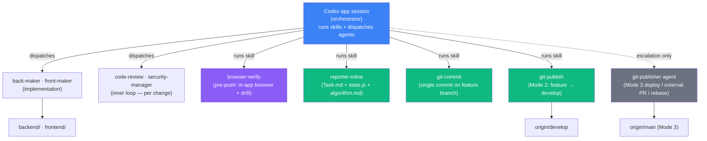
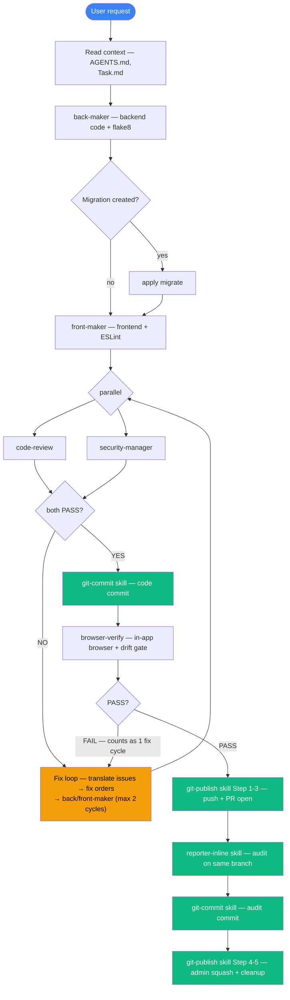

# ArchiTinder — Workflow

> **Read this when:** you want to understand how the project is built — the
> single Codex app session, its sub-agents, the skills it runs itself, the
> session model, the pre-push gate, and the token-saving rules.
> Branch model + PR rules + file ownership live in `CONTRIBUTING.md`.

---

## 1. Architecture — one session, agents + skills

ArchiTinder Make Web is built from **one Codex app session** (the
orchestrator). It owns architecture, schema, auth, product + release decisions,
and review. It does not write feature code itself — it **dispatches sub-agents**
for isolated work that returns a result, and runs **skills** itself for
procedures that benefit from staying in the main session context.



No Claude Code, no cmux terminals, no cross-session handoff signals — every worker is
either a sub-agent (isolated context) or a skill (main session context). Both
return their results to the session that ran them.

## 2. Agent + skill roster

### Skills (`.agents/skills/`) — main session runs these itself

| Skill | Role | Touches |
|-------|------|---------|
| **orchestrate** | Feature-implementation playbook — dispatches back-maker/front-maker, runs review/security, runs git-commit/git-publish, runs reporter-inline | — (orchestrates others) |
| **browser-verify** | Runtime verification checklist — main Codex session drives the in-app browser; SKIP / SMOKE / FEATURE-SCOPED / FULL-SWIPE | in-app browser |
| **reporter-inline** | Session-end audit — `.codex/Task.md` `## Done` + `project/state.js` + conditional `docs/algorithm.md`. Runs INLINE before squash so audit ships in the same PR as the work | `.codex/Task.md`, `project/state.js`, narrow `docs/algorithm.md` |
| **git-commit** | Single commit on a feature branch — caveman conventional commit + secret guards. Never pushes | `git commit` |
| **git-publish** | Mode 2: feature branch → develop (push + PR + admin squash + cleanup). Publish gate enforced at Step 0 | `git push`, `gh pr create/merge` |

### Sub-agents (`.codex/agents/`) — dispatched for isolated-context work

| Agent | Role | Touches |
|-------|------|---------|
| **back-maker** | Django/DRF backend code | `backend/` only |
| **front-maker** | React/Vite frontend code (consults `DESIGN.md`) | `frontend/` only |
| **code-review** | Static code review — API contracts, logic bugs, error handling, integration correctness | read-only |
| **security-manager** | Security scan — SQL injection, auth bypass, XSS, secret/token leakage | read-only |
| **git-publisher** | Edge case escalation only: Mode 3 `develop → main` deploy, external collaborator PR triage, complex rebase/force-with-lease conflicts | `git push`, `gh pr *` |

### Deprecated agents (`.codex/agents/` with `deprecated = true`) — fallback only

| Agent | Status | Use |
|-------|--------|-----|
| **git-manager** | Deprecated 2026-05-26 — superseded by `git-commit` skill | Fallback only — when `git-commit` skill hits an unfamiliar failure |
| **reporter** | Deprecated 2026-05-26 — superseded by `reporter-inline` skill | Fallback only — when skill produces a `state.js` that fails parse, or multi-PR batch needs broader-scope audit |

These agent files are kept for ~1 week of skill-only validation, then slated for deletion in a follow-up PR.

**Agent vs skill rule:** isolated work that returns a result → **agent**. A
procedure the main session runs itself, including ones that dispatch agents →
**skill**. There are no slash commands.

## 3. The orchestrate skill — feature pipeline

For any feature or bug fix, the session runs the `orchestrate` skill:



**Fix-cycle accounting:** max 2 cycles total across code-review / security /
browser verification FAIL paths. After 2 failed cycles → stop, report to user, ask for
guidance.

**Inner loop vs pre-push gate:** `code-review` + `security-manager` check the
*code* (static, per change, pre-commit). `browser-verify` checks the *running app*
(in-app browser journey + drift, pre-push). Different activities, no overlap.

**Reporter-inline placement (2026-05-26 change):** Reporter runs AFTER the PR
is opened (so the PR number is known) but BEFORE admin squash merge. The audit
commits land on the same feature branch as the code, get squashed together,
and ship as a single PR. No more separate reporter PR cycle.

A plain question or explanation spawns no agents — answer directly.

## 4. Session model

A **session** is one push-worthy unit of work (typically 1 PR). Multiple commits
accumulate locally on a `feature/*` branch; one push sweeps them as a PR. As of
2026-05-26, the audit commit is one of those bundled commits — same PR.

**Session start:**
1. `git status && git branch --show-current`. If on `main`/`develop`, do not
   edit — create a `feature/*` branch first (HARD RULE, `CONTRIBUTING.md`).
2. Confirm you are in your **own clone `make_web-codex/`** (NOT the main
   `make_web/`) on a `feature/codex-*` branch. If you are in the main clone, STOP
   and relocate before editing — one clone per worker, never operate in another's
   (`CONTRIBUTING.md` § Concurrent agents).
3. `git fetch origin develop --quiet`; if the branch is behind, ask before
   rebasing.
4. Scan `.codex/Task.md` for any `SESSION-START-TODO` pending action; surface
   it to the user before starting their request.

**Session end** (before the PR squash merges):
1. `reporter-inline` skill — update `.codex/Task.md` + `project/state.js`
   (conditionally `docs/algorithm.md`). Once per push-worthy unit, not per commit.
2. `git-commit` skill — audit commit on the same feature branch.
3. `git-publish` Step 4 — admin squash merge.
4. Append a `SESSION-START-TODO` line to `Task.md` if something must fire on
   the next session's start.

## 5. Planning — before substantive work

Before any `Edit` / `Write` / multi-step `Bash`, present a plan. Korean
narrative + English code identifiers. For non-trivial work, a short table:

```markdown
## 작업: <한 줄 한글 요약>
| Step | 에이전트 / 도구 | 동작 | 토큰 추정 |
|------|----------------|------|----------|
| 1 | ... | ... | ~XK |
**Risk**: low / medium / high — 이유
```

Decisions needing user input → `AskUserQuestion`, **one question per turn**,
3-4 multiple-choice options, wait for the answer before the next. Never batch.

Skip the plan table only for genuinely trivial single-action requests
("how do I…", "show me file X") — anything that results in an edit gets a plan.

For multi-step implementation, enter plan mode: data gathering → short Korean
summary → user review → sequential multiple-choice decisions → plan file →
`ExitPlanMode`.

## 6. Pre-push gate — browser-verify

The pipeline commits but runtime verification gates publish. Default path is the
`browser-verify` skill: the main Codex session drives the in-app browser, checks
the changed surface, watches console/network failures, and runs the
HEAD/`origin/develop` drift check. It returns one verdict — PASS / FAIL /
SKIPPED / NOT RUN / ABORTED.

Modes:
- **SKIP** — pure docs/policy/config with no runtime surface.
- **SMOKE** — app boots, target page loads, no blank screen, no obvious
  console/network failures.
- **FEATURE-SCOPED** — SMOKE plus a caller-supplied checklist for the changed
  surface.
- **FULL-SWIPE** — recommendation/swipe path regression: dev-login → AI search →
  swipe lifecycle → results → error recovery, with card-data validation and
  phase-transition checks.

On FAIL the orchestrate fix loop re-enters (counts as 1 cycle). On ABORTED drift,
sync/rebase and re-run; drift does not count as a code-fix cycle. Pure docs/config
changes auto-skip browser verification.

## 7. Token-saving rules

1. **Reporter inline (2026-05-26)** — `reporter-inline` skill runs in the same
   feature PR as the work. No separate reporter PR. Accumulate `Task.md` /
   dashboard changes across the session's commits, then run the skill once
   before `git-publish` admin squash. Override: "지금 reporter 돌려" — but the
   skill is fast enough that the override is rarely needed.
2. **Skip code-review + security-manager on trivial commits** — a commit is
   trivial when ALL of: `<50 LOC` or pure docs/policy/agent-file (zero source
   code); no migration; no production code; no auth/network/model-layer change.
   Trivial commits go straight to `git-commit` skill. Override: "리뷰 돌려".
3. **Skill-first, agent-second** (2026-05-26) — for git operations, default to
   the skill (`git-commit`, `git-publish`). Dispatch `git-publisher` agent only
   on the escalation matrix (Mode 3 deploy / external PR / complex rebase).
   Dispatch the deprecated `reporter` / `git-manager` agents only as documented
   fallback. Why: each agent dispatch costs 14-46k tokens + 23-150 seconds of
   round-trip latency; skills run in-context for 1/3 the cost on routine work.
4. **Bundle trivial commits; push only on push-worthy** — don't gate+push after
   every commit. Push-worthy = milestone / production code / migration /
   risky-zone (auth, token, external API, cross-cutting refactor) / explicit
   "지금 push" / session end. Bundle-worthy = pure docs/policy, tooling,
   sub-MINOR follow-ups. Each push still runs `browser-verify`'s drift check over the
   whole range, so bundling loses no protection.
   **Publish gate enforcement (codified post-PR #105 / #116 / #117 incidents)**:
   the `git-publish` skill Step 0 enforces — after commit, default action is
   STOP. Push / PR / merge requires explicit publish keyword (`push`, `올려`,
   `PR`, `배포`, `merge`, `deploy`, `ship`) OR an active `.codex/plans/<slug>.md`
   authorizing the action. The `orchestrate` skill Step 8 and `git-publisher`
   agent hard guardrails 7 + 8 mirror this for the escalation path.

## 8. Known issues

| Issue | Severity | Workaround |
|---|---|---|
| `tools/git-new-feature.sh` refuses a dirty working tree without auto-stash | LOW | `git stash push <paths>` → `git-new-feature.sh` → `git stash pop` |
| Local `pytest` gives a false-pass signal — `backend/conftest.py`'s SQLite override is not load-bearing for tests that open direct DB connections; they pass locally (dev Postgres on :5432) but fail in CI without it | MEDIUM | CI is the validation gate — green CI, not local pytest, is the proof |
| `reporter-inline` skill's `meta.head` in `state.js` is the pre-squash develop SHA, so it lags by one PR until the next pass | LOW (by design) | Steady-state self-correcting — next reporter-inline pass picks up the new develop HEAD |

## 9. Key rules

| Rule | Detail |
|------|--------|
| Feature work runs through the `orchestrate` skill | The session never implements feature code directly from the main thread |
| Direct edit allowed for | meta/infra (`tools/`, `hooks/`, `.github/`), single-line fixes, sub-MINOR follow-ups, pure docs (`AGENTS.md`, `.agents/*`, `.codex/*`, `docs/*`, `CONTRIBUTING.md`, `DESIGN.md`, `README.md`) — direct edit + `git-commit` skill |
| Makers are sandboxed | `back-maker`: `backend/` only · `front-maker`: `frontend/` only |
| Git operations use skills first | `git-commit` for commits, `git-publish` for Mode 2 push/PR/merge. `git-publisher` agent only for Mode 3 deploy / external PR / complex rebase |
| Audit recording uses `reporter-inline` skill | Runs INLINE before squash so audit ships in same PR. Reporter no longer needs a separate PR |
| Fix-cycle limit = 2 | After 2 failed cycles, stop and report to the user |
| Keep this file in sync | When workflow / agents / skills / pre-push gate change, update `WORKFLOW.md` (text + Mermaid) in the same commit |

---

_History: pre-2026-05-22 the project ran across multiple cmux terminals with
Codex CLI workers. Then collapsed to a single Claude Code session + sub-agents
once sub-agents provided the same context isolation. On 2026-05-28 the workflow
was ported to Codex app with local `.codex/agents` and `.agents/skills`.
2026-05-26: routine reporter / git-manager / git-publisher Mode 2 absorbed into
`reporter-inline` / `git-commit` / `git-publish` skills to eliminate per-cycle
Agent dispatch overhead (~30-40k tokens, ~150-300 seconds saved per PR cycle).
Agent files for the deprecated two kept ~1 week for fallback._
